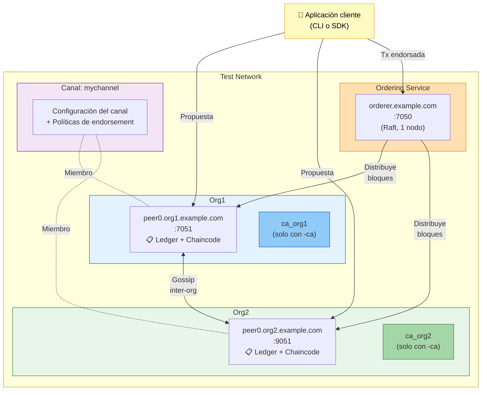
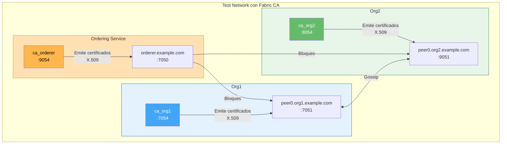

# 02 - Test Network: tu primera red Fabric

La **test-network** es una red pre-configurada incluida en `fabric-samples` que permite levantar un entorno completo de Fabric en minutos. Es ideal para aprender, experimentar y probar chaincodes.

---

## Qué incluye la test-network

| Componente | Detalle |
|---|---|
| **Org1** | 1 peer (`peer0.org1.example.com`) |
| **Org2** | 1 peer (`peer0.org2.example.com`) |
| **Orderer** | 1 nodo orderer (`orderer.example.com`) |
| **Fabric CA** | Opcional, 1 CA por organización |
| **Canal** | `mychannel` (por defecto) |

### Diagrama de la test-network



### Diagrama con la opción `-ca` (Fabric CA habilitada)

Cuando se levanta con `./network.sh up createChannel -ca`, se añaden 3 contenedores CA adicionales:



| Contenedor | Puerto | Función |
|---|---|---|
| `peer0.org1.example.com` | 7051 | Peer de Org1 (endorser + committer) |
| `peer0.org2.example.com` | 9051 | Peer de Org2 (endorser + committer) |
| `orderer.example.com` | 7050 | Ordering service (Raft) |
| `ca_org1` | 7054 | Fabric CA de Org1 (solo con `-ca`) |
| `ca_org2` | 8054 | Fabric CA de Org2 (solo con `-ca`) |
| `ca_orderer` | 9054 | Fabric CA del Orderer (solo con `-ca`) |

---

## 1. Navegar al directorio

```bash
cd $HOME/fabric/fabric-samples/test-network
```

---

## 2. Limpiar ejecuciones previas

**Siempre** ejecutar antes de levantar la red para partir de un estado limpio:

```bash
./network.sh down
```

---

## 3. Levantar la red

### Opción A: Solo levantar nodos (sin canal)

```bash
./network.sh up
```

### Opción B: Levantar nodos + crear canal (recomendado)

```bash
./network.sh up createChannel
```

### Opción C: Levantar con Fabric CA (en lugar de cryptogen)

```bash
./network.sh up createChannel -ca
```

> **Diferencia importante:**
> - Sin `-ca`: usa `cryptogen` para generar certificados (rápido, solo para desarrollo)
> - Con `-ca`: usa **Fabric CA** para generar certificados (realista, como en producción)

### Opción D: Canal con nombre personalizado

```bash
./network.sh up createChannel -c micanal
```

### Verificar que los contenedores están corriendo

```bash
docker ps --format "table {{.Names}}\t{{.Status}}\t{{.Ports}}"
```

Debes ver 3 contenedores (o 5 si usaste `-ca`):

```
peer0.org1.example.com      Up ...    7051/tcp
peer0.org2.example.com      Up ...    9051/tcp
orderer.example.com         Up ...    7050/tcp
```

---

## 4. Desplegar un chaincode

Desplegar el chaincode de ejemplo `asset-transfer-basic`:

### En Go

```bash
./network.sh deployCC -ccn basic -ccp ../asset-transfer-basic/chaincode-go -ccl go
```

### En JavaScript

```bash
./network.sh deployCC -ccn basic -ccp ../asset-transfer-basic/chaincode-javascript -ccl javascript
```

### En TypeScript

```bash
./network.sh deployCC -ccn basic -ccp ../asset-transfer-basic/chaincode-typescript -ccl typescript
```

### En Java

```bash
./network.sh deployCC -ccn basic -ccp ../asset-transfer-basic/chaincode-java -ccl java
```

**Parámetros:**

| Flag | Descripción |
|---|---|
| `-ccn` | Nombre del chaincode |
| `-ccp` | Ruta al código fuente del chaincode |
| `-ccl` | Lenguaje: `go`, `javascript`, `typescript`, `java` |
| `-c` | Canal (por defecto: `mychannel`) |

---

## 5. Configurar el entorno CLI

Para interactuar con la red desde la terminal necesitas configurar variables de entorno.

### Añadir binarios y config al PATH

```bash
export PATH=${PWD}/../bin:$PATH
export FABRIC_CFG_PATH=${PWD}/../config/
```

### Operar como Org1

```bash
export CORE_PEER_TLS_ENABLED=true
export CORE_PEER_LOCALMSPID=Org1MSP
export CORE_PEER_TLS_ROOTCERT_FILE=${PWD}/organizations/peerOrganizations/org1.example.com/peers/peer0.org1.example.com/tls/ca.crt
export CORE_PEER_MSPCONFIGPATH=${PWD}/organizations/peerOrganizations/org1.example.com/users/Admin@org1.example.com/msp
export CORE_PEER_ADDRESS=localhost:7051
```

### Operar como Org2

```bash
export CORE_PEER_TLS_ENABLED=true
export CORE_PEER_LOCALMSPID=Org2MSP
export CORE_PEER_TLS_ROOTCERT_FILE=${PWD}/organizations/peerOrganizations/org2.example.com/peers/peer0.org2.example.com/tls/ca.crt
export CORE_PEER_MSPCONFIGPATH=${PWD}/organizations/peerOrganizations/org2.example.com/users/Admin@org2.example.com/msp
export CORE_PEER_ADDRESS=localhost:9051
```

> **Tip:** Crea scripts `set-org1.sh` y `set-org2.sh` con estos exports para cambiar de organización rápidamente:
> ```bash
> source set-org1.sh
> ```

---

## 6. Interactuar con el chaincode

### 6.1 Inicializar el ledger

```bash
peer chaincode invoke \
  -o localhost:7050 \
  --ordererTLSHostnameOverride orderer.example.com \
  --tls \
  --cafile "${PWD}/organizations/ordererOrganizations/example.com/orderers/orderer.example.com/msp/tlscacerts/tlsca.example.com-cert.pem" \
  -C mychannel \
  -n basic \
  --peerAddresses localhost:7051 \
  --tlsRootCertFiles "${PWD}/organizations/peerOrganizations/org1.example.com/peers/peer0.org1.example.com/tls/ca.crt" \
  --peerAddresses localhost:9051 \
  --tlsRootCertFiles "${PWD}/organizations/peerOrganizations/org2.example.com/peers/peer0.org2.example.com/tls/ca.crt" \
  -c '{"function":"InitLedger","Args":[]}'
```

Si todo va bien, verás: `Chaincode invoke successful. result: status:200`

### 6.2 Consultar todos los activos

```bash
peer chaincode query -C mychannel -n basic -c '{"Args":["GetAllAssets"]}'
```

Resultado esperado (JSON con los activos iniciales):

```json
[
  {"ID":"asset1","Color":"blue","Size":5,"Owner":"Tomoko","AppraisedValue":300},
  {"ID":"asset2","Color":"red","Size":5,"Owner":"Brad","AppraisedValue":400},
  ...
]
```

### 6.3 Consultar un activo específico

```bash
peer chaincode query -C mychannel -n basic -c '{"Args":["ReadAsset","asset1"]}'
```

### 6.4 Transferir un activo

```bash
peer chaincode invoke \
  -o localhost:7050 \
  --ordererTLSHostnameOverride orderer.example.com \
  --tls \
  --cafile "${PWD}/organizations/ordererOrganizations/example.com/orderers/orderer.example.com/msp/tlscacerts/tlsca.example.com-cert.pem" \
  -C mychannel \
  -n basic \
  --peerAddresses localhost:7051 \
  --tlsRootCertFiles "${PWD}/organizations/peerOrganizations/org1.example.com/peers/peer0.org1.example.com/tls/ca.crt" \
  --peerAddresses localhost:9051 \
  --tlsRootCertFiles "${PWD}/organizations/peerOrganizations/org2.example.com/peers/peer0.org2.example.com/tls/ca.crt" \
  -c '{"function":"TransferAsset","Args":["asset1","Carlos"]}'
```

### 6.5 Verificar la transferencia (desde Org2)

Cambia a Org2 y consulta:

```bash
# Cambiar a Org2
export CORE_PEER_LOCALMSPID=Org2MSP
export CORE_PEER_TLS_ROOTCERT_FILE=${PWD}/organizations/peerOrganizations/org2.example.com/peers/peer0.org2.example.com/tls/ca.crt
export CORE_PEER_MSPCONFIGPATH=${PWD}/organizations/peerOrganizations/org2.example.com/users/Admin@org2.example.com/msp
export CORE_PEER_ADDRESS=localhost:9051

# Consultar
peer chaincode query -C mychannel -n basic -c '{"Args":["ReadAsset","asset1"]}'
```

El `Owner` ahora debe ser `Carlos`.

---

## 7. Crear canales adicionales

```bash
./network.sh createChannel -c canal2
```

Se pueden crear múltiples canales en la misma red. Cada canal tiene su propio ledger independiente.

---

## 8. Usar CouchDB como base de datos de estado

Por defecto Fabric usa LevelDB. Para habilitar CouchDB (permite consultas ricas con JSON):

```bash
./network.sh up createChannel -s couchdb
```

Acceder a la interfaz web de CouchDB: `http://localhost:5984/_utils`

---

## 9. Apagar la red

```bash
./network.sh down
```

Esto elimina:
- Todos los contenedores Docker de la red
- El material criptográfico generado
- Los artefactos del canal
- Las imágenes Docker de chaincodes
- Los volúmenes Docker

---

## 10. Solución de problemas comunes

### Limpiar todo Docker (último recurso)

```bash
# Parar y eliminar todos los contenedores
docker rm -f $(docker ps -aq) 2>/dev/null

# Eliminar imágenes de chaincodes
docker rmi -f $(docker images | grep dev-peer | awk '{print $3}') 2>/dev/null

# Limpiar redes Docker huérfanas
docker network prune -f

# Limpiar volúmenes
docker volume prune -f
```

### Error: "cannot connect to Docker daemon"

```bash
# Linux/WSL2
sudo systemctl start docker
sudo systemctl enable docker
```

### Error: "permission denied" al ejecutar docker

```bash
sudo usermod -aG docker $USER
# Cerrar sesión y volver a entrar, o:
newgrp docker
```

### Error: "channel already exists"

```bash
./network.sh down
./network.sh up createChannel
```

---

## Resumen de comandos

| Acción | Comando |
|---|---|
| Limpiar red | `./network.sh down` |
| Levantar red + canal | `./network.sh up createChannel` |
| Levantar con CA | `./network.sh up createChannel -ca` |
| Desplegar chaincode | `./network.sh deployCC -ccn basic -ccp <ruta> -ccl go` |
| Crear canal adicional | `./network.sh createChannel -c <nombre>` |
| Consultar chaincode | `peer chaincode query -C mychannel -n basic -c '{"Args":[...]}'` |
| Invocar chaincode | `peer chaincode invoke ... -c '{"function":"...","Args":[...]}'` |

---

**Anterior:** [01 - Requisitos e instalación](01-requisitos-e-instalacion.md)
**Siguiente:** [03 - Crear una red personalizada desde cero](03-crear-red-personalizada.md)
