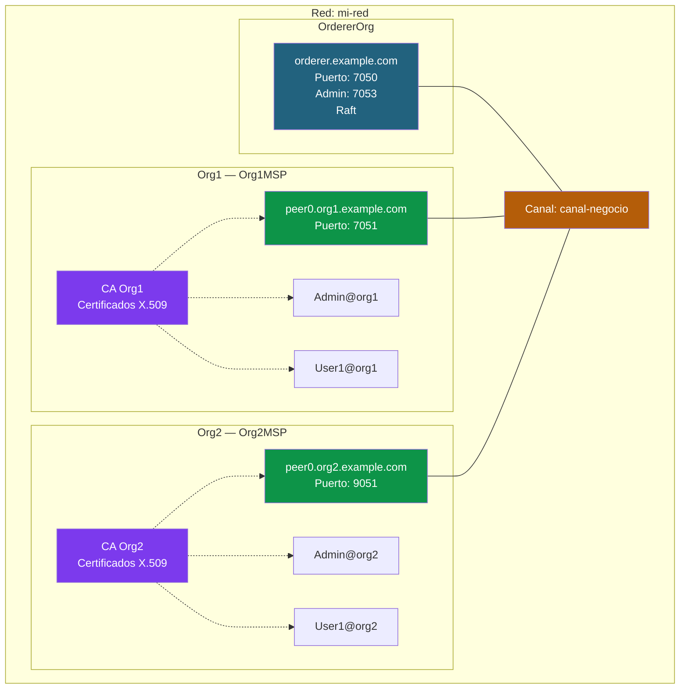
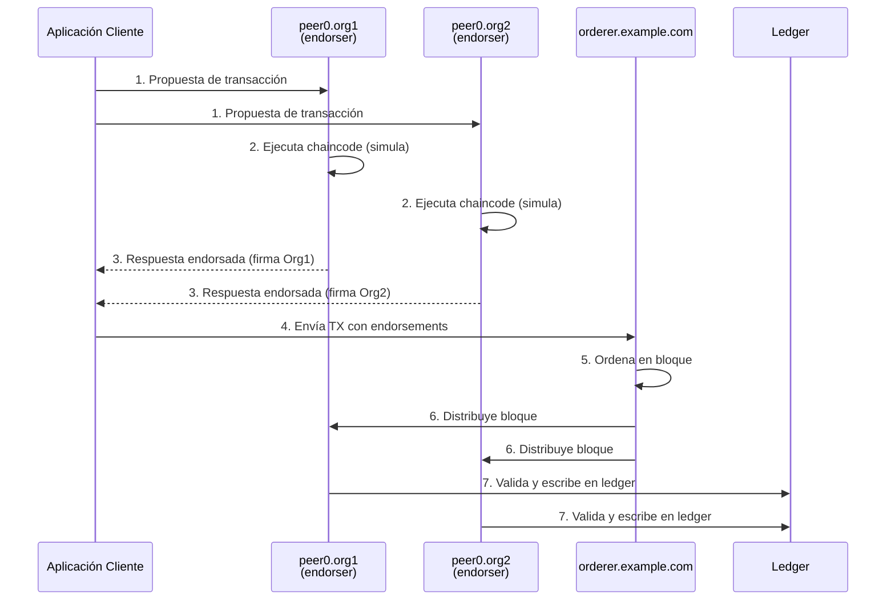
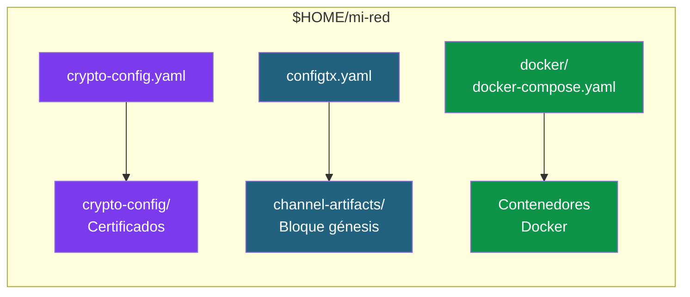
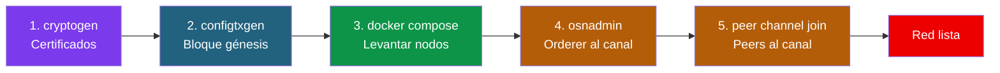

# 03 - Crear una red Hyperledger Fabric personalizada desde cero

En esta guía creamos una red Fabric **sin usar la test-network**, configurando manualmente cada componente. Esto es lo que se haría en un entorno real de producción.

---

## Arquitectura objetivo

Vamos a construir una red Fabric mínima pero completa, con dos organizaciones que comparten un canal de negocio. Cada organización tiene su propio peer y su propia autoridad certificadora (generada con `cryptogen`). Un servicio de ordenación Raft (con un solo nodo, por simplicidad) se encarga de ordenar las transacciones y distribuir los bloques.



**Componentes de la red:**

- **Orderer (orderer.example.com):** Servicio de ordenación basado en Raft. Recibe las transacciones endorsadas, las ordena en bloques y las distribuye a los peers. Usa TLS mutuo para todas las comunicaciones. El puerto 7050 es para el servicio normal y el 7053 para administración (`osnadmin`).

- **Peer0 Org1 y Peer0 Org2:** Cada organización tiene un peer que mantiene una copia del ledger y ejecuta los chaincodes. Los peers de distintas organizaciones se descubren entre sí mediante los **anchor peers** (configurados en `configtx.yaml`). Cada peer tiene su propio certificado TLS y MSP.

- **Canal (canal-negocio):** Un canal es una red lógica privada dentro de Fabric. Solo las organizaciones que pertenecen al canal pueden ver sus transacciones. Nuestra red tiene un único canal compartido entre Org1 y Org2.

- **Identidades (CA → MSP):** Cada organización tiene su propia CA que emite certificados X.509. Estos certificados identifican a peers, admins y usuarios. El MSP (Membership Service Provider) de cada org agrupa estos certificados y define quién pertenece a la organización y con qué rol.

### Flujo de una transacción en esta red



1. La **aplicación cliente** envía una propuesta de transacción a los peers endorsadores de cada organización.
2. Cada peer **ejecuta el chaincode** localmente (simulación) sin escribir en el ledger.
3. Si la ejecución es correcta, cada peer **firma el resultado** y lo devuelve al cliente.
4. El cliente recoge las respuestas endorsadas y las envía al **orderer**.
5. El orderer **ordena** las transacciones y las empaqueta en un bloque.
6. El bloque se **distribuye** a todos los peers del canal.
7. Cada peer **valida** que los endorsements cumplen la política y **escribe** en el ledger.

### Estructura de directorios que vamos a crear



Cada archivo de configuración genera un artefacto distinto:
- **crypto-config.yaml** → genera los certificados y claves de todas las organizaciones
- **configtx.yaml** → genera el bloque génesis del canal con las políticas y la topología
- **docker-compose.yaml** → levanta los contenedores (orderer, peers, CLI)

---

## 1. Crear la estructura de directorios

Lo primero es preparar el espacio de trabajo. En un proyecto Fabric real, cada archivo de configuración tiene un propósito claro y se organiza en carpetas separadas. Esta separación no es obligatoria, pero facilita mucho entender qué hace cada cosa y mantener el proyecto limpio.

```bash
mkdir -p $HOME/mi-red/{configtx,crypto-config,channel-artifacts,docker,scripts}
cd $HOME/mi-red
```

| Directorio | Contenido |
|---|---|
| `crypto-config/` | Certificados y claves de todas las organizaciones |
| `channel-artifacts/` | Bloque génesis y artefactos del canal |
| `docker/` | Archivo Docker Compose para levantar los nodos |
| `scripts/` | Scripts auxiliares para administrar la red |

---

## 2. Generar material criptográfico

En Fabric, **la identidad lo es todo**. A diferencia de Ethereum, donde cualquiera puede crear una wallet anónima, en Fabric cada participante necesita un certificado X.509 emitido por una autoridad certificadora (CA) reconocida. Sin certificado, no existes en la red.

Estos certificados se usan para:
- **Autenticar** quién eres (peer, admin, usuario, orderer)
- **Firmar** las transacciones y los endorsements
- **Cifrar** las comunicaciones con TLS mutuo entre componentes
- **Autorizar** operaciones según las políticas del canal

Hay dos formas de generar este material criptográfico:

- **cryptogen** — Herramienta de desarrollo que genera todo de golpe a partir de un YAML. Rápida y sencilla, pero no apta para producción porque no permite renovar certificados ni revocar identidades.
- **Fabric CA** — Autoridad certificadora real que emite certificados bajo demanda. Es lo que se usa en producción (se cubre en el documento 04).

### Opción A: Usando cryptogen (desarrollo)

#### 2.1 Crear `crypto-config.yaml`

Este archivo le dice a `cryptogen` cuántas organizaciones queremos, cuántos peers por org, cuántos usuarios y qué dominios usar. Es como un "plano" de las identidades de nuestra red.

Crea el archivo `crypto-config.yaml` en el directorio `$HOME/mi-red` con el siguiente contenido:

```yaml
# crypto-config.yaml
OrdererOrgs:
  - Name: Orderer
    Domain: example.com
    EnableNodeOUs: true
    Specs:
      - Hostname: orderer
        SANS:
          - localhost
          - 127.0.0.1

PeerOrgs:
  - Name: Org1
    Domain: org1.example.com
    EnableNodeOUs: true
    Template:
      Count: 1
      SANS:
        - localhost
        - 127.0.0.1
    Users:
      Count: 1

  - Name: Org2
    Domain: org2.example.com
    EnableNodeOUs: true
    Template:
      Count: 1
      SANS:
        - localhost
        - 127.0.0.1
    Users:
      Count: 1
```

> **Nota:** Copia solo el contenido YAML (desde `OrdererOrgs:` hasta el final).
> Puedes crear el archivo con `code crypto-config.yaml` desde la terminal de Ubuntu
> para abrirlo directamente en VS Code.

**Campos clave:**
- `EnableNodeOUs: true` — Habilita la clasificación de identidades por tipo (admin, peer, client, orderer). Sin esto, Fabric no distinguiría un admin de un usuario normal dentro de la misma organización.
- `SANS: [localhost, 127.0.0.1]` — Añade estos nombres alternativos al certificado TLS. Es necesario porque vamos a conectarnos a los nodos desde fuera de Docker usando `localhost`. Sin SANS, el TLS rechazaría la conexión porque el certificado solo sería válido para `orderer.example.com` o `peer0.org1.example.com`.
- `Template.Count` — Número de peers por organización (1 en nuestro caso, pero en producción suele haber 2+ para alta disponibilidad).
- `Users.Count` — Número de usuarios adicionales (además del Admin que se crea siempre automáticamente).

#### 2.2 Generar los certificados

Este comando lee `crypto-config.yaml` y genera toda la infraestructura de clave pública (PKI) de nuestra red: una CA por organización, certificados para cada peer, admin y usuario, y los certificados TLS para cifrar las comunicaciones.

```bash
cryptogen generate --config=crypto-config.yaml --output=crypto-config
```

> **Analogía para entender:** Es como si el registro civil de cada organización emitiera de golpe todos los DNIs de sus ciudadanos. En producción (con Fabric CA) se haría uno a uno, bajo demanda.

#### 2.3 Verificar la estructura generada

```bash
tree crypto-config --dirsfirst -L 4
```

Estructura resultante (simplificada):

```
crypto-config/
├── ordererOrganizations/
│   └── example.com/
│       ├── ca/                          # CA del orderer
│       ├── msp/                         # MSP de la org orderer
│       ├── orderers/
│       │   └── orderer.example.com/
│       │       ├── msp/                 # MSP del nodo orderer
│       │       └── tls/                 # Certificados TLS
│       ├── tlsca/                       # TLS CA
│       └── users/
│           └── Admin@example.com/
└── peerOrganizations/
    ├── org1.example.com/
    │   ├── ca/
    │   ├── msp/
    │   ├── peers/
    │   │   └── peer0.org1.example.com/
    │   │       ├── msp/
    │   │       └── tls/
    │   ├── tlsca/
    │   └── users/
    │       ├── Admin@org1.example.com/
    │       └── User1@org1.example.com/
    └── org2.example.com/
        └── (misma estructura que org1)
```

### Opción B: Usando Fabric CA (producción)

En producción se usa **Fabric CA**, una autoridad certificadora real que emite certificados bajo demanda, permite renovarlos y revocar identidades. El flujo es más complejo (register → enroll por cada identidad) pero es el adecuado para entornos reales.

---

## 3. Configurar la topología de la red (configtx.yaml)

Si `crypto-config.yaml` define *quiénes* participan en la red, `configtx.yaml` define *cómo* participan: qué organizaciones hay, qué reglas las gobiernan, cómo se ordena el consenso y qué canales existen.

Este es el archivo más importante de toda la red. Es el equivalente a los "estatutos" de un consorcio: establece las reglas del juego antes de que nadie empiece a jugar.

Aspectos clave que define:
- **Organizaciones:** quién participa y dónde están sus certificados (MSP)
- **Políticas:** quién puede leer, escribir, administrar y endorsar en cada nivel
- **Orderer:** qué tipo de consenso usamos (Raft), cuántos nodos tiene, cada cuánto se crean bloques
- **Canales:** qué combinación de organizaciones comparten un ledger
- **Anchor peers:** qué peer de cada org es el "embajador" para el descubrimiento inter-org (gossip)

Crea el archivo `configtx.yaml` en el directorio `$HOME/mi-red` con el siguiente contenido:

```yaml
# configtx.yaml
---
Organizations:
  - &OrdererOrg
    Name: OrdererOrg
    ID: OrdererMSP
    MSPDir: crypto-config/ordererOrganizations/example.com/msp
    Policies:
      Readers:
        Type: Signature
        Rule: "OR('OrdererMSP.member')"
      Writers:
        Type: Signature
        Rule: "OR('OrdererMSP.member')"
      Admins:
        Type: Signature
        Rule: "OR('OrdererMSP.admin')"
    OrdererEndpoints:
      - orderer.example.com:7050

  - &Org1
    Name: Org1MSP
    ID: Org1MSP
    MSPDir: crypto-config/peerOrganizations/org1.example.com/msp
    Policies:
      Readers:
        Type: Signature
        Rule: "OR('Org1MSP.admin', 'Org1MSP.peer', 'Org1MSP.client')"
      Writers:
        Type: Signature
        Rule: "OR('Org1MSP.admin', 'Org1MSP.client')"
      Admins:
        Type: Signature
        Rule: "OR('Org1MSP.admin')"
      Endorsement:
        Type: Signature
        Rule: "OR('Org1MSP.peer')"
    AnchorPeers:
      - Host: peer0.org1.example.com
        Port: 7051

  - &Org2
    Name: Org2MSP
    ID: Org2MSP
    MSPDir: crypto-config/peerOrganizations/org2.example.com/msp
    Policies:
      Readers:
        Type: Signature
        Rule: "OR('Org2MSP.admin', 'Org2MSP.peer', 'Org2MSP.client')"
      Writers:
        Type: Signature
        Rule: "OR('Org2MSP.admin', 'Org2MSP.client')"
      Admins:
        Type: Signature
        Rule: "OR('Org2MSP.admin')"
      Endorsement:
        Type: Signature
        Rule: "OR('Org2MSP.peer')"
    AnchorPeers:
      - Host: peer0.org2.example.com
        Port: 9051

Capabilities:
  Channel: &ChannelCapabilities
    V2_0: true
  Orderer: &OrdererCapabilities
    V2_0: true
  Application: &ApplicationCapabilities
    V2_0: true

Application: &ApplicationDefaults
  Organizations:
  Policies:
    Readers:
      Type: ImplicitMeta
      Rule: "ANY Readers"
    Writers:
      Type: ImplicitMeta
      Rule: "ANY Writers"
    Admins:
      Type: ImplicitMeta
      Rule: "MAJORITY Admins"
    LifecycleEndorsement:
      Type: ImplicitMeta
      Rule: "MAJORITY Endorsement"
    Endorsement:
      Type: ImplicitMeta
      Rule: "MAJORITY Endorsement"
  Capabilities:
    <<: *ApplicationCapabilities

Orderer: &OrdererDefaults
  OrdererType: etcdraft
  BatchTimeout: 2s
  BatchSize:
    MaxMessageCount: 10
    AbsoluteMaxBytes: 99 MB
    PreferredMaxBytes: 512 KB
  EtcdRaft:
    Consenters:
      - Host: orderer.example.com
        Port: 7050
        ClientTLSCert: crypto-config/ordererOrganizations/example.com/orderers/orderer.example.com/tls/server.crt
        ServerTLSCert: crypto-config/ordererOrganizations/example.com/orderers/orderer.example.com/tls/server.crt
  Organizations:
  Policies:
    Readers:
      Type: ImplicitMeta
      Rule: "ANY Readers"
    Writers:
      Type: ImplicitMeta
      Rule: "ANY Writers"
    Admins:
      Type: ImplicitMeta
      Rule: "MAJORITY Admins"
    BlockValidation:
      Type: ImplicitMeta
      Rule: "ANY Writers"
  Capabilities:
    <<: *OrdererCapabilities

Channel: &ChannelDefaults
  Policies:
    Readers:
      Type: ImplicitMeta
      Rule: "ANY Readers"
    Writers:
      Type: ImplicitMeta
      Rule: "ANY Writers"
    Admins:
      Type: ImplicitMeta
      Rule: "MAJORITY Admins"
  Capabilities:
    <<: *ChannelCapabilities

Profiles:
  CanalNegocio:
    <<: *ChannelDefaults
    Orderer:
      <<: *OrdererDefaults
      Organizations:
        - *OrdererOrg
    Application:
      <<: *ApplicationDefaults
      Organizations:
        - *Org1
        - *Org2
```

> **Nota:** Copia solo el contenido YAML (desde `---` hasta el final).
> Puedes crear el archivo con `code configtx.yaml` desde la terminal de Ubuntu.

### Conceptos clave del configtx.yaml

| Sección | Propósito |
|---|---|
| **Organizations** | Define cada organización con su MSP y políticas |
| **Orderer** | Tipo de consenso (Raft), configuración de batches, consenters |
| **Application** | Políticas de aplicación (endorsement, lifecycle) |
| **Channel** | Políticas a nivel de canal |
| **Profiles** | Perfiles reutilizables para crear canales |
| **Capabilities** | Versión de funcionalidades habilitadas |

### Tipos de políticas

- **Signature**: Regla explícita (`OR('Org1MSP.admin')`)
- **ImplicitMeta**: Regla agregada sobre sub-políticas (`MAJORITY Admins` = mayoría de las políticas Admins de las organizaciones miembro)

---

## 4. Generar el bloque génesis del canal

El **bloque génesis** es el primer bloque del canal. No contiene transacciones de negocio: contiene la *constitución* del canal — las organizaciones miembro, sus políticas, la configuración del orderer y los anchor peers.

Es el bloque más importante porque define el estado inicial de la red. Todos los peers y orderers que se unan al canal recibirán este bloque primero. Sin él, el canal no existe.

> **Analogía:** El bloque génesis es como la escritura de constitución de una empresa. Define quiénes son los socios, qué puede hacer cada uno y cómo se toman las decisiones. Todo lo que pase después en la empresa (transacciones) se rige por lo que dice esta escritura.

```bash
export FABRIC_CFG_PATH=$PWD

configtxgen -profile CanalNegocio \
  -outputBlock channel-artifacts/canal-negocio.block \
  -channelID canal-negocio
```

El flag `-profile CanalNegocio` le dice a `configtxgen` que use el perfil que definimos al final de `configtx.yaml`, que combina el orderer con Org1 y Org2.

Verificar que se generó:

```bash
ls -la channel-artifacts/
```

---

## 5. Configurar Docker Compose

Hasta ahora hemos generado certificados y el bloque génesis, pero la red aún no está "viva". Necesitamos levantar los procesos reales: el orderer, los peers y un contenedor CLI para administrar.

En Fabric, cada componente corre como un **contenedor Docker** independiente. Esto facilita el despliegue, el aislamiento y la portabilidad. Docker Compose nos permite definir todos los contenedores en un solo archivo y levantarlos con un comando.

Cada contenedor recibe:
- Su **imagen Docker** oficial de Hyperledger (`fabric-orderer`, `fabric-peer`, `fabric-tools`)
- Sus **certificados y claves** montados como volúmenes (los que generamos en el paso 2)
- Sus **variables de entorno** que configuran su identidad, puertos, TLS y comportamiento
- Su **red Docker** compartida (`fabric-net`) para que puedan comunicarse entre sí

### 5.1 Crear el archivo `docker/docker-compose.yaml`

Crea el archivo `docker/docker-compose.yaml` con el siguiente contenido:

```yaml
# docker/docker-compose.yaml
version: '3.7'

volumes:
  orderer.example.com:
  peer0.org1.example.com:
  peer0.org2.example.com:

networks:
  fabric-net:
    name: fabric-net

services:
  # ============================================================
  # ORDERER
  # ============================================================
  orderer.example.com:
    container_name: orderer.example.com
    image: hyperledger/fabric-orderer:2.5
    environment:
      - FABRIC_LOGGING_SPEC=INFO
      - ORDERER_GENERAL_LISTENADDRESS=0.0.0.0
      - ORDERER_GENERAL_LISTENPORT=7050
      - ORDERER_GENERAL_LOCALMSPID=OrdererMSP
      - ORDERER_GENERAL_LOCALMSPDIR=/var/hyperledger/orderer/msp
      - ORDERER_GENERAL_TLS_ENABLED=true
      - ORDERER_GENERAL_TLS_PRIVATEKEY=/var/hyperledger/orderer/tls/server.key
      - ORDERER_GENERAL_TLS_CERTIFICATE=/var/hyperledger/orderer/tls/server.crt
      - ORDERER_GENERAL_TLS_ROOTCAS=[/var/hyperledger/orderer/tls/ca.crt]
      - ORDERER_GENERAL_CLUSTER_CLIENTCERTIFICATE=/var/hyperledger/orderer/tls/server.crt
      - ORDERER_GENERAL_CLUSTER_CLIENTPRIVATEKEY=/var/hyperledger/orderer/tls/server.key
      - ORDERER_GENERAL_CLUSTER_ROOTCAS=[/var/hyperledger/orderer/tls/ca.crt]
      - ORDERER_GENERAL_BOOTSTRAPMETHOD=none
      - ORDERER_CHANNELPARTICIPATION_ENABLED=true
      - ORDERER_ADMIN_TLS_ENABLED=true
      - ORDERER_ADMIN_TLS_CERTIFICATE=/var/hyperledger/orderer/tls/server.crt
      - ORDERER_ADMIN_TLS_PRIVATEKEY=/var/hyperledger/orderer/tls/server.key
      - ORDERER_ADMIN_TLS_ROOTCAS=[/var/hyperledger/orderer/tls/ca.crt]
      - ORDERER_ADMIN_TLS_CLIENTROOTCAS=[/var/hyperledger/orderer/tls/ca.crt]
      - ORDERER_ADMIN_LISTENADDRESS=0.0.0.0:7053
    working_dir: /root
    command: orderer
    volumes:
      - ../crypto-config/ordererOrganizations/example.com/orderers/orderer.example.com/msp:/var/hyperledger/orderer/msp
      - ../crypto-config/ordererOrganizations/example.com/orderers/orderer.example.com/tls:/var/hyperledger/orderer/tls
      - orderer.example.com:/var/hyperledger/production/orderer
    ports:
      - 7050:7050
      - 7053:7053
    networks:
      - fabric-net

  # ============================================================
  # PEER0 ORG1
  # ============================================================
  peer0.org1.example.com:
    container_name: peer0.org1.example.com
    image: hyperledger/fabric-peer:2.5
    environment:
      - FABRIC_LOGGING_SPEC=INFO
      - CORE_PEER_ID=peer0.org1.example.com
      - CORE_PEER_ADDRESS=peer0.org1.example.com:7051
      - CORE_PEER_LISTENADDRESS=0.0.0.0:7051
      - CORE_PEER_CHAINCODEADDRESS=peer0.org1.example.com:7052
      - CORE_PEER_CHAINCODELISTENADDRESS=0.0.0.0:7052
      - CORE_PEER_GOSSIP_BOOTSTRAP=peer0.org1.example.com:7051
      - CORE_PEER_GOSSIP_EXTERNALENDPOINT=peer0.org1.example.com:7051
      - CORE_PEER_LOCALMSPID=Org1MSP
      - CORE_PEER_MSPCONFIGPATH=/etc/hyperledger/fabric/msp
      - CORE_PEER_TLS_ENABLED=true
      - CORE_PEER_TLS_CERT_FILE=/etc/hyperledger/fabric/tls/server.crt
      - CORE_PEER_TLS_KEY_FILE=/etc/hyperledger/fabric/tls/server.key
      - CORE_PEER_TLS_ROOTCERT_FILE=/etc/hyperledger/fabric/tls/ca.crt
      - CORE_VM_ENDPOINT=unix:///host/var/run/docker.sock
      - CORE_VM_DOCKER_HOSTCONFIG_NETWORKMODE=fabric-net
    working_dir: /root
    command: peer node start
    volumes:
      - /var/run/docker.sock:/host/var/run/docker.sock
      - ../crypto-config/peerOrganizations/org1.example.com/peers/peer0.org1.example.com/msp:/etc/hyperledger/fabric/msp
      - ../crypto-config/peerOrganizations/org1.example.com/peers/peer0.org1.example.com/tls:/etc/hyperledger/fabric/tls
      - peer0.org1.example.com:/var/hyperledger/production
    ports:
      - 7051:7051
    networks:
      - fabric-net

  # ============================================================
  # PEER0 ORG2
  # ============================================================
  peer0.org2.example.com:
    container_name: peer0.org2.example.com
    image: hyperledger/fabric-peer:2.5
    environment:
      - FABRIC_LOGGING_SPEC=INFO
      - CORE_PEER_ID=peer0.org2.example.com
      - CORE_PEER_ADDRESS=peer0.org2.example.com:9051
      - CORE_PEER_LISTENADDRESS=0.0.0.0:9051
      - CORE_PEER_CHAINCODEADDRESS=peer0.org2.example.com:9052
      - CORE_PEER_CHAINCODELISTENADDRESS=0.0.0.0:9052
      - CORE_PEER_GOSSIP_BOOTSTRAP=peer0.org2.example.com:9051
      - CORE_PEER_GOSSIP_EXTERNALENDPOINT=peer0.org2.example.com:9051
      - CORE_PEER_LOCALMSPID=Org2MSP
      - CORE_PEER_MSPCONFIGPATH=/etc/hyperledger/fabric/msp
      - CORE_PEER_TLS_ENABLED=true
      - CORE_PEER_TLS_CERT_FILE=/etc/hyperledger/fabric/tls/server.crt
      - CORE_PEER_TLS_KEY_FILE=/etc/hyperledger/fabric/tls/server.key
      - CORE_PEER_TLS_ROOTCERT_FILE=/etc/hyperledger/fabric/tls/ca.crt
      - CORE_VM_ENDPOINT=unix:///host/var/run/docker.sock
      - CORE_VM_DOCKER_HOSTCONFIG_NETWORKMODE=fabric-net
    working_dir: /root
    command: peer node start
    volumes:
      - /var/run/docker.sock:/host/var/run/docker.sock
      - ../crypto-config/peerOrganizations/org2.example.com/peers/peer0.org2.example.com/msp:/etc/hyperledger/fabric/msp
      - ../crypto-config/peerOrganizations/org2.example.com/peers/peer0.org2.example.com/tls:/etc/hyperledger/fabric/tls
      - peer0.org2.example.com:/var/hyperledger/production
    ports:
      - 9051:9051
    networks:
      - fabric-net

  # ============================================================
  # CLI (herramienta para administrar la red)
  # ============================================================
  cli:
    container_name: cli
    image: hyperledger/fabric-tools:2.5
    tty: true
    stdin_open: true
    environment:
      - GOPATH=/opt/gopath
      - FABRIC_LOGGING_SPEC=INFO
      - CORE_PEER_ID=cli
      - CORE_PEER_ADDRESS=peer0.org1.example.com:7051
      - CORE_PEER_LOCALMSPID=Org1MSP
      - CORE_PEER_MSPCONFIGPATH=/opt/gopath/src/github.com/hyperledger/fabric/peer/organizations/peerOrganizations/org1.example.com/users/Admin@org1.example.com/msp
      - CORE_PEER_TLS_ENABLED=true
      - CORE_PEER_TLS_CERT_FILE=/opt/gopath/src/github.com/hyperledger/fabric/peer/organizations/peerOrganizations/org1.example.com/peers/peer0.org1.example.com/tls/server.crt
      - CORE_PEER_TLS_KEY_FILE=/opt/gopath/src/github.com/hyperledger/fabric/peer/organizations/peerOrganizations/org1.example.com/peers/peer0.org1.example.com/tls/server.key
      - CORE_PEER_TLS_ROOTCERT_FILE=/opt/gopath/src/github.com/hyperledger/fabric/peer/organizations/peerOrganizations/org1.example.com/peers/peer0.org1.example.com/tls/ca.crt
    working_dir: /opt/gopath/src/github.com/hyperledger/fabric/peer
    command: /bin/bash
    volumes:
      - ../crypto-config:/opt/gopath/src/github.com/hyperledger/fabric/peer/organizations
      - ../channel-artifacts:/opt/gopath/src/github.com/hyperledger/fabric/peer/channel-artifacts
    networks:
      - fabric-net
    depends_on:
      - orderer.example.com
      - peer0.org1.example.com
      - peer0.org2.example.com
```

> **Nota:** Copia solo el contenido YAML (desde `version: '3.7'` hasta el final).
> Puedes crear el archivo con `code docker/docker-compose.yaml` desde la terminal de Ubuntu.

---

## 6. Levantar la red

Este es el momento en el que la red cobra vida. Docker Compose levanta los 4 contenedores (orderer, peer0.org1, peer0.org2, cli) y los conecta a la red `fabric-net`. Los nodos arrancan, cargan sus certificados, activan TLS y quedan escuchando en sus puertos.

En este punto los nodos están corriendo, pero **aún no hay canal**. Es como tener los servidores encendidos pero sin base de datos creada. Los peers y el orderer no tienen nada que hacer todavía.

```bash
cd $HOME/mi-red
docker compose -f docker/docker-compose.yaml up -d
```

### Verificar que todos los contenedores están corriendo

```bash
docker ps --format "table {{.Names}}\t{{.Status}}"
```

Resultado esperado:

```
NAMES                       STATUS
cli                         Up ...
peer0.org1.example.com      Up ...
peer0.org2.example.com      Up ...
orderer.example.com         Up ...
```

### Ver logs de un componente

```bash
docker logs orderer.example.com --tail 50
docker logs peer0.org1.example.com --tail 50
```

---

## 7. Crear el canal

Ahora viene el paso clave: crear el canal y hacer que los nodos se unan a él. En Fabric v2.x esto se hace en dos fases:

1. **Primero el orderer:** Se le entrega el bloque génesis usando `osnadmin`. El orderer crea el canal y empieza a servir bloques para él.
2. **Después los peers:** Cada peer se une al canal con `peer channel join`. A partir de ese momento, el peer mantiene una copia del ledger de ese canal.

> **¿Por qué primero el orderer?** Porque el orderer es quien gestiona los canales. Sin orderer activo en el canal, no hay quien distribuya bloques y los peers no tendrían de dónde obtener el ledger.

`osnadmin` es la herramienta de administración del ordering service. Se conecta por un puerto separado (7053) con TLS mutuo — necesita tanto el certificado de la CA del orderer como el certificado de cliente para autenticarse.

### 7.1 Unir el orderer al canal con osnadmin

```bash
export ORDERER_CA=$HOME/mi-red/crypto-config/ordererOrganizations/example.com/orderers/orderer.example.com/tls/ca.crt
export ORDERER_ADMIN_TLS_CERT=$HOME/mi-red/crypto-config/ordererOrganizations/example.com/orderers/orderer.example.com/tls/server.crt
export ORDERER_ADMIN_TLS_KEY=$HOME/mi-red/crypto-config/ordererOrganizations/example.com/orderers/orderer.example.com/tls/server.key

osnadmin channel join \
  --channelID canal-negocio \
  --config-block channel-artifacts/canal-negocio.block \
  -o localhost:7053 \
  --ca-file $ORDERER_CA \
  --client-cert $ORDERER_ADMIN_TLS_CERT \
  --client-key $ORDERER_ADMIN_TLS_KEY
```

### 7.2 Verificar que el canal se creó

```bash
osnadmin channel list \
  -o localhost:7053 \
  --ca-file $ORDERER_CA \
  --client-cert $ORDERER_ADMIN_TLS_CERT \
  --client-key $ORDERER_ADMIN_TLS_KEY
```

---

## 8. Unir los peers al canal

Con el orderer ya sirviendo el canal, ahora toca unir los peers. Cada peer necesita "presentar sus credenciales" para unirse: su MSPID (a qué organización pertenece), su certificado TLS (para la comunicación segura) y el certificado de Admin de su organización (para demostrar que tiene permiso de administrador para operar ese peer).

Fíjate en que ejecutamos los comandos `peer` desde **fuera** de Docker (desde nuestra terminal WSL), apuntando a `localhost`. Esto es posible porque los puertos de los peers están mapeados al host. Las variables de entorno le dicen al binario `peer` "quién soy" y "a qué peer me conecto".

> **Concepto importante:** Cambiar las variables de entorno `CORE_PEER_*` es equivalente a "cambiar de sombrero". Cuando exportas las variables de Org1, actúas como admin de Org1. Cuando las cambias a Org2, actúas como admin de Org2. Es la forma en que Fabric separa identidades sin necesitar diferentes terminales.

### 8.1 Unir peer0.org1

```bash
export FABRIC_CFG_PATH=$HOME/fabric/fabric-samples/config
export CORE_PEER_TLS_ENABLED=true
export CORE_PEER_LOCALMSPID=Org1MSP
export CORE_PEER_TLS_ROOTCERT_FILE=$HOME/mi-red/crypto-config/peerOrganizations/org1.example.com/peers/peer0.org1.example.com/tls/ca.crt
export CORE_PEER_MSPCONFIGPATH=$HOME/mi-red/crypto-config/peerOrganizations/org1.example.com/users/Admin@org1.example.com/msp
export CORE_PEER_ADDRESS=localhost:7051

peer channel join -b channel-artifacts/canal-negocio.block
```

### 8.2 Unir peer0.org2

```bash
export CORE_PEER_LOCALMSPID=Org2MSP
export CORE_PEER_TLS_ROOTCERT_FILE=$HOME/mi-red/crypto-config/peerOrganizations/org2.example.com/peers/peer0.org2.example.com/tls/ca.crt
export CORE_PEER_MSPCONFIGPATH=$HOME/mi-red/crypto-config/peerOrganizations/org2.example.com/users/Admin@org2.example.com/msp
export CORE_PEER_ADDRESS=localhost:9051

peer channel join -b channel-artifacts/canal-negocio.block
```

### 8.3 Verificar que los peers se unieron

```bash
# Desde Org1
export CORE_PEER_TLS_ENABLED=true
export CORE_PEER_LOCALMSPID=Org1MSP
export CORE_PEER_ADDRESS=localhost:7051
export CORE_PEER_TLS_ROOTCERT_FILE=$HOME/mi-red/crypto-config/peerOrganizations/org1.example.com/peers/peer0.org1.example.com/tls/ca.crt
export CORE_PEER_MSPCONFIGPATH=$HOME/mi-red/crypto-config/peerOrganizations/org1.example.com/users/Admin@org1.example.com/msp
peer channel list
```

Resultado: `canal-negocio`

---

## 9. Anchor peers

Los anchor peers permiten el descubrimiento entre organizaciones (gossip inter-org).

En nuestro caso, los anchor peers **ya están configurados** porque los definimos en `configtx.yaml`:

```yaml
  - &Org1
    ...
    AnchorPeers:
      - Host: peer0.org1.example.com
        Port: 7051

  - &Org2
    ...
    AnchorPeers:
      - Host: peer0.org2.example.com
        Port: 9051
```

Al crear el canal con `configtxgen`, estos anchor peers quedaron incluidos en el bloque génesis. **No es necesario hacer nada más.**

> **Nota:** Si no hubiéramos definido `AnchorPeers` en `configtx.yaml`, habría que añadirlos
> después de crear el canal mediante una actualización de configuración con `configtxlator`.
> Este proceso es más complejo y se usa cuando se necesita modificar la configuración de un
> canal que ya está en funcionamiento.

---

## 10. Apagar y limpiar

Hay dos formas de parar la red, dependiendo de si quieres conservar el estado o empezar de cero.

### Apagar la red (conservando datos)

Esto para los contenedores pero **mantiene los volúmenes Docker** donde los peers almacenan el ledger. Al volver a levantar con `docker compose up -d`, la red arranca con el mismo estado que tenía.

```bash
docker compose -f docker/docker-compose.yaml down
```

### Apagar y eliminar todo (volúmenes incluidos)

Esto borra todo: contenedores, volúmenes (ledger), certificados y artefactos del canal. Es un "reset total" — como si la red nunca hubiera existido. Útil cuando quieres empezar de cero después de un error de configuración.

```bash
docker compose -f docker/docker-compose.yaml down -v
rm -rf crypto-config channel-artifacts/*.block channel-artifacts/*.pb channel-artifacts/*.json
```

---

## Resumen del flujo completo



| Paso | Herramienta | Entrada | Salida |
|------|------------|---------|--------|
| 1 | `cryptogen generate` | `crypto-config.yaml` | Certificados y claves (PKI) |
| 2 | `configtxgen` | `configtx.yaml` | Bloque génesis del canal |
| 3 | `docker compose up` | `docker-compose.yaml` | Nodos corriendo (orderer, peers, CLI) |
| 4 | `osnadmin channel join` | Bloque génesis | Orderer sirviendo el canal |
| 5 | `peer channel join` | Bloque génesis | Peers con copia del ledger |

> **Siguiente paso natural:** Con la red en marcha y el canal creado, el siguiente paso es desplegar un chaincode (smart contract) en el canal. Eso se cubre en [04 - Chaincode Lifecycle](04-chaincode-lifecycle.md).

---

**Anterior:** [02 - Test Network](02-test-network.md)
**Siguiente:** [04 - Chaincode Lifecycle](04-chaincode-lifecycle.md)
