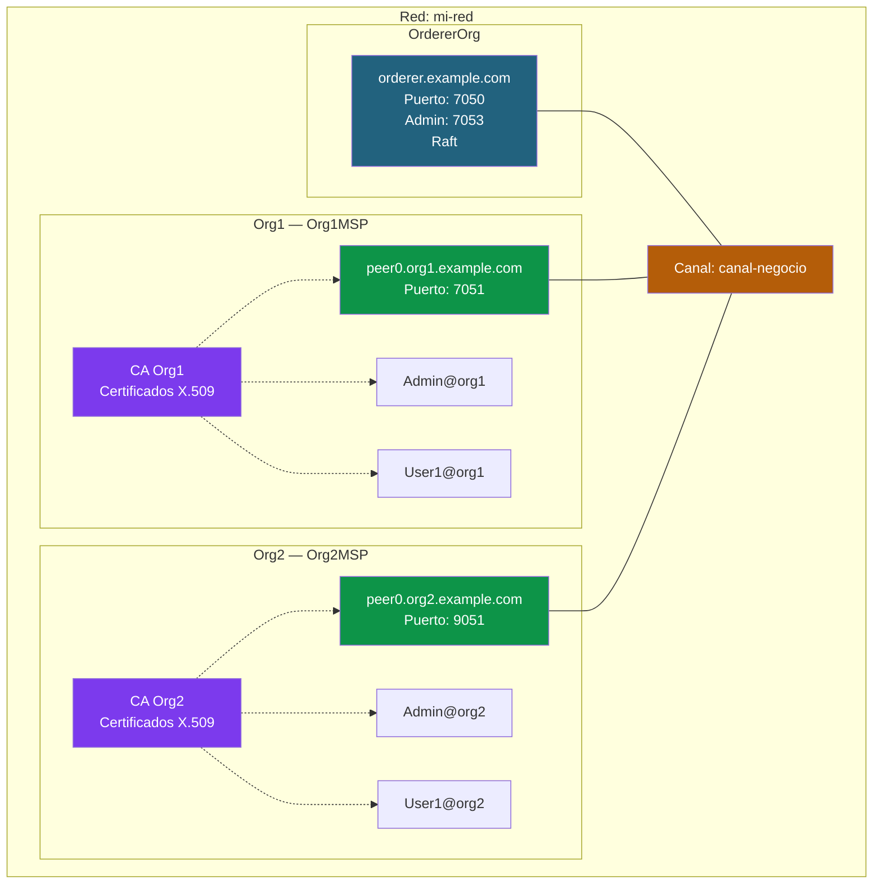
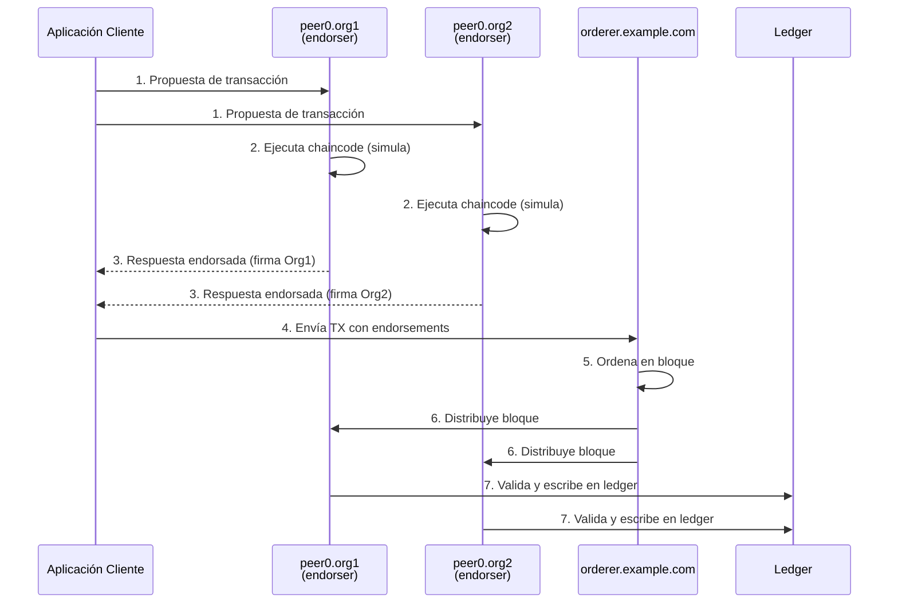
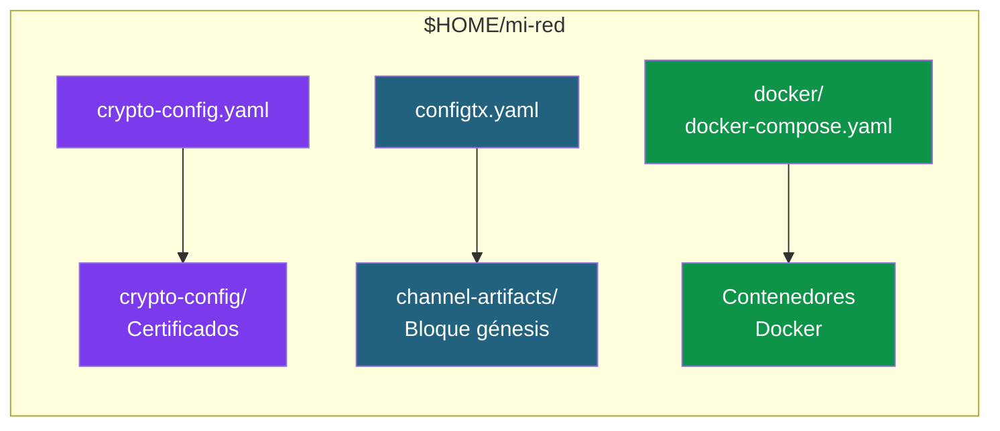

# 03 - Crear una red Hyperledger Fabric personalizada desde cero

En esta guía creamos una red Fabric **sin usar la test-network**, configurando manualmente cada componente. Esto es lo que se haría en un entorno real de producción.

---

## Arquitectura objetivo

Vamos a construir una red Fabric mínima pero completa, con dos organizaciones que comparten un canal de negocio. Cada organización tiene su propio peer y su propia autoridad certificadora (generada con `cryptogen`). Un servicio de ordenación Raft (con un solo nodo, por simplicidad) se encarga de ordenar las transacciones y distribuir los bloques.



**Componentes de la red:**

- **Orderer (orderer.example.com):** Servicio de ordenación basado en Raft. Recibe las transacciones endorsadas, las ordena en bloques y las distribuye a los peers. Usa TLS mutuo para todas las comunicaciones. El puerto 7050 es para el servicio normal y el 7053 para administración (`osnadmin`).

- **Peer0 Org1 y Peer0 Org2:** Cada organización tiene un peer que mantiene una copia del ledger y ejecuta los chaincodes. Los peers de distintas organizaciones se descubren entre sí mediante los **anchor peers** (configurados en `configtx.yaml`). Cada peer tiene su propio certificado TLS y MSP.

- **Canal (canal-negocio):** Un canal es una red lógica privada dentro de Fabric. Solo las organizaciones que pertenecen al canal pueden ver sus transacciones. Nuestra red tiene un único canal compartido entre Org1 y Org2.

- **Identidades (CA → MSP):** Cada organización tiene su propia CA que emite certificados X.509. Estos certificados identifican a peers, admins y usuarios. El MSP (Membership Service Provider) de cada org agrupa estos certificados y define quién pertenece a la organización y con qué rol.

### Flujo de una transacción en esta red



1. La **aplicación cliente** envía una propuesta de transacción a los peers endorsadores de cada organización.
2. Cada peer **ejecuta el chaincode** localmente (simulación) sin escribir en el ledger.
3. Si la ejecución es correcta, cada peer **firma el resultado** y lo devuelve al cliente.
4. El cliente recoge las respuestas endorsadas y las envía al **orderer**.
5. El orderer **ordena** las transacciones y las empaqueta en un bloque.
6. El bloque se **distribuye** a todos los peers del canal.
7. Cada peer **valida** que los endorsements cumplen la política y **escribe** en el ledger.

### Estructura de directorios que vamos a crear



Cada archivo de configuración genera un artefacto distinto:
- **crypto-config.yaml** → genera los certificados y claves de todas las organizaciones
- **configtx.yaml** → genera el bloque génesis del canal con las políticas y la topología
- **docker-compose.yaml** → levanta los contenedores (orderer, peers, CLI)

---

## 1. Crear la estructura de directorios

```bash
mkdir -p $HOME/mi-red/{configtx,crypto-config,channel-artifacts,docker,scripts}
cd $HOME/mi-red
```

---

## 2. Generar material criptográfico

### Opción A: Usando cryptogen (desarrollo)

#### 2.1 Crear `crypto-config.yaml`

Crea el archivo `crypto-config.yaml` en el directorio `$HOME/mi-red` con el siguiente contenido:

```yaml
# crypto-config.yaml
OrdererOrgs:
  - Name: Orderer
    Domain: example.com
    EnableNodeOUs: true
    Specs:
      - Hostname: orderer
        SANS:
          - localhost
          - 127.0.0.1

PeerOrgs:
  - Name: Org1
    Domain: org1.example.com
    EnableNodeOUs: true
    Template:
      Count: 1
      SANS:
        - localhost
        - 127.0.0.1
    Users:
      Count: 1

  - Name: Org2
    Domain: org2.example.com
    EnableNodeOUs: true
    Template:
      Count: 1
      SANS:
        - localhost
        - 127.0.0.1
    Users:
      Count: 1
```

> **Nota:** Copia solo el contenido YAML (desde `OrdererOrgs:` hasta el final).
> Puedes crear el archivo con `code crypto-config.yaml` desde la terminal de Ubuntu
> para abrirlo directamente en VS Code.

**Campos clave:**
- `EnableNodeOUs: true` — Habilita clasificación de identidades por tipo (admin, peer, client, orderer)
- `Template.Count` — Número de peers por organización
- `Users.Count` — Número de usuarios (además del Admin que se crea siempre)

#### 2.2 Generar los certificados

```bash
cryptogen generate --config=crypto-config.yaml --output=crypto-config
```

#### 2.3 Verificar la estructura generada

```bash
tree crypto-config --dirsfirst -L 4
```

Estructura resultante (simplificada):

```
crypto-config/
├── ordererOrganizations/
│   └── example.com/
│       ├── ca/                          # CA del orderer
│       ├── msp/                         # MSP de la org orderer
│       ├── orderers/
│       │   └── orderer.example.com/
│       │       ├── msp/                 # MSP del nodo orderer
│       │       └── tls/                 # Certificados TLS
│       ├── tlsca/                       # TLS CA
│       └── users/
│           └── Admin@example.com/
└── peerOrganizations/
    ├── org1.example.com/
    │   ├── ca/
    │   ├── msp/
    │   ├── peers/
    │   │   └── peer0.org1.example.com/
    │   │       ├── msp/
    │   │       └── tls/
    │   ├── tlsca/
    │   └── users/
    │       ├── Admin@org1.example.com/
    │       └── User1@org1.example.com/
    └── org2.example.com/
        └── (misma estructura que org1)
```

### Opción B: Usando Fabric CA (producción)

Ver [04 - Fabric CA en detalle](04-fabric-ca.md) para el flujo completo con CAs.

---

## 3. Configurar la topología de la red (configtx.yaml)

Este es el archivo más importante. Define organizaciones, políticas, orderer y perfiles de canales.

Crea el archivo `configtx.yaml` en el directorio `$HOME/mi-red` con el siguiente contenido:

```yaml
# configtx.yaml
---
Organizations:
  - &OrdererOrg
    Name: OrdererOrg
    ID: OrdererMSP
    MSPDir: crypto-config/ordererOrganizations/example.com/msp
    Policies:
      Readers:
        Type: Signature
        Rule: "OR('OrdererMSP.member')"
      Writers:
        Type: Signature
        Rule: "OR('OrdererMSP.member')"
      Admins:
        Type: Signature
        Rule: "OR('OrdererMSP.admin')"
    OrdererEndpoints:
      - orderer.example.com:7050

  - &Org1
    Name: Org1MSP
    ID: Org1MSP
    MSPDir: crypto-config/peerOrganizations/org1.example.com/msp
    Policies:
      Readers:
        Type: Signature
        Rule: "OR('Org1MSP.admin', 'Org1MSP.peer', 'Org1MSP.client')"
      Writers:
        Type: Signature
        Rule: "OR('Org1MSP.admin', 'Org1MSP.client')"
      Admins:
        Type: Signature
        Rule: "OR('Org1MSP.admin')"
      Endorsement:
        Type: Signature
        Rule: "OR('Org1MSP.peer')"
    AnchorPeers:
      - Host: peer0.org1.example.com
        Port: 7051

  - &Org2
    Name: Org2MSP
    ID: Org2MSP
    MSPDir: crypto-config/peerOrganizations/org2.example.com/msp
    Policies:
      Readers:
        Type: Signature
        Rule: "OR('Org2MSP.admin', 'Org2MSP.peer', 'Org2MSP.client')"
      Writers:
        Type: Signature
        Rule: "OR('Org2MSP.admin', 'Org2MSP.client')"
      Admins:
        Type: Signature
        Rule: "OR('Org2MSP.admin')"
      Endorsement:
        Type: Signature
        Rule: "OR('Org2MSP.peer')"
    AnchorPeers:
      - Host: peer0.org2.example.com
        Port: 9051

Capabilities:
  Channel: &ChannelCapabilities
    V2_0: true
  Orderer: &OrdererCapabilities
    V2_0: true
  Application: &ApplicationCapabilities
    V2_0: true

Application: &ApplicationDefaults
  Organizations:
  Policies:
    Readers:
      Type: ImplicitMeta
      Rule: "ANY Readers"
    Writers:
      Type: ImplicitMeta
      Rule: "ANY Writers"
    Admins:
      Type: ImplicitMeta
      Rule: "MAJORITY Admins"
    LifecycleEndorsement:
      Type: ImplicitMeta
      Rule: "MAJORITY Endorsement"
    Endorsement:
      Type: ImplicitMeta
      Rule: "MAJORITY Endorsement"
  Capabilities:
    <<: *ApplicationCapabilities

Orderer: &OrdererDefaults
  OrdererType: etcdraft
  BatchTimeout: 2s
  BatchSize:
    MaxMessageCount: 10
    AbsoluteMaxBytes: 99 MB
    PreferredMaxBytes: 512 KB
  EtcdRaft:
    Consenters:
      - Host: orderer.example.com
        Port: 7050
        ClientTLSCert: crypto-config/ordererOrganizations/example.com/orderers/orderer.example.com/tls/server.crt
        ServerTLSCert: crypto-config/ordererOrganizations/example.com/orderers/orderer.example.com/tls/server.crt
  Organizations:
  Policies:
    Readers:
      Type: ImplicitMeta
      Rule: "ANY Readers"
    Writers:
      Type: ImplicitMeta
      Rule: "ANY Writers"
    Admins:
      Type: ImplicitMeta
      Rule: "MAJORITY Admins"
    BlockValidation:
      Type: ImplicitMeta
      Rule: "ANY Writers"
  Capabilities:
    <<: *OrdererCapabilities

Channel: &ChannelDefaults
  Policies:
    Readers:
      Type: ImplicitMeta
      Rule: "ANY Readers"
    Writers:
      Type: ImplicitMeta
      Rule: "ANY Writers"
    Admins:
      Type: ImplicitMeta
      Rule: "MAJORITY Admins"
  Capabilities:
    <<: *ChannelCapabilities

Profiles:
  CanalNegocio:
    <<: *ChannelDefaults
    Orderer:
      <<: *OrdererDefaults
      Organizations:
        - *OrdererOrg
    Application:
      <<: *ApplicationDefaults
      Organizations:
        - *Org1
        - *Org2
```

> **Nota:** Copia solo el contenido YAML (desde `---` hasta el final).
> Puedes crear el archivo con `code configtx.yaml` desde la terminal de Ubuntu.

### Conceptos clave del configtx.yaml

| Sección | Propósito |
|---|---|
| **Organizations** | Define cada organización con su MSP y políticas |
| **Orderer** | Tipo de consenso (Raft), configuración de batches, consenters |
| **Application** | Políticas de aplicación (endorsement, lifecycle) |
| **Channel** | Políticas a nivel de canal |
| **Profiles** | Perfiles reutilizables para crear canales |
| **Capabilities** | Versión de funcionalidades habilitadas |

### Tipos de políticas

- **Signature**: Regla explícita (`OR('Org1MSP.admin')`)
- **ImplicitMeta**: Regla agregada sobre sub-políticas (`MAJORITY Admins` = mayoría de las políticas Admins de las organizaciones miembro)

---

## 4. Generar el bloque génesis del canal

```bash
export FABRIC_CFG_PATH=$PWD

configtxgen -profile CanalNegocio \
  -outputBlock channel-artifacts/canal-negocio.block \
  -channelID canal-negocio
```

Verificar que se generó:

```bash
ls -la channel-artifacts/
```

---

## 5. Configurar Docker Compose

### 5.1 Crear el archivo `docker/docker-compose.yaml`

Crea el archivo `docker/docker-compose.yaml` con el siguiente contenido:

```yaml
# docker/docker-compose.yaml
version: '3.7'

volumes:
  orderer.example.com:
  peer0.org1.example.com:
  peer0.org2.example.com:

networks:
  fabric-net:
    name: fabric-net

services:
  # ============================================================
  # ORDERER
  # ============================================================
  orderer.example.com:
    container_name: orderer.example.com
    image: hyperledger/fabric-orderer:2.5
    environment:
      - FABRIC_LOGGING_SPEC=INFO
      - ORDERER_GENERAL_LISTENADDRESS=0.0.0.0
      - ORDERER_GENERAL_LISTENPORT=7050
      - ORDERER_GENERAL_LOCALMSPID=OrdererMSP
      - ORDERER_GENERAL_LOCALMSPDIR=/var/hyperledger/orderer/msp
      - ORDERER_GENERAL_TLS_ENABLED=true
      - ORDERER_GENERAL_TLS_PRIVATEKEY=/var/hyperledger/orderer/tls/server.key
      - ORDERER_GENERAL_TLS_CERTIFICATE=/var/hyperledger/orderer/tls/server.crt
      - ORDERER_GENERAL_TLS_ROOTCAS=[/var/hyperledger/orderer/tls/ca.crt]
      - ORDERER_GENERAL_CLUSTER_CLIENTCERTIFICATE=/var/hyperledger/orderer/tls/server.crt
      - ORDERER_GENERAL_CLUSTER_CLIENTPRIVATEKEY=/var/hyperledger/orderer/tls/server.key
      - ORDERER_GENERAL_CLUSTER_ROOTCAS=[/var/hyperledger/orderer/tls/ca.crt]
      - ORDERER_GENERAL_BOOTSTRAPMETHOD=none
      - ORDERER_CHANNELPARTICIPATION_ENABLED=true
      - ORDERER_ADMIN_TLS_ENABLED=true
      - ORDERER_ADMIN_TLS_CERTIFICATE=/var/hyperledger/orderer/tls/server.crt
      - ORDERER_ADMIN_TLS_PRIVATEKEY=/var/hyperledger/orderer/tls/server.key
      - ORDERER_ADMIN_TLS_ROOTCAS=[/var/hyperledger/orderer/tls/ca.crt]
      - ORDERER_ADMIN_TLS_CLIENTROOTCAS=[/var/hyperledger/orderer/tls/ca.crt]
      - ORDERER_ADMIN_LISTENADDRESS=0.0.0.0:7053
    working_dir: /root
    command: orderer
    volumes:
      - ../crypto-config/ordererOrganizations/example.com/orderers/orderer.example.com/msp:/var/hyperledger/orderer/msp
      - ../crypto-config/ordererOrganizations/example.com/orderers/orderer.example.com/tls:/var/hyperledger/orderer/tls
      - orderer.example.com:/var/hyperledger/production/orderer
    ports:
      - 7050:7050
      - 7053:7053
    networks:
      - fabric-net

  # ============================================================
  # PEER0 ORG1
  # ============================================================
  peer0.org1.example.com:
    container_name: peer0.org1.example.com
    image: hyperledger/fabric-peer:2.5
    environment:
      - FABRIC_LOGGING_SPEC=INFO
      - CORE_PEER_ID=peer0.org1.example.com
      - CORE_PEER_ADDRESS=peer0.org1.example.com:7051
      - CORE_PEER_LISTENADDRESS=0.0.0.0:7051
      - CORE_PEER_CHAINCODEADDRESS=peer0.org1.example.com:7052
      - CORE_PEER_CHAINCODELISTENADDRESS=0.0.0.0:7052
      - CORE_PEER_GOSSIP_BOOTSTRAP=peer0.org1.example.com:7051
      - CORE_PEER_GOSSIP_EXTERNALENDPOINT=peer0.org1.example.com:7051
      - CORE_PEER_LOCALMSPID=Org1MSP
      - CORE_PEER_MSPCONFIGPATH=/etc/hyperledger/fabric/msp
      - CORE_PEER_TLS_ENABLED=true
      - CORE_PEER_TLS_CERT_FILE=/etc/hyperledger/fabric/tls/server.crt
      - CORE_PEER_TLS_KEY_FILE=/etc/hyperledger/fabric/tls/server.key
      - CORE_PEER_TLS_ROOTCERT_FILE=/etc/hyperledger/fabric/tls/ca.crt
      - CORE_VM_ENDPOINT=unix:///host/var/run/docker.sock
      - CORE_VM_DOCKER_HOSTCONFIG_NETWORKMODE=fabric-net
    working_dir: /root
    command: peer node start
    volumes:
      - /var/run/docker.sock:/host/var/run/docker.sock
      - ../crypto-config/peerOrganizations/org1.example.com/peers/peer0.org1.example.com/msp:/etc/hyperledger/fabric/msp
      - ../crypto-config/peerOrganizations/org1.example.com/peers/peer0.org1.example.com/tls:/etc/hyperledger/fabric/tls
      - peer0.org1.example.com:/var/hyperledger/production
    ports:
      - 7051:7051
    networks:
      - fabric-net

  # ============================================================
  # PEER0 ORG2
  # ============================================================
  peer0.org2.example.com:
    container_name: peer0.org2.example.com
    image: hyperledger/fabric-peer:2.5
    environment:
      - FABRIC_LOGGING_SPEC=INFO
      - CORE_PEER_ID=peer0.org2.example.com
      - CORE_PEER_ADDRESS=peer0.org2.example.com:9051
      - CORE_PEER_LISTENADDRESS=0.0.0.0:9051
      - CORE_PEER_CHAINCODEADDRESS=peer0.org2.example.com:9052
      - CORE_PEER_CHAINCODELISTENADDRESS=0.0.0.0:9052
      - CORE_PEER_GOSSIP_BOOTSTRAP=peer0.org2.example.com:9051
      - CORE_PEER_GOSSIP_EXTERNALENDPOINT=peer0.org2.example.com:9051
      - CORE_PEER_LOCALMSPID=Org2MSP
      - CORE_PEER_MSPCONFIGPATH=/etc/hyperledger/fabric/msp
      - CORE_PEER_TLS_ENABLED=true
      - CORE_PEER_TLS_CERT_FILE=/etc/hyperledger/fabric/tls/server.crt
      - CORE_PEER_TLS_KEY_FILE=/etc/hyperledger/fabric/tls/server.key
      - CORE_PEER_TLS_ROOTCERT_FILE=/etc/hyperledger/fabric/tls/ca.crt
      - CORE_VM_ENDPOINT=unix:///host/var/run/docker.sock
      - CORE_VM_DOCKER_HOSTCONFIG_NETWORKMODE=fabric-net
    working_dir: /root
    command: peer node start
    volumes:
      - /var/run/docker.sock:/host/var/run/docker.sock
      - ../crypto-config/peerOrganizations/org2.example.com/peers/peer0.org2.example.com/msp:/etc/hyperledger/fabric/msp
      - ../crypto-config/peerOrganizations/org2.example.com/peers/peer0.org2.example.com/tls:/etc/hyperledger/fabric/tls
      - peer0.org2.example.com:/var/hyperledger/production
    ports:
      - 9051:9051
    networks:
      - fabric-net

  # ============================================================
  # CLI (herramienta para administrar la red)
  # ============================================================
  cli:
    container_name: cli
    image: hyperledger/fabric-tools:2.5
    tty: true
    stdin_open: true
    environment:
      - GOPATH=/opt/gopath
      - FABRIC_LOGGING_SPEC=INFO
      - CORE_PEER_ID=cli
      - CORE_PEER_ADDRESS=peer0.org1.example.com:7051
      - CORE_PEER_LOCALMSPID=Org1MSP
      - CORE_PEER_MSPCONFIGPATH=/opt/gopath/src/github.com/hyperledger/fabric/peer/organizations/peerOrganizations/org1.example.com/users/Admin@org1.example.com/msp
      - CORE_PEER_TLS_ENABLED=true
      - CORE_PEER_TLS_CERT_FILE=/opt/gopath/src/github.com/hyperledger/fabric/peer/organizations/peerOrganizations/org1.example.com/peers/peer0.org1.example.com/tls/server.crt
      - CORE_PEER_TLS_KEY_FILE=/opt/gopath/src/github.com/hyperledger/fabric/peer/organizations/peerOrganizations/org1.example.com/peers/peer0.org1.example.com/tls/server.key
      - CORE_PEER_TLS_ROOTCERT_FILE=/opt/gopath/src/github.com/hyperledger/fabric/peer/organizations/peerOrganizations/org1.example.com/peers/peer0.org1.example.com/tls/ca.crt
    working_dir: /opt/gopath/src/github.com/hyperledger/fabric/peer
    command: /bin/bash
    volumes:
      - ../crypto-config:/opt/gopath/src/github.com/hyperledger/fabric/peer/organizations
      - ../channel-artifacts:/opt/gopath/src/github.com/hyperledger/fabric/peer/channel-artifacts
    networks:
      - fabric-net
    depends_on:
      - orderer.example.com
      - peer0.org1.example.com
      - peer0.org2.example.com
```

> **Nota:** Copia solo el contenido YAML (desde `version: '3.7'` hasta el final).
> Puedes crear el archivo con `code docker/docker-compose.yaml` desde la terminal de Ubuntu.

---

## 6. Levantar la red

```bash
cd $HOME/mi-red
docker compose -f docker/docker-compose.yaml up -d
```

### Verificar que todos los contenedores están corriendo

```bash
docker ps --format "table {{.Names}}\t{{.Status}}"
```

Resultado esperado:

```
NAMES                       STATUS
cli                         Up ...
peer0.org1.example.com      Up ...
peer0.org2.example.com      Up ...
orderer.example.com         Up ...
```

### Ver logs de un componente

```bash
docker logs orderer.example.com --tail 50
docker logs peer0.org1.example.com --tail 50
```

---

## 7. Crear el canal

### 7.1 Unir el orderer al canal con osnadmin

```bash
export ORDERER_CA=$HOME/mi-red/crypto-config/ordererOrganizations/example.com/orderers/orderer.example.com/tls/ca.crt
export ORDERER_ADMIN_TLS_CERT=$HOME/mi-red/crypto-config/ordererOrganizations/example.com/orderers/orderer.example.com/tls/server.crt
export ORDERER_ADMIN_TLS_KEY=$HOME/mi-red/crypto-config/ordererOrganizations/example.com/orderers/orderer.example.com/tls/server.key

osnadmin channel join \
  --channelID canal-negocio \
  --config-block channel-artifacts/canal-negocio.block \
  -o localhost:7053 \
  --ca-file $ORDERER_CA \
  --client-cert $ORDERER_ADMIN_TLS_CERT \
  --client-key $ORDERER_ADMIN_TLS_KEY
```

### 7.2 Verificar que el canal se creó

```bash
osnadmin channel list \
  -o localhost:7053 \
  --ca-file $ORDERER_CA \
  --client-cert $ORDERER_ADMIN_TLS_CERT \
  --client-key $ORDERER_ADMIN_TLS_KEY
```

---

## 8. Unir los peers al canal

### 8.1 Unir peer0.org1

```bash
export FABRIC_CFG_PATH=$HOME/fabric/fabric-samples/config
export CORE_PEER_TLS_ENABLED=true
export CORE_PEER_LOCALMSPID=Org1MSP
export CORE_PEER_TLS_ROOTCERT_FILE=$HOME/mi-red/crypto-config/peerOrganizations/org1.example.com/peers/peer0.org1.example.com/tls/ca.crt
export CORE_PEER_MSPCONFIGPATH=$HOME/mi-red/crypto-config/peerOrganizations/org1.example.com/users/Admin@org1.example.com/msp
export CORE_PEER_ADDRESS=localhost:7051

peer channel join -b channel-artifacts/canal-negocio.block
```

### 8.2 Unir peer0.org2

```bash
export CORE_PEER_LOCALMSPID=Org2MSP
export CORE_PEER_TLS_ROOTCERT_FILE=$HOME/mi-red/crypto-config/peerOrganizations/org2.example.com/peers/peer0.org2.example.com/tls/ca.crt
export CORE_PEER_MSPCONFIGPATH=$HOME/mi-red/crypto-config/peerOrganizations/org2.example.com/users/Admin@org2.example.com/msp
export CORE_PEER_ADDRESS=localhost:9051

peer channel join -b channel-artifacts/canal-negocio.block
```

### 8.3 Verificar que los peers se unieron

```bash
# Desde Org1
export CORE_PEER_TLS_ENABLED=true
export CORE_PEER_LOCALMSPID=Org1MSP
export CORE_PEER_ADDRESS=localhost:7051
export CORE_PEER_TLS_ROOTCERT_FILE=$HOME/mi-red/crypto-config/peerOrganizations/org1.example.com/peers/peer0.org1.example.com/tls/ca.crt
export CORE_PEER_MSPCONFIGPATH=$HOME/mi-red/crypto-config/peerOrganizations/org1.example.com/users/Admin@org1.example.com/msp
peer channel list
```

Resultado: `canal-negocio`

---

## 9. Anchor peers

Los anchor peers permiten el descubrimiento entre organizaciones (gossip inter-org).

En nuestro caso, los anchor peers **ya están configurados** porque los definimos en `configtx.yaml`:

```yaml
  - &Org1
    ...
    AnchorPeers:
      - Host: peer0.org1.example.com
        Port: 7051

  - &Org2
    ...
    AnchorPeers:
      - Host: peer0.org2.example.com
        Port: 9051
```

Al crear el canal con `configtxgen`, estos anchor peers quedaron incluidos en el bloque génesis. **No es necesario hacer nada más.**

> **Nota:** Si no hubiéramos definido `AnchorPeers` en `configtx.yaml`, habría que añadirlos
> después de crear el canal mediante una actualización de configuración con `configtxlator`.
> Este proceso es más complejo y se usa cuando se necesita modificar la configuración de un
> canal que ya está en funcionamiento.

---

## 10. Apagar y limpiar

### Apagar la red (conservando datos)

```bash
docker compose -f docker/docker-compose.yaml down
```

### Apagar y eliminar todo (volúmenes incluidos)

```bash
docker compose -f docker/docker-compose.yaml down -v
rm -rf crypto-config channel-artifacts/*.block channel-artifacts/*.pb channel-artifacts/*.json
```

---

## Resumen del flujo completo

```
1. crypto-config.yaml          → cryptogen generate     → Certificados
2. configtx.yaml               → configtxgen            → Bloque génesis del canal
3. docker-compose.yaml         → docker compose up      → Nodos corriendo
4. osnadmin channel join       →                        → Orderer en el canal
5. peer channel join           →                        → Peers en el canal
6. Configurar anchor peers     →                        → Gossip inter-org
```

---

**Anterior:** [02 - Test Network](02-test-network.md)
**Siguiente:** [04 - Fabric CA: gestión de identidades](04-fabric-ca.md)
