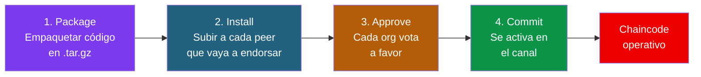
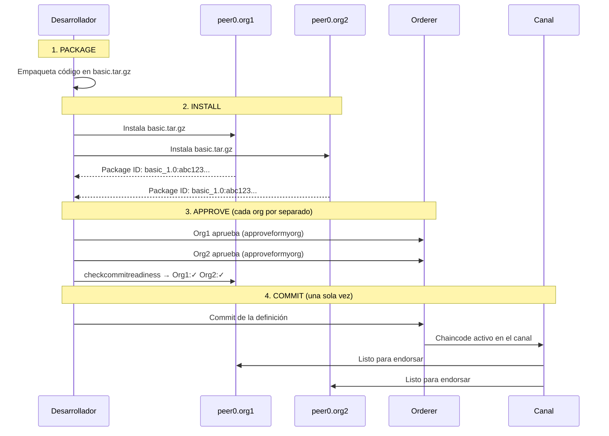
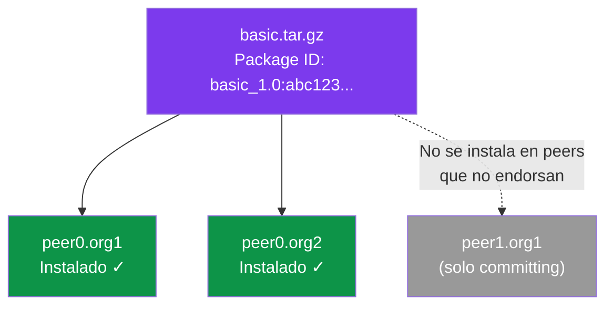
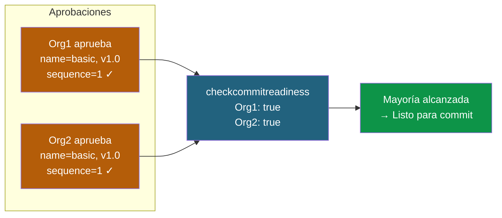
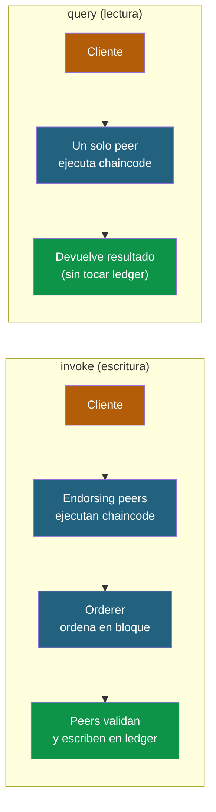
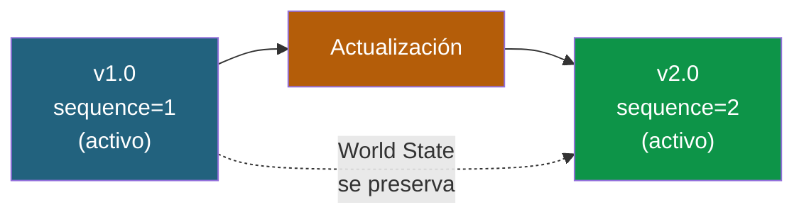

# 04 - Ciclo de vida de un Chaincode (Smart Contract)

En Hyperledger Fabric, desplegar un chaincode no es un solo paso. Requiere un proceso de gobernanza donde **múltiples organizaciones deben aprobar** antes de que el chaincode sea operativo en el canal.

Esto es radicalmente distinto a Ethereum, donde cualquiera puede desplegar un smart contract con una sola transacción. En Fabric, el despliegue es un proceso **democrático**: las organizaciones del canal votan si aceptan o no un chaincode antes de que entre en funcionamiento. Es como si los socios de una empresa tuvieran que aprobar cada nuevo sistema informático antes de ponerlo en producción.

### ¿Por qué este proceso tan complejo?

En una red permissioned, los participantes necesitan confiar en el código que se va a ejecutar sobre sus datos. No puedes permitir que una organización despliegue unilateralmente un chaincode que modifique el ledger compartido. El lifecycle de Fabric garantiza que:

- Cada organización **revisa el código** antes de aprobarlo
- Se necesita **mayoría** (o la política que se defina) para activar un chaincode
- Las **actualizaciones** requieren la misma gobernanza que el despliegue inicial
- Cada organización puede **instalar su propia versión** del paquete (compilada por ellos) siempre que el resultado sea el mismo

---

## Comparativa rápida: Solidity (EVM) vs Chaincode (Fabric)

| Aspecto | EVM (Ethereum) | Hyperledger Fabric |
|---|---|---|
| Lenguajes | Solidity, Vyper | Go, Node.js, Java |
| Despliegue | Una transacción | 4 pasos (package → install → approve → commit) |
| Quién despliega | Cualquier cuenta | Solo organizaciones autorizadas |
| Actualización | Proxy pattern / nuevo deploy | Incrementar `sequence` + re-aprobar |
| Estado | Mapping en storage | World State (LevelDB o CouchDB) |
| Ejecución | En todos los nodos | Solo en endorsing peers |
| Determinismo | Garantizado por EVM | Responsabilidad del desarrollador |

---

## El flujo de 4 pasos

El lifecycle de un chaincode en Fabric sigue siempre el mismo patrón: empaquetar, instalar, aprobar y activar. Cada paso tiene un propósito claro y un responsable distinto.





**¿Quién hace qué?**

| Paso | ¿Quién lo hace? | ¿Cuántas veces? | ¿Qué produce? |
|------|-----------------|-----------------|----------------|
| **Package** | Un desarrollador (cualquier org) | 1 vez | Archivo `.tar.gz` con el código |
| **Install** | Admin de cada org en su peer | 1 vez por peer | El peer tiene el código listo |
| **Approve** | Admin de cada org | 1 vez por org | Voto registrado en el orderer |
| **Commit** | Cualquier admin (una sola vez) | 1 vez para toda la red | Chaincode activo en el canal |

> **Analogía:** Es como aprobar un nuevo reglamento en una comunidad de vecinos. Alguien redacta la propuesta (package), se la envía a cada vecino (install), cada vecino vota a favor (approve) y cuando hay mayoría, el presidente la registra oficialmente (commit).

---

## Prerequisitos

Estos ejemplos asumen que tienes la red levantada (ver docs anteriores) y las variables de entorno configuradas:

```bash
export PATH=${PWD}/../bin:$PATH
export FABRIC_CFG_PATH=${PWD}/../config/
```

---

## Paso 1: Empaquetar el chaincode

El primer paso es tomar el código fuente del chaincode y empaquetarlo en un archivo `.tar.gz`. Este paquete contiene el código, sus dependencias y unos metadatos (lenguaje, etiqueta).

El paquete es **portátil**: se puede crear en un ordenador y distribuir a todas las organizaciones. Cada organización puede incluso compilar su propia versión del código (para auditarlo), siempre que el resultado funcional sea el mismo.

La **etiqueta** (`--label basic_1.0`) es un identificador legible que ayuda a distinguir versiones. Se recomienda incluir nombre y versión.

### Go

```bash
# Descargar dependencias del módulo Go
cd ../asset-transfer-basic/chaincode-go
GO111MODULE=on go mod vendor
cd ../../test-network

# Empaquetar
peer lifecycle chaincode package basic.tar.gz \
  --path ../asset-transfer-basic/chaincode-go/ \
  --lang golang \
  --label basic_1.0
```

### Node.js

```bash
cd ../asset-transfer-basic/chaincode-javascript
npm install
cd ../../test-network

peer lifecycle chaincode package basic.tar.gz \
  --path ../asset-transfer-basic/chaincode-javascript/ \
  --lang node \
  --label basic_1.0
```

### Java

```bash
cd ../asset-transfer-basic/chaincode-java
./gradlew installDist
cd ../../test-network

peer lifecycle chaincode package basic.tar.gz \
  --path ../asset-transfer-basic/chaincode-java/ \
  --lang java \
  --label basic_1.0
```

**Resultado:** archivo `basic.tar.gz` en el directorio actual.

**Parámetros:**
| Flag | Descripción |
|---|---|
| `--path` | Ruta al código fuente |
| `--lang` | Lenguaje: `golang`, `node`, `java` |
| `--label` | Etiqueta identificativa (nombre_versión) |

---

## Paso 2: Instalar en los peers

El chaincode debe instalarse en **cada peer que vaya a endosar transacciones**. Instalar no es lo mismo que activar — es simplemente subir el código al peer para que esté listo.

Un detalle importante: **no es necesario instalar el chaincode en todos los peers**. Solo necesitan tenerlo los peers que vayan a participar en el endorsement. Los peers que solo commitean bloques (committing peers) no necesitan el chaincode instalado.

Tras la instalación, el peer devuelve un **Package ID** que es un hash del contenido del paquete. Este ID es fundamental para el paso siguiente (approve) porque vincula la aprobación de cada org con un paquete concreto de código.



### Instalar en peer0.org1

```bash
# Configurar entorno como Org1
export CORE_PEER_TLS_ENABLED=true
export CORE_PEER_LOCALMSPID=Org1MSP
export CORE_PEER_TLS_ROOTCERT_FILE=${PWD}/organizations/peerOrganizations/org1.example.com/peers/peer0.org1.example.com/tls/ca.crt
export CORE_PEER_MSPCONFIGPATH=${PWD}/organizations/peerOrganizations/org1.example.com/users/Admin@org1.example.com/msp
export CORE_PEER_ADDRESS=localhost:7051

peer lifecycle chaincode install basic.tar.gz
```

### Instalar en peer0.org2

```bash
export CORE_PEER_LOCALMSPID=Org2MSP
export CORE_PEER_TLS_ROOTCERT_FILE=${PWD}/organizations/peerOrganizations/org2.example.com/peers/peer0.org2.example.com/tls/ca.crt
export CORE_PEER_MSPCONFIGPATH=${PWD}/organizations/peerOrganizations/org2.example.com/users/Admin@org2.example.com/msp
export CORE_PEER_ADDRESS=localhost:9051

peer lifecycle chaincode install basic.tar.gz
```

### Consultar el Package ID (lo necesitarás para aprobar)

```bash
peer lifecycle chaincode queryinstalled
```

Resultado:

```
Installed chaincodes on peer:
Package ID: basic_1.0:abc123def456..., Label: basic_1.0
```

Guardar el Package ID:

```bash
export CC_PACKAGE_ID=basic_1.0:abc123def456...
```

---

## Paso 3: Aprobar el chaincode por organización

Este es el paso de **gobernanza**. Cada organización revisa el chaincode y decide si lo acepta o no. La aprobación registra en el orderer que "esta org está de acuerdo con esta definición de chaincode".

La definición incluye: nombre del chaincode, versión, Package ID (hash del código), número de secuencia y política de endorsement. Todas las orgs deben aprobar **la misma definición** (mismo nombre, versión, secuencia). Si una org aprueba con parámetros diferentes, no contará como aprobación válida.

El `--sequence` es un contador que empieza en 1 y se incrementa con cada actualización. Fabric lo usa para garantizar que todas las orgs están aprobando la misma "iteración" del chaincode.



### Aprobar como Org1

```bash
# Asegurarse de estar como Org1
export CORE_PEER_LOCALMSPID=Org1MSP
export CORE_PEER_ADDRESS=localhost:7051
export CORE_PEER_MSPCONFIGPATH=${PWD}/organizations/peerOrganizations/org1.example.com/users/Admin@org1.example.com/msp
export CORE_PEER_TLS_ROOTCERT_FILE=${PWD}/organizations/peerOrganizations/org1.example.com/peers/peer0.org1.example.com/tls/ca.crt

peer lifecycle chaincode approveformyorg \
  -o localhost:7050 \
  --ordererTLSHostnameOverride orderer.example.com \
  --tls \
  --cafile "${PWD}/organizations/ordererOrganizations/example.com/orderers/orderer.example.com/msp/tlscacerts/tlsca.example.com-cert.pem" \
  --channelID mychannel \
  --name basic \
  --version 1.0 \
  --package-id $CC_PACKAGE_ID \
  --sequence 1
```

### Aprobar como Org2

```bash
export CORE_PEER_LOCALMSPID=Org2MSP
export CORE_PEER_ADDRESS=localhost:9051
export CORE_PEER_MSPCONFIGPATH=${PWD}/organizations/peerOrganizations/org2.example.com/users/Admin@org2.example.com/msp
export CORE_PEER_TLS_ROOTCERT_FILE=${PWD}/organizations/peerOrganizations/org2.example.com/peers/peer0.org2.example.com/tls/ca.crt

peer lifecycle chaincode approveformyorg \
  -o localhost:7050 \
  --ordererTLSHostnameOverride orderer.example.com \
  --tls \
  --cafile "${PWD}/organizations/ordererOrganizations/example.com/orderers/orderer.example.com/msp/tlscacerts/tlsca.example.com-cert.pem" \
  --channelID mychannel \
  --name basic \
  --version 1.0 \
  --package-id $CC_PACKAGE_ID \
  --sequence 1
```

### Verificar quién ha aprobado

```bash
peer lifecycle chaincode checkcommitreadiness \
  --channelID mychannel \
  --name basic \
  --version 1.0 \
  --sequence 1 \
  --output json
```

Resultado:

```json
{
  "approvals": {
    "Org1MSP": true,
    "Org2MSP": true
  }
}
```

---

## Paso 4: Commit (activar en el canal)

El commit es el momento en que el chaincode **se activa oficialmente** en el canal. Solo se ejecuta una vez (por cualquier admin) y solo tiene éxito si la política de lifecycle se cumple (por defecto, mayoría de organizaciones deben haber aprobado).

El commit necesita contactar a **peers de las organizaciones que han aprobado** para recoger sus firmas como prueba de que efectivamente aprobaron. Por eso se pasan los `--peerAddresses` de ambas orgs.

A partir del commit, el chaincode está vivo: cualquier cliente autorizado puede invocarlo.

```bash
peer lifecycle chaincode commit \
  -o localhost:7050 \
  --ordererTLSHostnameOverride orderer.example.com \
  --tls \
  --cafile "${PWD}/organizations/ordererOrganizations/example.com/orderers/orderer.example.com/msp/tlscacerts/tlsca.example.com-cert.pem" \
  --channelID mychannel \
  --name basic \
  --version 1.0 \
  --sequence 1 \
  --peerAddresses localhost:7051 \
  --tlsRootCertFiles "${PWD}/organizations/peerOrganizations/org1.example.com/peers/peer0.org1.example.com/tls/ca.crt" \
  --peerAddresses localhost:9051 \
  --tlsRootCertFiles "${PWD}/organizations/peerOrganizations/org2.example.com/peers/peer0.org2.example.com/tls/ca.crt"
```

### Verificar que el chaincode está activo

```bash
peer lifecycle chaincode querycommitted --channelID mychannel --name basic
```

---

## 5. Invocar y consultar

Con el chaincode activo, ya podemos interactuar con él. Hay dos tipos de operaciones:

- **invoke** (escritura): Modifica el World State. Requiere endorsement de los peers y pasa por el orderer. Es más lento porque genera una transacción en el ledger.
- **query** (lectura): Solo lee del World State. Se ejecuta en un único peer, no genera transacción y es mucho más rápido.



### Inicializar

```bash
peer chaincode invoke \
  -o localhost:7050 \
  --ordererTLSHostnameOverride orderer.example.com \
  --tls \
  --cafile "${PWD}/organizations/ordererOrganizations/example.com/orderers/orderer.example.com/msp/tlscacerts/tlsca.example.com-cert.pem" \
  -C mychannel \
  -n basic \
  --peerAddresses localhost:7051 \
  --tlsRootCertFiles "${PWD}/organizations/peerOrganizations/org1.example.com/peers/peer0.org1.example.com/tls/ca.crt" \
  --peerAddresses localhost:9051 \
  --tlsRootCertFiles "${PWD}/organizations/peerOrganizations/org2.example.com/peers/peer0.org2.example.com/tls/ca.crt" \
  -c '{"function":"InitLedger","Args":[]}'
```

### Consultar

```bash
peer chaincode query -C mychannel -n basic -c '{"Args":["GetAllAssets"]}'
```

### Invocar una función

```bash
peer chaincode invoke \
  -o localhost:7050 \
  --ordererTLSHostnameOverride orderer.example.com \
  --tls \
  --cafile "${PWD}/organizations/ordererOrganizations/example.com/orderers/orderer.example.com/msp/tlscacerts/tlsca.example.com-cert.pem" \
  -C mychannel \
  -n basic \
  --peerAddresses localhost:7051 \
  --tlsRootCertFiles "${PWD}/organizations/peerOrganizations/org1.example.com/peers/peer0.org1.example.com/tls/ca.crt" \
  --peerAddresses localhost:9051 \
  --tlsRootCertFiles "${PWD}/organizations/peerOrganizations/org2.example.com/peers/peer0.org2.example.com/tls/ca.crt" \
  -c '{"function":"CreateAsset","Args":["asset7","yellow","10","Elena","500"]}'
```

---

## 6. Actualizar un chaincode

Una de las grandes ventajas de Fabric sobre Ethereum: los chaincodes **se pueden actualizar** sin perder datos ni necesitar patrones proxy. El proceso es el mismo que el despliegue inicial, pero con el `--sequence` incrementado.



El sequence actúa como un **número de versión del despliegue** (no del código). Cada vez que se quiere cambiar algo del chaincode en el canal — ya sea el código, la política de endorsement o la colección de datos privados — hay que incrementar el sequence y repetir el ciclo approve + commit.

> **Importante:** El World State se **preserva** entre actualizaciones. Los datos no se pierden. Pero hay que tener cuidado con la compatibilidad: si el nuevo código espera campos que no existen en los datos antiguos, hay que manejar la migración (ver Módulo 4, día 5).

Para actualizar un chaincode ya desplegado, repetir el flujo con **sequence incrementado**:

```bash
# 1. Empaquetar nueva versión
peer lifecycle chaincode package basic_2.tar.gz \
  --path ../asset-transfer-basic/chaincode-go/ \
  --lang golang \
  --label basic_2.0

# 2. Instalar en todos los peers
peer lifecycle chaincode install basic_2.tar.gz

# 3. Obtener nuevo Package ID
peer lifecycle chaincode queryinstalled
export CC_PACKAGE_ID=basic_2.0:...

# 4. Aprobar con sequence=2 (cada org)
peer lifecycle chaincode approveformyorg \
  -o localhost:7050 \
  --ordererTLSHostnameOverride orderer.example.com \
  --tls \
  --cafile "${PWD}/organizations/ordererOrganizations/example.com/orderers/orderer.example.com/msp/tlscacerts/tlsca.example.com-cert.pem" \
  --channelID mychannel \
  --name basic \
  --version 2.0 \
  --package-id $CC_PACKAGE_ID \
  --sequence 2

# 5. Commit con sequence=2
peer lifecycle chaincode commit \
  -o localhost:7050 \
  --ordererTLSHostnameOverride orderer.example.com \
  --tls \
  --cafile "${PWD}/organizations/ordererOrganizations/example.com/orderers/orderer.example.com/msp/tlscacerts/tlsca.example.com-cert.pem" \
  --channelID mychannel \
  --name basic \
  --version 2.0 \
  --sequence 2 \
  --peerAddresses localhost:7051 \
  --tlsRootCertFiles "${PWD}/organizations/peerOrganizations/org1.example.com/peers/peer0.org1.example.com/tls/ca.crt" \
  --peerAddresses localhost:9051 \
  --tlsRootCertFiles "${PWD}/organizations/peerOrganizations/org2.example.com/peers/peer0.org2.example.com/tls/ca.crt"
```

> **Nota importante:** El world state se **preserva** entre actualizaciones. No se pierden datos.

---

## 7. Políticas de endorsement

Las políticas de endorsement definen **cuántas y cuáles organizaciones deben ejecutar y firmar una transacción** antes de que sea válida. Es el mecanismo fundamental de confianza en Fabric: ninguna organización puede modificar el ledger unilateralmente.

Por defecto, se aplica la política `MAJORITY Endorsement` (mayoría de las orgs deben endosar). Se puede personalizar:

### Al aprobar/commit

```bash
# Requiere endorsement de AMBAS orgs
--signature-policy "AND('Org1MSP.peer','Org2MSP.peer')"

# Requiere endorsement de CUALQUIERA
--signature-policy "OR('Org1MSP.peer','Org2MSP.peer')"

# Usar la política por defecto del canal
--channel-config-policy /Channel/Application/Endorsement
```

---

## Resumen de comandos del lifecycle

| Paso | Comando | Quién lo ejecuta |
|---|---|---|
| Empaquetar | `peer lifecycle chaincode package` | Cualquier admin |
| Instalar | `peer lifecycle chaincode install` | Admin de cada org (en su peer) |
| Consultar instalados | `peer lifecycle chaincode queryinstalled` | Admin del peer |
| Aprobar | `peer lifecycle chaincode approveformyorg` | Admin de cada org |
| Verificar aprobaciones | `peer lifecycle chaincode checkcommitreadiness` | Cualquiera |
| Commit | `peer lifecycle chaincode commit` | Cualquier admin (una vez) |
| Consultar committed | `peer lifecycle chaincode querycommitted` | Cualquiera |
| Invocar | `peer chaincode invoke` | Clientes autorizados |
| Consultar | `peer chaincode query` | Clientes autorizados |

---

**Anterior:** [03 - Crear una red personalizada](03-crear-red-personalizada.md)
**Siguiente:** Módulo 4 — Tokens y Smart Contracts (ver slides en `docs/slides/Modulo 4/`)
