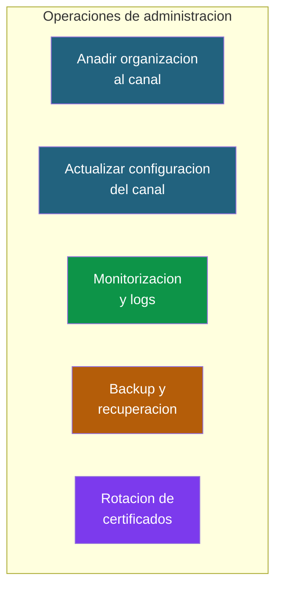
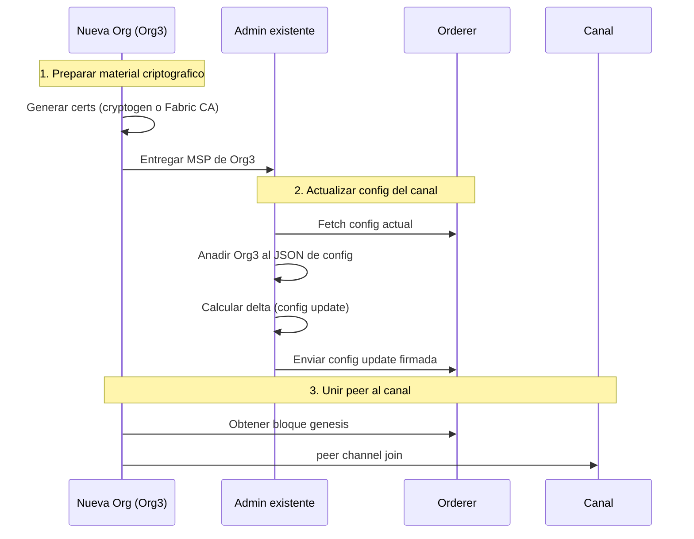
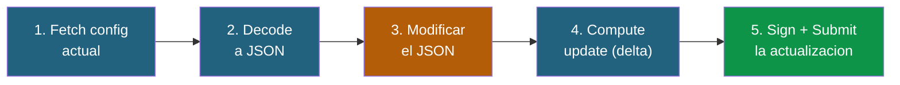
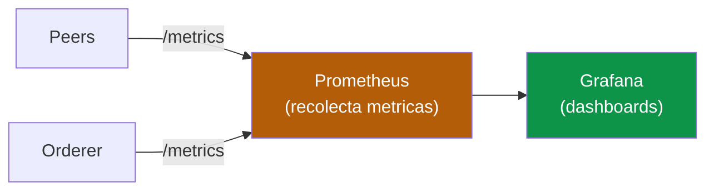
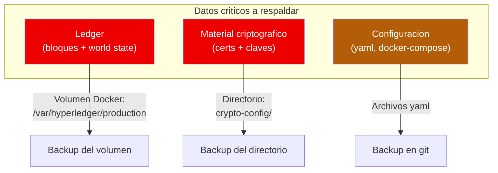
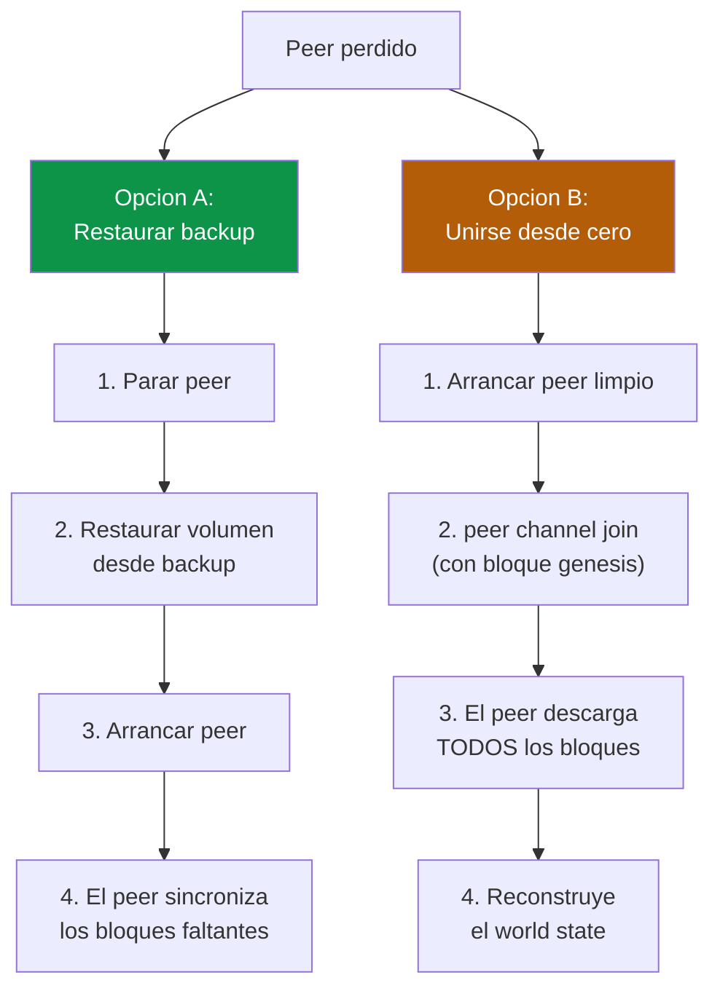

# 06 - Operaciones de administracion

## Vision general

Una vez que la red esta en produccion, hay que mantenerla. Este documento cubre las operaciones mas comunes que un administrador de Fabric necesita realizar: anadir organizaciones, actualizar configuracion, monitorizar y hacer backups.



---

## 1. Anadir una nueva organizacion a un canal existente

Esta es una de las operaciones mas complejas en Fabric. En el mundo real, un nuevo socio se une al consorcio y necesita participar en un canal existente.

### Flujo general



### Paso a paso

#### 1. Generar el material criptografico de la nueva org

La nueva organizacion genera sus certificados (con cryptogen o Fabric CA) y prepara su MSP.

```bash
# Si usas cryptogen, crear un crypto-config-org3.yaml solo para la nueva org
# Si usas Fabric CA, registrar y enrollar las identidades
```

#### 2. Generar la definicion JSON de la nueva org

```bash
export FABRIC_CFG_PATH=$PWD

# Generar el JSON de la org (necesita un configtx.yaml con la definicion de Org3)
configtxgen -printOrg Org3MSP > channel-artifacts/org3-definition.json
```

#### 3. Obtener la configuracion actual del canal

```bash
# Fetch del ultimo bloque de config
peer channel fetch config channel-artifacts/config_block.pb \
  -o localhost:7050 \
  --ordererTLSHostnameOverride orderer.example.com \
  --tls --cafile $ORDERER_CA \
  -c mychannel

# Decodificar a JSON
configtxlator proto_decode --input channel-artifacts/config_block.pb \
  --type common.Block --output channel-artifacts/config_block.json

# Extraer la seccion de configuracion
jq '.data.data[0].payload.data.config' channel-artifacts/config_block.json \
  > channel-artifacts/config.json
```

#### 4. Anadir la nueva org a la configuracion

```bash
# Insertar Org3 en la seccion Application.groups
jq -s '.[0] * {"channel_group":{"groups":{"Application":{"groups":{
  "Org3MSP":.[1]}}}}}' \
  channel-artifacts/config.json \
  channel-artifacts/org3-definition.json \
  > channel-artifacts/config_modified.json
```

#### 5. Calcular el delta y enviar la actualizacion

```bash
# Codificar ambas configs a protobuf
configtxlator proto_encode --input channel-artifacts/config.json \
  --type common.Config --output channel-artifacts/config.pb
configtxlator proto_encode --input channel-artifacts/config_modified.json \
  --type common.Config --output channel-artifacts/modified_config.pb

# Calcular el delta
configtxlator compute_update --channel_id mychannel \
  --original channel-artifacts/config.pb \
  --updated channel-artifacts/modified_config.pb \
  --output channel-artifacts/config_update.pb

# Envolver en envelope
configtxlator proto_decode --input channel-artifacts/config_update.pb \
  --type common.ConfigUpdate --output channel-artifacts/config_update.json

echo '{"payload":{"header":{"channel_header":{
  "channel_id":"mychannel","type":2}},
  "data":{"config_update":'$(cat channel-artifacts/config_update.json)'}}}' | \
  jq . > channel-artifacts/config_update_envelope.json

configtxlator proto_encode --input channel-artifacts/config_update_envelope.json \
  --type common.Envelope --output channel-artifacts/config_update_envelope.pb
```

#### 6. Firmar y enviar

La actualizacion necesita ser firmada por la **mayoria** de las organizaciones existentes (segun la politica `MAJORITY Admins`):

```bash
# Org1 firma
peer channel signconfigtx -f channel-artifacts/config_update_envelope.pb

# Org2 envía (su firma se anade automaticamente)
peer channel update -f channel-artifacts/config_update_envelope.pb \
  -c mychannel \
  -o localhost:7050 \
  --ordererTLSHostnameOverride orderer.example.com \
  --tls --cafile $ORDERER_CA
```

#### 7. Unir el peer de la nueva org al canal

```bash
# Como Org3
export CORE_PEER_LOCALMSPID=Org3MSP
export CORE_PEER_ADDRESS=localhost:11051
# ... (configurar todas las variables TLS y MSP de Org3)

# Obtener el bloque genesis del canal
peer channel fetch 0 channel-artifacts/mychannel.block \
  -o localhost:7050 \
  --ordererTLSHostnameOverride orderer.example.com \
  --tls --cafile $ORDERER_CA \
  -c mychannel

# Unirse
peer channel join -b channel-artifacts/mychannel.block
```

> **Nota:** Este proceso es complejo a proposito. Fabric requiere gobernanza: no puedes anadir una org sin el consentimiento de las existentes. Es una caracteristica, no un defecto.

---

## 2. Actualizar la configuracion del canal

Ademas de anadir organizaciones, hay otros parametros del canal que se pueden modificar:

### Que se puede cambiar

| Parametro | Donde | Ejemplo |
|-----------|-------|---------|
| Batch timeout | Orderer | Cambiar de 2s a 1s para mas velocidad |
| Batch size | Orderer | Aumentar MaxMessageCount de 10 a 50 |
| Politicas | Canal/Application/Orderer | Cambiar MAJORITY a ALL |
| Anchor peers | Application.groups.OrgX | Anadir o cambiar anchor peers |
| ACLs | Application | Cambiar permisos de acceso a recursos |
| Capabilities | Canal/Orderer/Application | Habilitar nuevas features de Fabric |

### Proceso general

El proceso es siempre el mismo patron:



Es un patron que se repite para cualquier cambio de configuracion. La parte que cambia es el paso 3 (que exactamente modificas en el JSON).

### Ejemplo: cambiar el batch timeout

```bash
# Despues de fetch y decode (pasos 1-2 del patron anterior)

# Modificar el batch timeout de 2s a 1s
jq '.channel_group.groups.Orderer.values.BatchTimeout.value.timeout = "1s"' \
  channel-artifacts/config.json > channel-artifacts/config_modified.json

# Seguir con compute_update, envelope, sign, submit (pasos 4-5)
```

### Ejemplo: cambiar el tamano maximo de bloque

```bash
jq '.channel_group.groups.Orderer.values.BatchSize.value.max_message_count = 50' \
  channel-artifacts/config.json > channel-artifacts/config_modified.json
```

---

## 3. Monitorizacion y logs

### Logs de los contenedores

Cada componente de Fabric genera logs que son fundamentales para diagnosticar problemas.

```bash
# Ver logs en tiempo real
docker logs -f peer0.org1.example.com
docker logs -f orderer.example.com

# Ultimas 100 lineas
docker logs --tail 100 peer0.org1.example.com

# Filtrar por nivel
docker logs peer0.org1.example.com 2>&1 | grep -i error
docker logs peer0.org1.example.com 2>&1 | grep -i warn
```

### Niveles de log

Se controlan con la variable `FABRIC_LOGGING_SPEC`:

```bash
# En docker-compose.yaml
- FABRIC_LOGGING_SPEC=INFO

# Mas detalle para debugging
- FABRIC_LOGGING_SPEC=DEBUG

# Solo para un modulo especifico
- FABRIC_LOGGING_SPEC=INFO:gossip=DEBUG:msp=DEBUG

# En caliente (sin reiniciar)
docker exec peer0.org1.example.com \
  peer node logsetlevel gossip DEBUG
```

| Nivel | Cuando usarlo |
|-------|--------------|
| `ERROR` | Produccion (solo errores criticos) |
| `WARNING` | Produccion (errores + advertencias) |
| `INFO` | Normal (operaciones principales) |
| `DEBUG` | Diagnostico (muy verboso, solo temporal) |

### Metricas con Operations API

Fabric expone metricas en formato Prometheus via la Operations API:

```bash
# Verificar que el peer esta vivo
curl -k https://localhost:9443/healthz

# Metricas en formato Prometheus
curl -k https://localhost:9443/metrics
```

Metricas utiles:

| Metrica | Que indica |
|---------|-----------|
| `endorser_proposal_duration` | Tiempo de endorsement |
| `ledger_block_processing_time` | Tiempo de procesado de bloque |
| `ledger_blockchain_height` | Altura del blockchain (numero de bloques) |
| `gossip_state_height` | Altura del state segun gossip |
| `chaincode_launch_duration` | Tiempo de arranque del chaincode |



> En produccion se configura Prometheus para recolectar metricas de todos los peers y orderers, y Grafana para visualizarlas. Esto esta fuera del alcance de este documento pero es la practica estandar.

---

## 4. Backup y recuperacion

### Que hay que respaldar



| Que | Donde esta | Frecuencia | Criticidad |
|-----|-----------|-----------|------------|
| **Claves privadas** | `crypto-config/*/keystore/` | Una vez (no cambian) | **CRITICA** — si se pierden, la identidad se pierde |
| **Certificados** | `crypto-config/*/signcerts/` | Al renovar | Alta |
| **Ledger (bloques)** | Volumen Docker del peer | Periodica | Alta — pero se puede reconstruir desde otros peers |
| **World State** | Volumen Docker (LevelDB/CouchDB) | Periodica | Media — se puede reconstruir desde los bloques |
| **Configuracion** | Archivos yaml | En cada cambio | Alta — tener en git |

### Backup del ledger de un peer

```bash
# 1. Parar el peer (para consistencia)
docker stop peer0.org1.example.com

# 2. Copiar el volumen
docker cp peer0.org1.example.com:/var/hyperledger/production ./backup-peer0-org1

# 3. Reiniciar el peer
docker start peer0.org1.example.com
```

### Backup sin parar el peer (snapshot)

En Fabric 2.5+ se puede usar el comando `peer snapshot`:

```bash
# Solicitar snapshot al peer
peer snapshot submitrequest \
  -c mychannel \
  --peerAddress localhost:7051 \
  --tlsRootCertFiles $PEER_TLS_CA

# Listar snapshots disponibles
peer snapshot listpending \
  -c mychannel \
  --peerAddress localhost:7051 \
  --tlsRootCertFiles $PEER_TLS_CA
```

### Recuperacion de un peer

Si un peer pierde sus datos, puede recuperarse de dos formas:



> **Opcion A es mas rapida** si tienes un backup reciente. Solo necesita sincronizar los bloques desde el ultimo backup. **Opcion B** funciona siempre pero puede tardar mucho si hay millones de bloques.

---

## 5. Rotacion de certificados TLS

Los certificados TLS tienen fecha de caducidad. Antes de que caduquen, hay que renovarlos sin interrumpir el servicio.

### Proceso para un peer

```bash
# 1. Generar nuevo certificado con Fabric CA
fabric-ca-client reenroll \
  --caname ca-org1 \
  --csr.hosts peer0.org1.example.com,localhost \
  --tls.certfiles $CA_TLS_CERT \
  -M $NEW_CERT_PATH

# 2. Reemplazar los certificados en el volumen montado
cp $NEW_CERT_PATH/signcerts/cert.pem \
   $PEER_TLS_DIR/server.crt
cp $NEW_CERT_PATH/keystore/priv_sk \
   $PEER_TLS_DIR/server.key

# 3. Reiniciar el peer
docker restart peer0.org1.example.com
```

### Proceso para el orderer

El mismo proceso pero con precauciones adicionales:
- Si hay multiples orderers (Raft), renovar de uno en uno
- Verificar que el cluster sigue operativo entre cada renovacion
- Actualizar las referencias en la configuracion del canal si es necesario

### Calendario de rotacion

| Componente | Frecuencia recomendada | Impacto |
|-----------|----------------------|---------|
| Certificados TLS de peers | Cada 12 meses | Reinicio del peer (segundos) |
| Certificados TLS de orderers | Cada 12 meses | Reinicio del orderer (coordinar con cluster) |
| Certificados de enrollment | Segun politica de la org | Sin reinicio (se usa en transacciones) |
| CA root certificate | Cada 5-10 anos | Renovacion completa de toda la cadena |

---

## Resumen de comandos de administracion

| Operacion | Herramienta | Comando principal |
|-----------|------------|-------------------|
| Ver canales de un peer | `peer` | `peer channel list` |
| Info de un canal | `peer` | `peer channel getinfo -c canal` |
| Fetch config del canal | `peer` | `peer channel fetch config` |
| Actualizar config | `configtxlator` + `peer` | `compute_update` + `channel update` |
| Ver chaincodes instalados | `peer` | `peer lifecycle chaincode queryinstalled` |
| Ver chaincodes activos | `peer` | `peer lifecycle chaincode querycommitted` |
| Logs en caliente | `peer` | `peer node logsetlevel modulo NIVEL` |
| Health check | HTTP | `curl https://peer:9443/healthz` |
| Metricas | HTTP | `curl https://peer:9443/metrics` |
| Listar canales del orderer | `osnadmin` | `osnadmin channel list` |
| Snapshot | `peer` | `peer snapshot submitrequest` |

---

**Anterior:** [05 - Fabric CA](05-fabric-ca.md)
