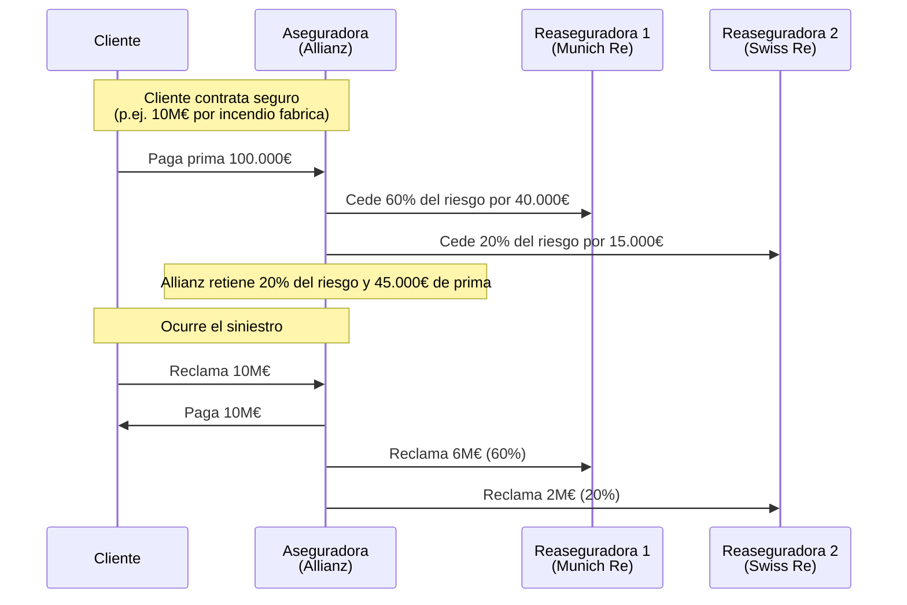
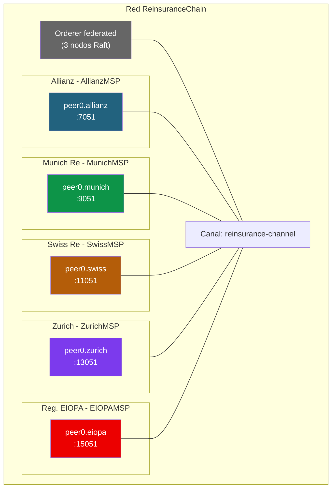

# Ejercicio 5: Caso de fracaso — Reaseguros automatizados (B3i)

## Contexto

**B3i (Blockchain Insurance Industry Initiative)** fue un consorcio de **15+ aseguradoras europeas** (Allianz, Swiss Re, Zurich, Munich Re, AIG, Generali, Hannover Re, entre otras) que en 2016-2017 lanzaron una plataforma de reaseguros automatizados basada en R3 Corda.

El objetivo era ambicioso: digitalizar y automatizar los contratos de reaseguro entre aseguradoras, eliminando el papeleo y reduciendo los tiempos de liquidacion de siniestros.

**B3i cerro en 2022** tras cinco anos de desarrollo. La razon no fue tecnica — la tecnologia funcionaba. El problema fue de **modelo de negocio**: las aseguradoras querian participar pero no querian financiar indefinidamente una plataforma sin retorno claro.

Este ejercicio analiza **un fracaso distinto a TradeLens**: no hubo problema de fundador dominante, pero nadie quiso ser sostenible financieramente.

---

## ¿Que es el reaseguro?

Antes del ejercicio, entendamos el negocio:



**Problema actual (sin blockchain):**
- Cada contrato de reaseguro tarda **semanas** en negociarse
- Las reclamaciones tardan **meses** en liquidarse
- **Papeleo manual** entre multiples partes
- Sin trazabilidad clara de quien cubre que porcentaje

**Prometia B3i:** contratos inteligentes que se activan automaticamente cuando ocurre un siniestro, distribuyendo la reclamacion entre las reaseguradoras segun los porcentajes pactados.

---

## Fase 1: Diseño sobre el papel

### Problemas de modelo de negocio

B3i fracaso por el modelo de financiacion, no por la tecnologia. En tu diseño, piensa:

1. **¿Quien paga la infraestructura de la red?**
   - Cuota fija por miembro
   - Pay-per-use (por transaccion)
   - Escalado por tamano de la aseguradora
2. **¿Quien desarrolla y mantiene el chaincode?**
   - Empresa externa contratada
   - Equipo compartido entre miembros
   - Open source con contribuciones
3. **¿Como se financia la primera version (MVP) antes de tener trafico real?**
4. **¿Que pasa si una reaseguradora deja de pagar?** ¿Se le expulsa? ¿Pierde datos?

### Estructura tecnica

5. **¿Canal unico para todos los contratos o canales por linea de negocio?**
   (p.ej. reaseguro de vida vs. no-vida vs. catastrofico)
6. **¿Los importes son privados entre las partes del contrato?** (Private Data Collections)
7. **¿Que datos del cliente final van on-chain?** Cuidado con GDPR.
8. **¿Como se verifica que un siniestro es real?**
   - Oraculos externos (meteo, noticias)
   - Validacion cruzada entre partes
   - Peritaje fisico registrado manualmente

### Politicas

9. **¿Un contrato de reaseguro entre Allianz y Munich Re puede ser modificado unilateralmente?** (Spoiler: NO)
10. **¿Para liquidar un siniestro, quien endorsa?** ¿Todas las partes del contrato?

---

## Solución propuesta: ReinsuranceChain

### Gobernanza con modelo de negocio sostenible

**Claves aprendidas del fracaso de B3i:**

| Problema de B3i | Nuestra solucion |
|-----------------|------------------|
| Financiacion voluntaria | Comision fija por transaccion (revenue share) |
| Desarrollo centralizado | Chaincode open source, contribuciones por miembros |
| Sin MVP claro | Empezar con 1 linea de negocio (p.ej. catastroficos) |
| Complejidad regulatoria | Solo reaseguros entre companias reguladas (no al cliente final) |
| Integracion con legacy | APIs estandar y no forzar migracion interna |

**Modelo economico propuesto:**
- Fee del **0.01% del valor del contrato** por cada contrato registrado
- Fee del **0.05%** por cada liquidacion de siniestro
- Los fees financian operacion + reinversion
- Sobrante reinvertido en nuevas funcionalidades

### Topología



**Decisiones:**
- **4 aseguradoras + regulador** (EIOPA - European Insurance and Occupational Pensions Authority)
- **1 canal principal** compartido (para catastroficos)
- **Private Data Collections por par de orgs** para importes sensibles
- **Orderer federado** entre las 4 aseguradoras (cada una opera un nodo Raft)

### Modelo de datos

```json
{
  "docType": "reinsuranceContract",
  "contractID": "RE-2026-00001",
  "primaryInsurer": "AllianzMSP",
  "reinsurers": [
    {"org": "MunichMSP", "percentage": 60, "maxCoverage": 6000000},
    {"org": "SwissMSP", "percentage": 20, "maxCoverage": 2000000}
  ],
  "underwritingYear": 2026,
  "line": "property_catastrophic",
  "territory": "Germany",
  "totalCoverage": 10000000,
  "currency": "EUR",
  "premium": 100000,
  "attachmentPoint": 500000,
  "status": "active",
  "createdAt": "2026-04-22T10:00:00Z",
  "expiresAt": "2027-04-22T10:00:00Z"
}
```

**Importante:** los porcentajes de cada reasegurador y los importes sensibles van **cifrados o en Private Data Collection** compartida solo entre las partes del contrato.

### Modelo de datos: siniestro

```json
{
  "docType": "claim",
  "claimID": "CL-2026-00345",
  "contractID": "RE-2026-00001",
  "eventDate": "2026-08-15",
  "eventType": "earthquake",
  "location": "Munich, Germany",
  "totalLoss": 3000000,
  "status": "liquidated",
  "distribution": [
    {"org": "AllianzMSP", "amount": 600000, "percentage": 20},
    {"org": "MunichMSP", "amount": 1800000, "percentage": 60},
    {"org": "SwissMSP", "amount": 600000, "percentage": 20}
  ],
  "validatedBy": ["AllianzMSP", "MunichMSP", "SwissMSP"],
  "createdAt": "2026-08-16T09:00:00Z",
  "liquidatedAt": "2026-08-17T14:30:00Z"
}
```

### Funciones del chaincode

```go
// Registrar contrato de reaseguro
func (s *SmartContract) CreateContract(ctx ...,
    contractID, primaryInsurer, line, territory string,
    totalCoverage, premium int, reinsurersJSON string) error {

    // El caller debe ser el primaryInsurer
    callerMSP, _ := ctx.GetClientIdentity().GetMSPID()
    if callerMSP != primaryInsurer {
        return fmt.Errorf("solo la aseguradora primaria puede crear el contrato")
    }

    var reinsurers []Reinsurer
    json.Unmarshal([]byte(reinsurersJSON), &reinsurers)

    // Validar: los porcentajes deben sumar 100% (o menos, si el primario retiene algo)
    totalPercentage := 0
    for _, r := range reinsurers {
        totalPercentage += r.Percentage
    }
    if totalPercentage > 100 {
        return fmt.Errorf("los porcentajes suman mas del 100%%")
    }

    // ... crear contrato
}

// Reportar siniestro (solo el primaryInsurer)
func (s *SmartContract) ReportClaim(ctx ...,
    claimID, contractID, eventType, location string,
    totalLoss int, eventDate string) error {

    contract, _ := s.ReadContract(ctx, contractID)
    callerMSP, _ := ctx.GetClientIdentity().GetMSPID()

    if callerMSP != contract.PrimaryInsurer {
        return fmt.Errorf("solo la aseguradora primaria puede reportar siniestros")
    }

    // Calcular distribucion automatica segun porcentajes del contrato
    claim := Claim{
        ClaimID:     claimID,
        ContractID:  contractID,
        TotalLoss:   totalLoss,
        Distribution: calculateDistribution(contract, totalLoss),
        Status:      "pending_validation",
        ValidatedBy: []string{callerMSP},
    }

    // ... guardar y emitir evento
    ctx.GetStub().SetEvent("ClaimReported", []byte(fmt.Sprintf(
        `{"claimID":"%s","totalLoss":%d}`, claimID, totalLoss)))
}

// Validar siniestro (cada reasegurador debe validar)
func (s *SmartContract) ValidateClaim(ctx ...,
    claimID string) error {

    claim, _ := s.ReadClaim(ctx, claimID)
    callerMSP, _ := ctx.GetClientIdentity().GetMSPID()

    // El caller debe ser una de las partes del contrato
    contract, _ := s.ReadContract(ctx, claim.ContractID)
    if !isPartyToContract(callerMSP, contract) {
        return fmt.Errorf("solo las partes del contrato pueden validar")
    }

    // Marcar como validado
    claim.ValidatedBy = append(claim.ValidatedBy, callerMSP)

    // Si todas las partes han validado, liquidar automaticamente
    if len(claim.ValidatedBy) == len(contract.Reinsurers)+1 {
        claim.Status = "liquidated"
        claim.LiquidatedAt = getTxTimestamp(ctx)
        ctx.GetStub().SetEvent("ClaimLiquidated", ...)
    }

    // ... guardar
}
```

### Politicas de endorsement con state-based

Cada contrato tiene su propia politica, que requiere endorsement de TODAS las partes:

```go
// Al crear el contrato
policy, _ := statebased.NewStateEP(nil)
policy.AddOrgs(statebased.RoleTypePeer, primaryInsurer)
for _, r := range reinsurers {
    policy.AddOrgs(statebased.RoleTypePeer, r.Org)
}
policyBytes, _ := policy.Policy()
ctx.GetStub().SetStateValidationParameter("contract_"+contractID, policyBytes)
```

Esto garantiza que **un contrato solo puede modificarse con firma de todas las aseguradoras involucradas**.

---

## Fase 2: Montar la red

### Estructura y crypto-config

```yaml
PeerOrgs:
  - Name: Allianz
    Domain: allianz.reinsurance.com
    Template: {Count: 1, SANS: [localhost, 127.0.0.1]}
    Users: {Count: 2}

  # (Munich, Swiss, Zurich similar)

  - Name: EIOPA
    Domain: eiopa.reinsurance.com
    Template: {Count: 1, SANS: [localhost, 127.0.0.1]}
    Users: {Count: 2}
```

### Orderer federado con Raft

```yaml
Orderer: &OrdererDefaults
  OrdererType: etcdraft
  EtcdRaft:
    Consenters:
      - Host: orderer.allianz.reinsurance.com
        Port: 7050
      - Host: orderer.munich.reinsurance.com
        Port: 8050
      - Host: orderer.swiss.reinsurance.com
        Port: 9050
```

3 nodos Raft (tolera 1 fallo). Cada nodo en una aseguradora distinta → nadie controla el ordering.

### Desplegar con CouchDB

```bash
./network.sh up createChannel -s couchdb
peer lifecycle chaincode install reinsurance.tar.gz
# ...
```

---

## Fase 3: Probar el caso

```bash
# 1. Allianz crea un contrato de reaseguro
export CORE_PEER_LOCALMSPID=AllianzMSP

REINSURERS='[
  {"org":"MunichMSP","percentage":60,"maxCoverage":6000000},
  {"org":"SwissMSP","percentage":20,"maxCoverage":2000000}
]'

peer chaincode invoke ... \
  -c "{\"function\":\"CreateContract\",\"Args\":[\"RE-2026-00001\",\"AllianzMSP\",\"property_catastrophic\",\"Germany\",\"10000000\",\"100000\",$REINSURERS]}"

# 2. Ocurre un terremoto en Munich (3M€ de danos)
#    Allianz reporta el siniestro
peer chaincode invoke ... \
  -c '{"function":"ReportClaim","Args":["CL-2026-00345","RE-2026-00001","earthquake","Munich","3000000","2026-08-15"]}'

# 3. Munich Re valida
export CORE_PEER_LOCALMSPID=MunichMSP
peer chaincode invoke ... \
  -c '{"function":"ValidateClaim","Args":["CL-2026-00345"]}'

# 4. Swiss Re valida
export CORE_PEER_LOCALMSPID=SwissMSP
peer chaincode invoke ... \
  -c '{"function":"ValidateClaim","Args":["CL-2026-00345"]}'

# 5. Consultar distribucion (es automatica al tener todas las validaciones)
peer chaincode query ... \
  -c '{"Args":["ReadClaim","CL-2026-00345"]}'
# status: "liquidated"
# distribution: Allianz 600k€, Munich 1.8M€, Swiss 600k€

# 6. Regulador (EIOPA) audita
export CORE_PEER_LOCALMSPID=EIOPAMSP
peer chaincode query ... \
  -c '{"Args":["AuditClaimsByYear","2026"]}'
# Ve todas las reclamaciones del sistema
```

---

## Preguntas para el debate

1. B3i fracaso por modelo de negocio. ¿Nuestro modelo de fees por transaccion es sostenible?
2. ¿Que pasa si una aseguradora quiere salir del consorcio? ¿Que hacemos con sus contratos activos?
3. ¿Deberia el regulador (EIOPA) tener voto en decisiones de governance o solo acceso de lectura?
4. ¿Es realista que las aseguradoras confien en un chaincode open source para mover millones de euros?
5. ¿Como gestionariais los contratos viejos (pre-blockchain) al lanzar la plataforma?
6. ¿Tendria sentido que el regulador EMITIERA certificados digitales de los peritos para que registren siniestros?

---

## Leccion del caso: sostenibilidad > tecnologia

**B3i tenia:**
- Tecnologia probada (R3 Corda)
- 15+ aseguradoras top del mundo
- 5 anos de desarrollo
- Pilotos exitosos

**B3i NO tenia:**
- Modelo de negocio que se sostuviera solo
- MVP claro que generara valor rapido
- Incentivos para que los miembros pagaran indefinidamente
- Integracion facil con sistemas legacy

**Resultado:** cerro en 2022.

> Un proyecto blockchain enterprise necesita un **modelo de negocio sostenible desde el dia 1**. No es suficiente con que la tecnologia funcione. Si no hay un flujo de ingresos que financie la operacion, el proyecto muere cuando el capital inicial se agota.

---

## Comparativa: TradeLens vs B3i

Ambos fracasaron, pero por **motivos distintos**:

| Aspecto | TradeLens | B3i |
|---------|-----------|-----|
| Motivo principal | Gobernanza (fundador dominante) | Modelo de negocio (sin ingresos) |
| Fundador | Maersk (competidor) | Consorcio de 15 (neutro) |
| Financiacion | Comercial (IBM + Maersk) | Cuotas voluntarias |
| Adopcion | Limitada (sin competidores) | Alta (todos los grandes) |
| Tecnologia | Funcionaba | Funcionaba |
| Cierre | 2022 | 2022 |

**Dos tipos de fracaso, dos lecciones distintas.** Si disenas un proyecto blockchain enterprise, evita **ambas trampas**.

---

## Referencias

- Caso B3i en las slides: [Modulo 3 dia 1](../../slides/Modulo 3/dia_1.pptx)
- Presentacion adopcion: [Modulo 4 adopcion.pptx](../../slides/Modulo 4/adopcion.pptx)
- Gobernanza: [Modulo 3 dia 3](../../slides/Modulo 3/dia_3.pptx)
- Ejercicio TradeLens (complementario): [ejercicio-tradelens.md](ejercicio-tradelens.md)
