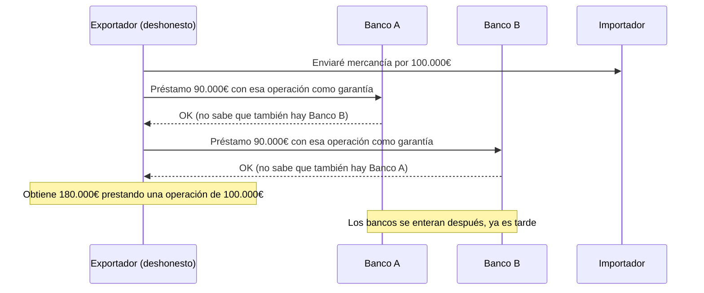
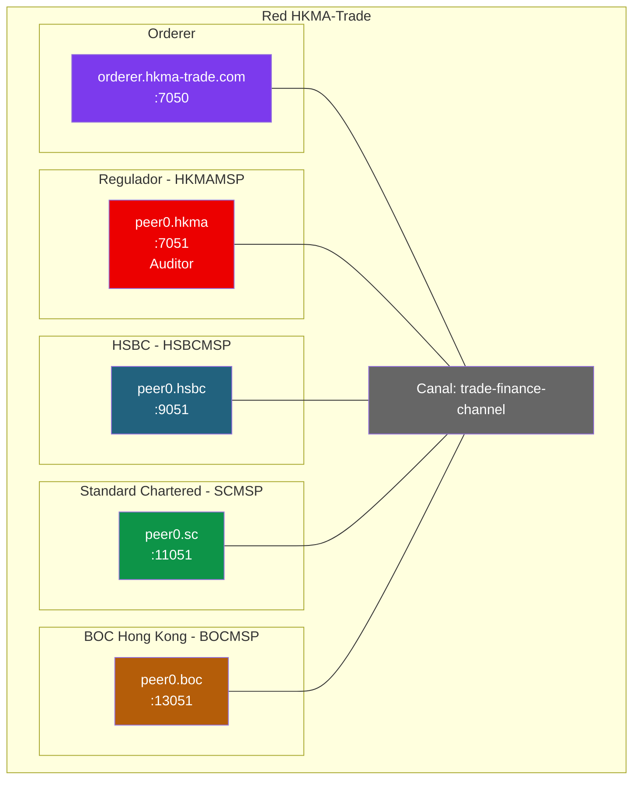

# Ejercicio 3: Plataforma interbancaria regulada (caso HKMA eTradeConnect)

## Contexto

En 2018, la **Hong Kong Monetary Authority (HKMA)** — el banco central de Hong Kong — lanzo **eTradeConnect**, una plataforma de trade finance basada en Hyperledger Fabric. La diferencia clave con We.Trade: **el regulador esta en el consorcio desde el dia 1**.

eTradeConnect conecta a los principales bancos de Hong Kong (HSBC, Standard Chartered, BOC HK, DBS, ICBC, ANZ, Hang Seng, BNP Paribas, etc.) para compartir informacion de operaciones comerciales. Es interoperable con We.Trade (Europa) para operaciones Asia-Europa.

Caso de uso especial que resuelve: **el fraude de doble financiacion** — cuando un exportador pide credito a dos bancos por la misma mercancia. Sin un ledger compartido, cada banco solo ve sus propias operaciones y no puede detectar el solapamiento.

Tu mision: disenar una red Fabric donde **el regulador tiene un rol especial** con visibilidad completa y capacidad de auditoria, pero sin poder modificar operaciones de los bancos.

---

## El problema: fraude de doble financiacion



**Como lo soluciona blockchain**: cuando un banco registra una solicitud de financiacion sobre una operacion, el sistema detecta automaticamente si ya existe otra financiacion previa sobre esa misma operacion.

---

## Fase 1: Diseño sobre el papel

### Roles y permisos

1. **¿Cuantos bancos minimo tiene sentido?** (el nuestro sera 3 bancos + regulador)
2. **¿Que puede hacer el regulador (HKMA)?** Piensa en:
   - ¿Leer todas las operaciones?
   - ¿Invocar funciones administrativas (bloquear operaciones sospechosas)?
   - ¿Participar en el endorsement?
3. **¿El regulador debe endorsar cada transaccion o solo auditar?**

### Deteccion de doble financiacion

4. **¿Como detectas que dos bancos estan financiando la misma operacion?**
   - ¿Un identificador comun (hash de factura, numero de BL)?
   - ¿Una consulta antes de crear la financiacion?
5. **¿Como garantizas que el identificador comun sea unico y verificable?**
6. **¿Que pasa si se detecta doble financiacion?** ¿Se rechaza automaticamente? ¿Se alerta al regulador?

### Datos y privacidad

7. **¿Todos los bancos ven los importes exactos?** ¿O solo el regulador?
8. **¿Como conciliar privacidad bancaria con auditoria del regulador?**
9. **¿Que datos PERSONALES del cliente pueden ir on-chain?** (pista: GDPR)

### Politicas

10. **¿Politica de endorsement por operacion?** (solo el banco que crea)
11. **¿Politica de canal?** ¿El regulador tiene voto en decisiones del canal?

---

## Solución propuesta

### Topología



**Decisiones clave:**

- **HKMA es una org mas en el canal**, con peer propio. No es un "super-admin" — es un miembro con privilegios específicos codificados en el chaincode.
- **El regulador tiene politica de lectura amplia** pero NO endorsa operaciones comerciales entre bancos.
- **Identificador unico: hash de la factura**. Cuando un banco quiere financiar, debe registrar el hash de la factura. El chaincode verifica que no existe otra financiacion con ese hash.
- **Datos personales off-chain**: en el ledger solo va el hash. Los datos reales (nombre del importador/exportador, numero de factura) estan en los sistemas de cada banco.

### Modelo de datos

```json
{
  "docType": "financingRecord",
  "recordID": "FIN-2026-000789",
  "invoiceHash": "sha256:3f5e7b2a9c1d...",
  "bankOrg": "HSBCMSP",
  "clientID": "hash:abc123",
  "amount": 90000,
  "currency": "USD",
  "operationType": "invoice_financing",
  "status": "active",
  "createdAt": "2026-04-22T10:00:00Z",
  "dueDate": "2026-06-22T00:00:00Z",
  "flaggedByRegulator": false
}
```

El `invoiceHash` es el **campo clave**: es lo que permite detectar doble financiacion.

### Funciones con control de acceso

```go
// Solicitar financiacion (solo bancos, NO regulador)
func (s *SmartContract) RequestFinancing(ctx ...,
    recordID, invoiceHash, clientID string, amount int,
    currency, dueDate string) error {

    callerMSP, _ := ctx.GetClientIdentity().GetMSPID()
    if callerMSP == "HKMAMSP" {
        return fmt.Errorf("el regulador no puede solicitar financiacion")
    }

    // Detectar doble financiacion
    query := fmt.Sprintf(`{
        "selector": {
            "docType": "financingRecord",
            "invoiceHash": "%s",
            "status": "active"
        }
    }`, invoiceHash)
    existing, _ := queryRecords(ctx, query)

    if len(existing) > 0 {
        // Emitir alerta al regulador
        ctx.GetStub().SetEvent("DoubleFinancingAttempt", []byte(
            fmt.Sprintf(`{"invoiceHash":"%s","attemptedBy":"%s","existingRecord":"%s"}`,
                invoiceHash, callerMSP, existing[0].RecordID)))
        return fmt.Errorf("doble financiacion detectada: la factura %s ya esta financiada por %s",
            invoiceHash, existing[0].BankOrg)
    }

    // Si no hay duplicado, crear el registro
    record := FinancingRecord{
        DocType: "financingRecord",
        RecordID: recordID,
        InvoiceHash: invoiceHash,
        BankOrg: callerMSP,
        Amount: amount,
        Status: "active",
        // ...
    }
    recordJSON, _ := json.Marshal(record)
    return ctx.GetStub().PutState("fin_"+recordID, recordJSON)
}

// Bloquear operacion sospechosa (SOLO regulador)
func (s *SmartContract) FlagOperation(ctx ...,
    recordID, reason string) error {

    callerMSP, _ := ctx.GetClientIdentity().GetMSPID()
    if callerMSP != "HKMAMSP" {
        return fmt.Errorf("solo el regulador puede marcar operaciones")
    }

    record, err := s.ReadRecord(ctx, recordID)
    if err != nil {
        return err
    }

    record.FlaggedByRegulator = true
    record.Status = "under_review"
    // ... guardar y emitir evento
}

// Consultar por regulador (puede ver todo)
func (s *SmartContract) RegulatorAuditQuery(ctx ...,
    timeRange, bankOrg string) ([]*FinancingRecord, error) {

    callerMSP, _ := ctx.GetClientIdentity().GetMSPID()
    if callerMSP != "HKMAMSP" {
        return nil, fmt.Errorf("funcion exclusiva del regulador")
    }

    // Query sin restricciones — el regulador puede filtrar por cualquier campo
    // ...
}
```

### Politicas de endorsement

- **Operaciones comerciales entre bancos**: endorsement solo del banco que crea (OR).
- **Cambios de configuracion del canal**: MAJORITY de todas las orgs (incluido regulador).
- **Funciones del regulador** (flag, bloquear): solo HKMA endorsa — evita que bancos flaggen operaciones entre si.

```bash
peer lifecycle chaincode approveformyorg ... \
  --signature-policy "OR('HSBCMSP.peer','SCMSP.peer','BOCMSP.peer','HKMAMSP.peer')"
```

---

## Fase 2: Montar la red

### crypto-config.yaml

```yaml
OrdererOrgs:
  - Name: Orderer
    Domain: hkma-trade.com
    EnableNodeOUs: true
    Specs:
      - Hostname: orderer
        SANS: [localhost, 127.0.0.1]

PeerOrgs:
  - Name: HKMA
    Domain: hkma.hkma-trade.com
    EnableNodeOUs: true
    Template: {Count: 1, SANS: [localhost, 127.0.0.1]}
    Users: {Count: 2}  # auditor1, auditor2

  - Name: HSBC
    Domain: hsbc.hkma-trade.com
    EnableNodeOUs: true
    Template: {Count: 1, SANS: [localhost, 127.0.0.1]}
    Users: {Count: 2}

  - Name: SC
    Domain: sc.hkma-trade.com
    EnableNodeOUs: true
    Template: {Count: 1, SANS: [localhost, 127.0.0.1]}
    Users: {Count: 2}

  - Name: BOC
    Domain: boc.hkma-trade.com
    EnableNodeOUs: true
    Template: {Count: 1, SANS: [localhost, 127.0.0.1]}
    Users: {Count: 2}
```

```bash
cryptogen generate --config=crypto-config.yaml --output=crypto-config
```

### Indices CouchDB para detectar duplicados

Es crucial para el rendimiento. El chaincode hace una query por `invoiceHash` en cada operacion.

`META-INF/statedb/couchdb/indexes/indexInvoiceHash.json`:

```json
{
  "index": {
    "fields": ["docType", "invoiceHash", "status"]
  },
  "ddoc": "indexInvoiceHashDoc",
  "name": "indexInvoiceHash",
  "type": "json"
}
```

### Desplegar con CouchDB

```bash
# El chaincode NECESITA CouchDB — las rich queries son imprescindibles
./network.sh up createChannel -s couchdb
```

---

## Fase 3: Probar el caso

### Flujo happy path

```bash
# 1. Como HSBC: solicitar financiacion sobre factura
export CORE_PEER_LOCALMSPID=HSBCMSP

peer chaincode invoke ... \
  -c '{"function":"RequestFinancing","Args":["FIN-2026-000789","sha256:3f5e7b2a9c1d","client-001","90000","USD","2026-06-22"]}'
# OK

# 2. Como HKMA (regulador): auditar
export CORE_PEER_LOCALMSPID=HKMAMSP

peer chaincode query ... \
  -c '{"Args":["RegulatorAuditQuery","2026-04","all"]}'
# Devuelve todas las operaciones del mes
```

### Flujo de deteccion de fraude

```bash
# 3. Como Standard Chartered: INTENTAR financiar LA MISMA factura
export CORE_PEER_LOCALMSPID=SCMSP

peer chaincode invoke ... \
  -c '{"function":"RequestFinancing","Args":["FIN-2026-000790","sha256:3f5e7b2a9c1d","client-099","85000","USD","2026-06-22"]}'
# ERROR: "doble financiacion detectada: la factura sha256:3f5e7b2a9c1d ya esta financiada por HSBCMSP"

# 4. El evento DoubleFinancingAttempt se dispara automaticamente
# El regulador (HKMA) recibe la notificacion en tiempo real
```

### Flujo de intervencion del regulador

```bash
# 5. Como HKMA: marcar operacion sospechosa para revision
export CORE_PEER_LOCALMSPID=HKMAMSP

peer chaincode invoke ... \
  -c '{"function":"FlagOperation","Args":["FIN-2026-000789","Solicitud inusual, cliente con historial de impagos"]}'
# OK — ahora la operacion esta en "under_review"

# 6. Como HSBC: intentar marcar una operacion de otro banco
export CORE_PEER_LOCALMSPID=HSBCMSP

peer chaincode invoke ... \
  -c '{"function":"FlagOperation","Args":["FIN-2026-000800","sospechosa"]}'
# ERROR: "solo el regulador puede marcar operaciones"
```

---

## Preguntas para el debate

1. ¿Por que HKMA es una org y no un "super-usuario" del sistema? ¿Que ganamos?
2. ¿El regulador deberia poder bloquear (no solo marcar) operaciones? ¿Por que?
3. Si una operacion esta bajo revision, ¿el banco puede seguir operando? ¿O queda congelada?
4. ¿Como afecta GDPR a este modelo? Estamos guardando hashes, pero el hash de una factura + timestamp permite correlacionar.
5. Hong Kong tiene al regulador en el consorcio. En Europa, ¿seria la BCE? ¿Cada pais su banco central?
6. ¿Que pasa si el regulador es comprometido (certificado robado)? ¿Que impacto tendria?

---

## Particularidades vs We.Trade

| Aspecto | We.Trade (Europa) | HKMA (Hong Kong) |
|---------|-------------------|------------------|
| Regulador | No participa | Miembro del consorcio |
| Fundador | Consorcio de bancos | Banco central |
| Deteccion de fraude | No explicita | Core del sistema |
| Adopcion | Voluntaria (y limitada) | Obligatoria para bancos de HK |
| Financiacion | Los bancos (insuficiente) | HKMA subsidia |
| Estado actual | Cerrado (2022) | Operativo |

**Leccion:** el respaldo regulatorio no es solo una caracteristica — puede ser LA diferencia entre exito y fracaso.

---

## Referencias

- Control de acceso en chaincodes: [Modulo 4 dia 3](../../slides/Modulo 4/dia_3.pptx)
- Rich queries con CouchDB: [doc ejercicio Registro de Propiedad](../../modulo-4/ejercicios/ejercicio-registro-propiedad.md)
- Políticas de endorsement: [doc 04 Chaincode Lifecycle](../../04-chaincode-lifecycle.md)
