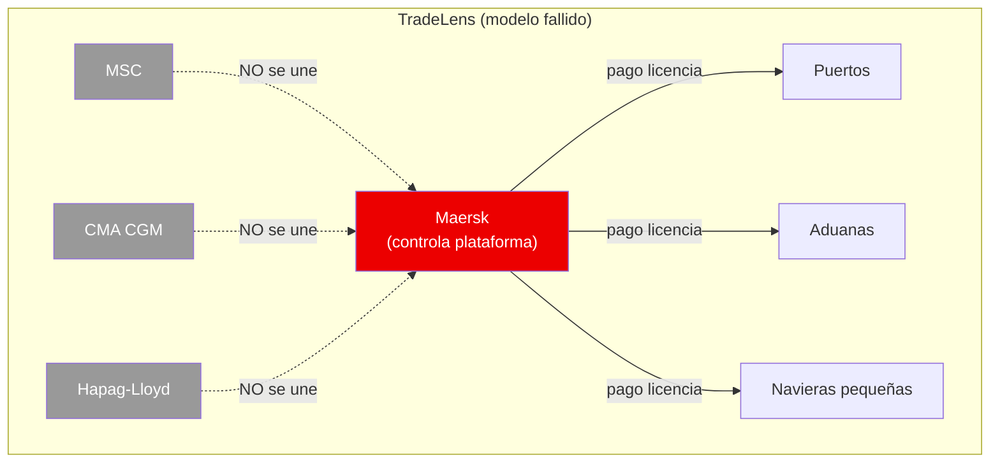
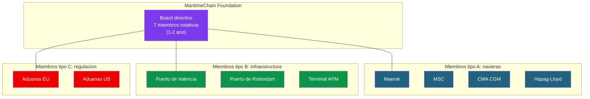
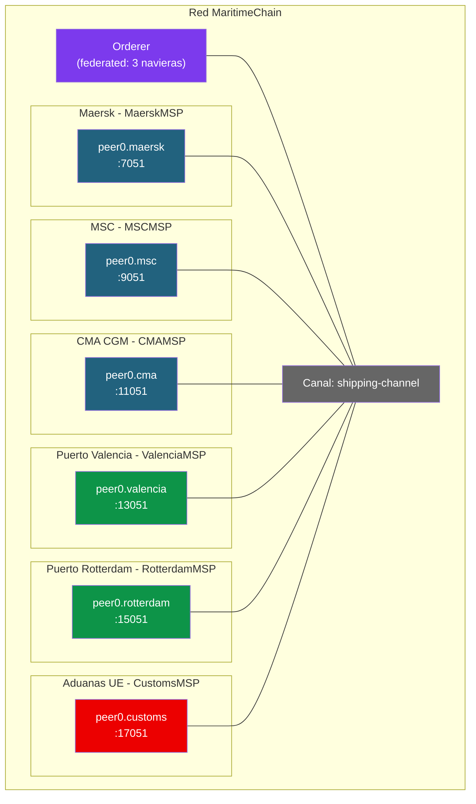

# Ejercicio 4: Caso de fracaso — Trazabilidad maritima (TradeLens)

## Contexto

TradeLens fue un proyecto ambicioso de **Maersk + IBM** lanzado en 2018 para digitalizar y hacer trazable el comercio maritimo global. Basado en Hyperledger Fabric, llego a conectar a mas de 150 organizaciones (navieras, puertos, aduanas, terminales) y a procesar millones de eventos al dia.

**Cerro en noviembre de 2022** tras casi 5 anos de operacion. La razon no fue tecnica — la plataforma funcionaba. El problema fue de **gobernanza**: las navieras competidoras de Maersk (MSC, CMA CGM, Hapag-Lloyd) no querian participar en una plataforma controlada por su mayor rival.

Este ejercicio es **al reves** que los anteriores: analizaremos **que sali mal** y disenaremos una alternativa que SI podria funcionar, corrigiendo el problema del fundador dominante.

---

## El problema del fundador dominante



**¿Por que fallo?**

1. **Control concentrado**: Maersk decidia las reglas, el roadmap y los precios
2. **Conflicto de intereses**: ¿por que MSC daria sus datos operacionales a su mayor competidor?
3. **Licencia de pago**: IBM y Maersk cobraban por usar la plataforma
4. **Sin masa critica**: sin los otros 3 grandes, el 40% del trafico mundial no estaba en TradeLens
5. **Red inutil sin todos**: trazar un contenedor que cambia de naviera a mitad de viaje es imposible si una de las navieras no esta

---

## Fase 1: Rediseñar sobre el papel

Tu mision es disenar una **alternativa a TradeLens** que evite el problema del fundador dominante. Piensa en estas preguntas:

### Gobernanza

1. **¿Quien deberia ser el fundador?**
   - ¿Un consorcio multi-naviera?
   - ¿Una asociacion sectorial (BIMCO, ICS)?
   - ¿Un organismo internacional (IMO)?
   - ¿Una fundacion sin animo de lucro?
2. **¿Que modelo de decision usarias?**
   - MAJORITY entre navieras
   - MAJORITY ponderada por tamano (peligroso — vuelve al problema de dominancia)
   - Comite rotativo entre miembros
3. **¿Como se financia la plataforma?**
   - Cuota fija por miembro
   - Pay-per-use
   - Sin coste (fondos publicos)

### Tecnologia

4. **¿Un solo canal o canales por ruta / region?**
5. **¿Que datos son publicos entre todos los miembros?** (estados de contenedor, ETAs)
6. **¿Que datos son privados?** (tarifas, clientes finales, margenes)
7. **¿El regulador (aduanas) esta en el canal o accede por API externa?**

### Adopcion

8. **¿Como atraes a las navieras competidoras desde el dia 1?**
9. **¿Que pasa si un miembro quiere salir?** ¿Mantiene acceso a sus datos historicos?
10. **¿Se puede garantizar que ningun miembro tenga ventaja competitiva?**

---

## Solución propuesta: MaritimeChain (neutral, multi-naviera)

### Gobernanza: fundacion sin animo de lucro



**Principios:**
- **Fundacion sin animo de lucro** (modelo Alastria, Hyperledger): nadie es dueño
- **Board rotativo**: miembros elegidos cada 1-2 anos por la asamblea
- **1 miembro = 1 voto**: sin importar tamano
- **Cuotas escalonadas**: por tamano de empresa (fairness sin dominancia)
- **Codigo abierto**: chaincodes auditables por cualquier miembro

### Topología

Para el ejercicio, 3 navieras + 2 puertos + aduanas:



**Clave:** los **orderers estan distribuidos** entre las 3 navieras principales (Raft con 3 nodos). Asi ninguna naviera controla el ordering. Si uno se cae, la red sigue funcionando.

### Modelo de datos: contenedor

```json
{
  "docType": "container",
  "containerID": "MAEU1234567",
  "currentCarrier": "MaerskMSP",
  "status": "in_transit",
  "origin": "Shanghai",
  "destination": "Rotterdam",
  "currentLocation": "43.2N, 29.5E (Mar Mediterraneo)",
  "estimatedArrival": "2026-05-15T14:00:00Z",
  "cargo": {
    "type": "electronics",
    "weight": 24500,
    "value_hash": "sha256:abc..."
  },
  "history": [
    {"event": "loaded", "location": "Shanghai", "carrier": "MaerskMSP", "timestamp": "2026-04-01T10:00:00Z"},
    {"event": "transshipment", "location": "Singapore", "fromCarrier": "MaerskMSP", "toCarrier": "MSCMSP", "timestamp": "2026-04-15T08:00:00Z"}
  ]
}
```

**Caso especial: transbordos.** Un contenedor puede pasar de Maersk a MSC en medio del viaje. Sin red compartida, cada naviera solo ve su tramo. Con MaritimeChain, todos ven el viaje completo.

---

## Fase 2: Montar la red

### crypto-config.yaml (resumido)

```yaml
OrdererOrgs:
  - Name: Orderer
    Domain: maritimechain.org
    EnableNodeOUs: true
    Specs:
      - Hostname: orderer1
        SANS: [localhost, 127.0.0.1]
      - Hostname: orderer2
        SANS: [localhost, 127.0.0.1]
      - Hostname: orderer3
        SANS: [localhost, 127.0.0.1]
```

Notar que usamos **3 orderers en Raft** para demostrar alta disponibilidad.

### configtx.yaml: consenters Raft

```yaml
Orderer: &OrdererDefaults
  OrdererType: etcdraft
  EtcdRaft:
    Consenters:
      - Host: orderer1.maritimechain.org
        Port: 7050
        ClientTLSCert: ...
        ServerTLSCert: ...
      - Host: orderer2.maritimechain.org
        Port: 8050
        ...
      - Host: orderer3.maritimechain.org
        Port: 9050
        ...
```

**3 consenters** → puede fallar 1 sin afectar el servicio. Para tolerar 2 fallos: 5 consenters (tolerancia = (N-1)/2).

### Funciones del chaincode

```go
// Registrar evento de contenedor (solo la naviera que lo lleva)
func (s *SmartContract) RegisterEvent(ctx ...,
    containerID, eventType, location string) error {

    container, _ := s.ReadContainer(ctx, containerID)
    callerMSP, _ := ctx.GetClientIdentity().GetMSPID()

    // Solo la naviera actual puede registrar eventos
    if !isCarrier(callerMSP) || container.CurrentCarrier != callerMSP {
        return fmt.Errorf("solo la naviera que lleva el contenedor puede registrar eventos")
    }

    container.History = append(container.History, HistEntry{
        Event: eventType,
        Location: location,
        Carrier: callerMSP,
        Timestamp: getTxTimestamp(ctx),
    })

    // ... guardar
}

// Transbordo: cambiar de naviera (ambas navieras deben firmar)
func (s *SmartContract) Transship(ctx ...,
    containerID, toCarrierOrg, location string) error {

    // Esta funcion tiene politica de endorsement ESPECIAL:
    // AND(currentCarrier, toCarrier) — ambas deben aprobar
    // Se configura con state-based endorsement

    container, _ := s.ReadContainer(ctx, containerID)
    callerMSP, _ := ctx.GetClientIdentity().GetMSPID()

    if container.CurrentCarrier != callerMSP {
        return fmt.Errorf("solo la naviera actual puede iniciar transbordo")
    }

    container.CurrentCarrier = toCarrierOrg
    container.History = append(container.History, HistEntry{
        Event: "transshipment",
        Location: location,
        FromCarrier: callerMSP,
        ToCarrier: toCarrierOrg,
        Timestamp: getTxTimestamp(ctx),
    })

    // ... guardar
}

// Verificacion por aduanas (solo customs puede marcar como "cleared")
func (s *SmartContract) ClearCustoms(ctx ...,
    containerID string) error {

    callerMSP, _ := ctx.GetClientIdentity().GetMSPID()
    if callerMSP != "CustomsMSP" {
        return fmt.Errorf("solo aduanas puede autorizar")
    }
    // ... marcar como cleared
}
```

### Politica de endorsement con state-based

Al crear un contenedor, asignar una politica de endorsement dinamica para transbordos:

```go
// Al crear el contenedor
import "github.com/hyperledger/fabric-chaincode-go/pkg/statebased"

policy, _ := statebased.NewStateEP(nil)
policy.AddOrgs(statebased.RoleTypePeer, callerMSP)  // La naviera actual
policyBytes, _ := policy.Policy()
ctx.GetStub().SetStateValidationParameter("container_"+containerID, policyBytes)

// Al hacer transbordo (antes de cambiar currentCarrier)
newPolicy, _ := statebased.NewStateEP(nil)
newPolicy.AddOrgs(statebased.RoleTypePeer, currentCarrier, toCarrierOrg)  // Ambos
newPolicyBytes, _ := newPolicy.Policy()
ctx.GetStub().SetStateValidationParameter("container_"+containerID, newPolicyBytes)
```

---

## Fase 3: Probar el caso (flujo con transbordo)

```bash
# 1. Como Maersk: crear contenedor en Shanghai
export CORE_PEER_LOCALMSPID=MaerskMSP

peer chaincode invoke ... \
  -c '{"function":"CreateContainer","Args":["MAEU1234567","Shanghai","Rotterdam","electronics"]}'

# 2. Como Maersk: registrar eventos durante el viaje
peer chaincode invoke ... \
  -c '{"function":"RegisterEvent","Args":["MAEU1234567","departed","Shanghai"]}'

peer chaincode invoke ... \
  -c '{"function":"RegisterEvent","Args":["MAEU1234567","passed_suez","Suez Canal"]}'

# 3. Transbordo en Singapur: cambiar de Maersk a MSC
# Esta operacion requiere firma de AMBAS navieras (state-based endorsement)
peer chaincode invoke \
  --peerAddresses localhost:7051 --tlsRootCertFiles $PEER_MAERSK_TLS \
  --peerAddresses localhost:9051 --tlsRootCertFiles $PEER_MSC_TLS \
  ... \
  -c '{"function":"Transship","Args":["MAEU1234567","MSCMSP","Singapore"]}'

# 4. Como MSC: continuar el viaje
export CORE_PEER_LOCALMSPID=MSCMSP
peer chaincode invoke ... \
  -c '{"function":"RegisterEvent","Args":["MAEU1234567","arrived","Rotterdam"]}'

# 5. Como Aduanas: dar luz verde
export CORE_PEER_LOCALMSPID=CustomsMSP
peer chaincode invoke ... \
  -c '{"function":"ClearCustoms","Args":["MAEU1234567"]}'

# 6. Cualquier miembro: ver trazabilidad COMPLETA (incluido el tramo de Maersk)
peer chaincode query ... \
  -c '{"Args":["GetContainerHistory","MAEU1234567"]}'
# Devuelve: Shanghai → Suez → Singapore (transship) → Rotterdam → cleared
# Aunque MSC nunca estuvo en Shanghai, ve toda la historia
```

---

## Preguntas para el debate

1. ¿Por que el modelo de fundacion funciona mejor que "Maersk lanza la plataforma"?
2. Si todos los miembros tienen voto igual, ¿que pasa con empresas pequenas vs gigantes como Maersk?
3. ¿Orderers distribuidos entre los miembros o en un tercero neutral (cloud)?
4. El codigo de chaincode es publico y auditable. ¿Puede seguir habiendo "features" que favorezcan a una naviera?
5. ¿Aduanas deberia poder BLOQUEAR un contenedor desde el chaincode (sanciones)? ¿O solo leer?
6. Despues del fracaso de TradeLens, ¿quien deberia relanzar este tipo de proyecto?

---

## Leccion del caso: gobernanza > tecnologia

**TradeLens tenia:**
- Tecnologia probada (Hyperledger Fabric funciona)
- Inversion masiva (cientos de millones de dolares)
- Respaldo de IBM y Maersk (el lider mundial)
- 150+ organizaciones conectadas

**TradeLens NO tenia:**
- Adopcion de los competidores directos de Maersk
- Modelo de gobernanza neutral
- Confianza del resto del sector

**Resultado:** fracaso.

> La tecnologia blockchain es un requisito **necesario pero no suficiente** para que un proyecto multi-organizacion funcione. El exito depende de la **gobernanza**, los **incentivos** y la **confianza** entre los miembros.

---

## Referencias

- Caso TradeLens en las slides: [Modulo 3 dia 1](../../slides/Modulo 3/dia_1.pptx)
- Presentacion adopcion: [Modulo 4 adopcion.pptx](../../slides/Modulo 4/adopcion.pptx)
- State-based endorsement: [Modulo 4 dia 5](../../slides/Modulo 4/dia_5.pptx)
- Gobernanza de consorcios: [Modulo 3 dia 3](../../slides/Modulo 3/dia_3.pptx)
