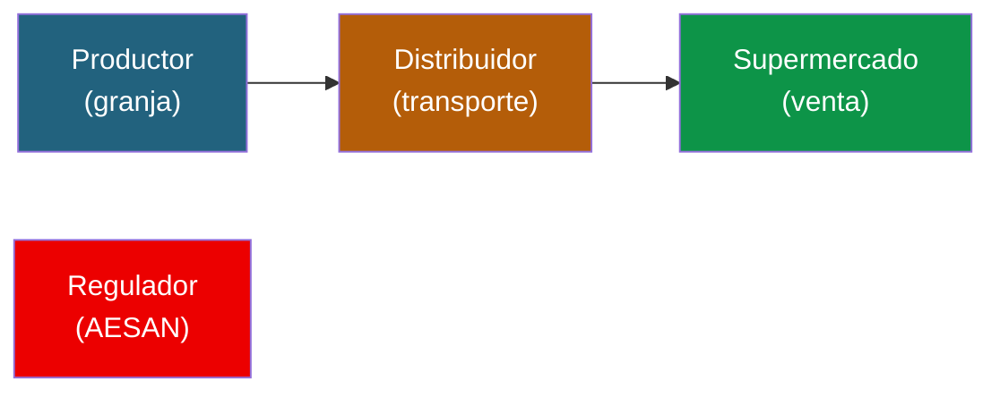
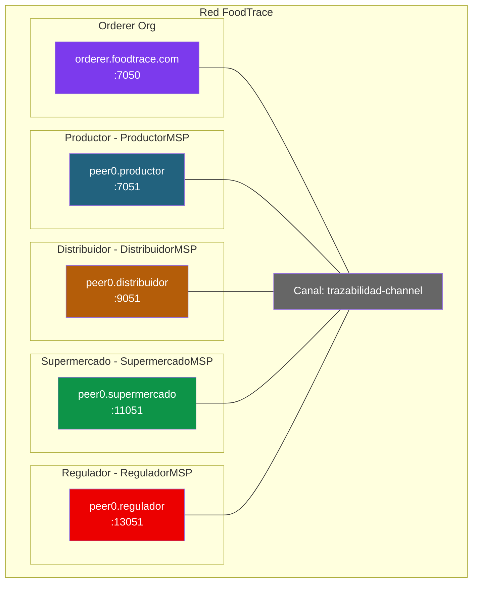

# Ejercicio 1: Trazabilidad alimentaria (caso Walmart)

## Contexto

Walmart, junto con IBM, lanzo en 2018 **IBM Food Trust**, una plataforma basada en Hyperledger Fabric para rastrear el origen de productos frescos. Antes del sistema, rastrear un mango desde la tienda hasta la granja tardaba 7 dias. Con Fabric, el mismo rastreo tarda 2.2 segundos.

Tu misión: diseñar y montar una red Fabric que soporte un caso similar (pero a escala de aula) para trazar **lotes de aguacates** desde el productor hasta el supermercado.

---

## Fase 1: Diseño sobre el papel

Antes de escribir un solo comando, responde estas preguntas en tu cuaderno.

### Actores y organizaciones



1. **¿Cuantas organizaciones hay en la red?** Enumera cada una con su MSPID.
2. **¿Que rol tiene cada organización?** ¿Cuales emiten datos, cuales solo leen?
3. **¿Necesitamos un regulador con acceso de solo lectura?** ¿O es mejor que sea una org mas?

### Datos y canales

4. **¿Cuantos canales necesitas?** ¿Uno compartido por todas las orgs? ¿Canales privados entre ciertas orgs?
5. **¿Que datos son públicos para todo el consorcio?** Piensa en: ID del lote, producto, origen, estado.
6. **¿Que datos son confidenciales?** Piensa en: precios, margenes, condiciones comerciales entre actores.
7. **¿Donde guardarias los precios?** ¿En el ledger público, en Private Data Collections, o off-chain?

### Flujo de datos

8. **¿Quien puede crear un nuevo lote?** ¿Solo el productor?
9. **¿Quien puede transferir la posesion?** ¿Solo el actual poseedor?
10. **¿Quien puede hacer un recall (retirar del mercado)?** ¿Solo el regulador o cualquier actor?
11. **¿El consumidor final necesita acceso?** ¿Como verificaria un QR?

### Políticas de endorsement

12. **¿Que política de endorsement usarias?** Justifica:
    - `AND(Productor, Distribuidor, Supermercado)` — todos deben aprobar
    - `OR(Productor, Distribuidor, Supermercado)` — basta con uno
    - `MAJORITY` — mayoria
    - Política por state (state-based endorsement)

---

## Solución propuesta

> **Intenta responder tu las preguntas antes de leer esto.**

### Topologia de red



**Decisiones clave:**

- **4 organizaciones + orderer**: Productor, Distribuidor, Supermercado y Regulador (este último como actor con permisos especiales).
- **1 canal compartido**: todos ven el mismo ledger. La trazabilidad tiene que ser pública dentro del consorcio.
- **Private Data Collection `priceAgreement`**: compartida solo entre Productor-Distribuidor para precios de compra.
- **Private Data Collection `wholesalePrice`**: compartida solo entre Distribuidor-Supermercado.
- **Política de endorsement**: `AND(productor, distribuidor, supermercado)` solo para recall. Para movimientos normales: solo el holder actual endorsa.

### Modelo de datos

```json
{
  "docType": "foodLot",
  "lotID": "LOT-AGU-2026-001",
  "productType": "aguacate",
  "origin": "Malaga, Espana",
  "producer": "ProductorMSP",
  "currentHolder": "DistribuidorMSP",
  "status": "in_transit",
  "temperature": 6.5,
  "weight": 500.0,
  "history": [
    {"org": "ProductorMSP", "action": "produced", "timestamp": "2026-04-20T08:00:00Z", "location": "Malaga"},
    {"org": "ProductorMSP", "action": "transferred_to_DistribuidorMSP", "timestamp": "2026-04-20T10:30:00Z", "location": "Malaga"}
  ]
}
```

---

## Fase 2: Montar la red

### Prerequisitos

- Docker y Docker Compose funcionando
- Binarios de Fabric en el PATH
- `jq` instalado

```bash
mkdir -p $HOME/foodtrace/{network,chaincode,channel-artifacts}
cd $HOME/foodtrace/network
```

### Paso 1: Generar certificados

Crea `crypto-config.yaml`:

```yaml
OrdererOrgs:
  - Name: Orderer
    Domain: foodtrace.com
    EnableNodeOUs: true
    Specs:
      - Hostname: orderer
        SANS: [localhost, 127.0.0.1]

PeerOrgs:
  - Name: Productor
    Domain: productor.foodtrace.com
    EnableNodeOUs: true
    Template: {Count: 1, SANS: [localhost, 127.0.0.1]}
    Users: {Count: 1}
  - Name: Distribuidor
    Domain: distribuidor.foodtrace.com
    EnableNodeOUs: true
    Template: {Count: 1, SANS: [localhost, 127.0.0.1]}
    Users: {Count: 1}
  - Name: Supermercado
    Domain: supermercado.foodtrace.com
    EnableNodeOUs: true
    Template: {Count: 1, SANS: [localhost, 127.0.0.1]}
    Users: {Count: 1}
  - Name: Regulador
    Domain: regulador.foodtrace.com
    EnableNodeOUs: true
    Template: {Count: 1, SANS: [localhost, 127.0.0.1]}
    Users: {Count: 1}
```

Generar:

```bash
cryptogen generate --config=crypto-config.yaml --output=crypto-config
```

### Paso 2: Configurar el canal

`configtx.yaml` (resumido — ver doc 03 como referencia completa):

```yaml
Organizations:
  - &OrdererOrg
    Name: OrdererOrg
    ID: OrdererMSP
    MSPDir: crypto-config/ordererOrganizations/foodtrace.com/msp
    OrdererEndpoints: [orderer.foodtrace.com:7050]
    Policies: {...}

  - &Productor
    Name: ProductorMSP
    ID: ProductorMSP
    MSPDir: crypto-config/peerOrganizations/productor.foodtrace.com/msp
    AnchorPeers: [{Host: peer0.productor.foodtrace.com, Port: 7051}]
    Policies: {...}

  # Mismo patron para Distribuidor, Supermercado, Regulador

Profiles:
  TrazabilidadChannel:
    Application:
      Organizations:
        - *Productor
        - *Distribuidor
        - *Supermercado
        - *Regulador
```

Generar bloque genesis:

```bash
export FABRIC_CFG_PATH=$PWD
configtxgen -profile TrazabilidadChannel \
  -outputBlock ../channel-artifacts/trazabilidad-channel.block \
  -channelID trazabilidad-channel
```

### Paso 3: Levantar la red

docker-compose con orderer + 4 peers + 4 CouchDB. Ver `docs/03-crear-red-personalizada.md` para la plantilla completa, adaptando puertos:

| Componente | Puerto |
|-----------|--------|
| orderer | 7050 |
| peer productor | 7051 |
| peer distribuidor | 9051 |
| peer supermercado | 11051 |
| peer regulador | 13051 |

```bash
docker compose -f ../docker/docker-compose.yaml up -d
```

### Paso 4: Crear canal y unir peers

```bash
# Unir orderer al canal
osnadmin channel join --channelID trazabilidad-channel \
  --config-block ../channel-artifacts/trazabilidad-channel.block \
  -o localhost:7053 --ca-file $ORDERER_CA \
  --client-cert $ORDERER_ADMIN_TLS_CERT \
  --client-key $ORDERER_ADMIN_TLS_KEY

# Unir cada peer (cambiar variables de entorno para cada org)
# Productor
export CORE_PEER_LOCALMSPID=ProductorMSP
export CORE_PEER_ADDRESS=localhost:7051
# ... (ver doc 03 para el patron completo)
peer channel join -b ../channel-artifacts/trazabilidad-channel.block

# Repetir para Distribuidor, Supermercado, Regulador
```

### Paso 5: Private Data Collections

Crea `collections_config.json`:

```json
[
  {
    "name": "priceAgreement",
    "policy": "OR('ProductorMSP.member', 'DistribuidorMSP.member')",
    "requiredPeerCount": 1,
    "maxPeerCount": 2,
    "blockToLive": 0,
    "memberOnlyRead": true,
    "memberOnlyWrite": true
  },
  {
    "name": "wholesalePrice",
    "policy": "OR('DistribuidorMSP.member', 'SupermercadoMSP.member')",
    "requiredPeerCount": 1,
    "maxPeerCount": 2,
    "blockToLive": 0,
    "memberOnlyRead": true,
    "memberOnlyWrite": true
  }
]
```

### Paso 6: Desplegar chaincode de trazabilidad

Puedes reutilizar el chaincode `FoodLot` del proyecto FidelityChain (Módulo 6) o uno similar. El despliegue es el estandar:

```bash
# Empaquetar
peer lifecycle chaincode package foodtrace.tar.gz \
  --path ../chaincode/ --lang golang --label foodtrace_1.0

# Instalar en cada peer (4 veces, una por org)
peer lifecycle chaincode install foodtrace.tar.gz

# Aprobar desde cada org (4 veces) — IMPORTANTE: pasar collections-config
peer lifecycle chaincode approveformyorg \
  -o localhost:7050 --ordererTLSHostnameOverride orderer.foodtrace.com \
  --tls --cafile $ORDERER_CA \
  --channelID trazabilidad-channel \
  --name foodtrace --version 1.0 \
  --package-id $CC_PACKAGE_ID --sequence 1 \
  --collections-config ./collections_config.json

# Commit
peer lifecycle chaincode commit \
  --collections-config ./collections_config.json \
  # ... resto de flags
```

---

## Fase 3: Probar el caso

### Flujo completo

```bash
# 1. Como Productor: crear un lote
peer chaincode invoke ... \
  -c '{"function":"ProduceLot","Args":["LOT-AGU-2026-001","aguacate","Malaga","500"]}'

# 2. Como Productor: acordar precio privado con Distribuidor
export PRICE_DATA=$(echo -n '{"price":1500,"currency":"EUR"}' | base64 | tr -d \\n)
peer chaincode invoke ... \
  --transient "{\"price\":\"$PRICE_DATA\"}" \
  -c '{"function":"SetPrivatePrice","Args":["LOT-AGU-2026-001","priceAgreement"]}'

# 3. Como Productor: transferir al Distribuidor
peer chaincode invoke ... \
  -c '{"function":"TransferLot","Args":["LOT-AGU-2026-001","DistribuidorMSP","Malaga","6.5"]}'

# 4. Como Distribuidor: verificar que tiene el lote
peer chaincode query -C trazabilidad-channel -n foodtrace \
  -c '{"Args":["ReadLot","LOT-AGU-2026-001"]}'

# 5. Como Supermercado: consultar trazabilidad completa
peer chaincode query -C trazabilidad-channel -n foodtrace \
  -c '{"Args":["GetLotHistory","LOT-AGU-2026-001"]}'

# 6. Como Regulador: hacer recall de un lote contaminado
peer chaincode invoke ... \
  -c '{"function":"RecallLot","Args":["LOT-AGU-2026-001","Contaminacion detectada"]}'
```

### Validar que la privacidad funciona

```bash
# Como Supermercado: NO deberia poder leer priceAgreement
peer chaincode query -C trazabilidad-channel -n foodtrace \
  -c '{"Args":["GetPrivatePrice","LOT-AGU-2026-001","priceAgreement"]}'
# Resultado esperado: error "access denied" o datos vacios
```

---

## Preguntas para el debate

1. ¿Que ventaja real tiene usar Fabric aqui frente a una base de datos compartida gestionada por el supermercado?
2. ¿Que pasa si el productor miente sobre el origen? ¿Blockchain lo detecta?
3. ¿Como integrariais sensores IoT (temperatura) para que registren datos automáticamente?
4. ¿Deberia el consumidor final tener acceso? ¿Como?
5. Si un productor abandona el consorcio, ¿que pasa con sus lotes históricos?

---

## Referencias

- Chaincode FoodLot: [Módulo 6 Dia 4](../../módulo-6/03-chaincode.md) (adaptar el modelo para aguacates)
- Tutorial de Private Data: [Doc 04 Chaincode Lifecycle](../../04-chaincode-lifecycle.md)
- Administracion: [Doc 06 Operaciones](../../06-operaciones-administracion.md)
