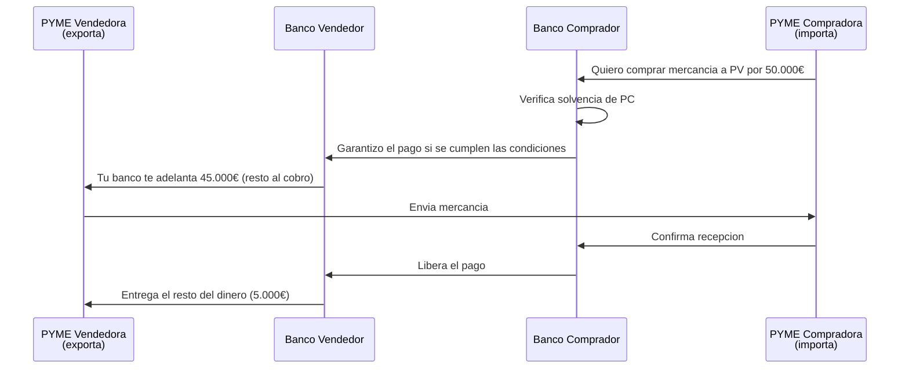
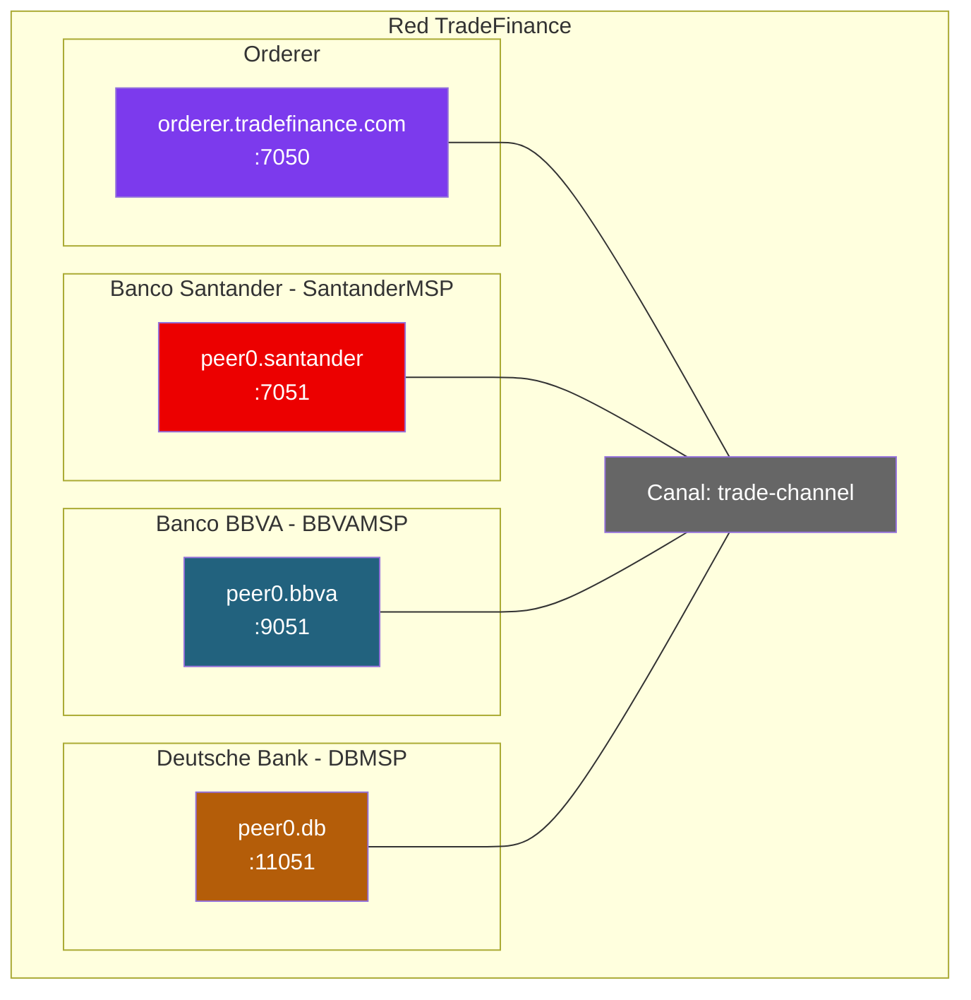

# Ejercicio 2: Trade Finance para PYMEs (caso We.Trade)

## Contexto

We.Trade fue una plataforma de financiacion de comercio internacional entre PYMEs, basada en Hyperledger Fabric. Fundada en 2018 por un consorcio de 12 bancos europeos (Deutsche Bank, HSBC, Santander, KBC, Nordea, Rabobank, Societe Generale, UBS, Unicredit, CaixaBank, Erste Group, UBS), ofrecia una solucion para reducir el papeleo y el riesgo de fraude en operaciones cross-border.

La plataforma cerro en 2022 por problemas de modelo de negocio — no de tecnologia. Pero su arquitectura es un caso de estudio excelente para entender como Fabric puede resolver problemas reales en el sector financiero.

Tu mision: disenar y montar una red Fabric que soporte un caso similar (a escala de aula) donde **3 bancos europeos** gestionen operaciones de comercio entre sus clientes PYMEs.

---

## El flujo de negocio



**Problema que resuelve:** sin esto, una PYME no se fia de exportar a un cliente en otro pais. Y el banco del comprador no se fia de prestar. Fabric da un ledger compartido donde todos ven el estado de la operacion en tiempo real.

---

## Fase 1: Diseño sobre el papel

### Actores y organizaciones

1. **¿Cuantas organizaciones hay?** ¿Los bancos son orgs y las PYMEs son usuarios?
2. **¿O las PYMEs deberian ser orgs tambien?** Justifica tu decision.
3. **¿Necesitas un regulador (BCE, CNMV) en la red?** ¿Que rol tendria?

### Datos y privacidad

4. **¿Los bancos ven las operaciones de otros bancos?** ¿Los importes? ¿Las condiciones?
5. **¿Las PYMEs ven operaciones de otras PYMEs?** ¿Incluso de sus competidores?
6. **¿Como gestionarias la privacidad?** Piensa en:
   - Canales separados por par de bancos
   - Private Data Collections
   - Un canal unico con acceso restringido en el chaincode
7. **¿Donde guardar los documentos comerciales** (facturas, albaranes, BL)?

### Máquina de estados de una operacion

Una operacion comercial tiene un ciclo de vida claro. Diseñalo:

```
propuesta → aprobada → en_transito → entregada → pagada
                   ↘ rechazada
                              ↘ disputa → resuelta
```

8. **¿Quien puede cambiar cada estado?** ¿Quien puede iniciar una disputa?
9. **¿Que pasa si el comprador no confirma la recepcion?** ¿Hay un timeout?

### Politicas de endorsement

10. **¿Que politica usarias para crear una operacion?**
    - `AND(BancoVendedor, BancoComprador)` — ambos bancos aprueban
    - `OR(BancoVendedor, BancoComprador)` — con uno basta
11. **¿Y para liberar el pago?** ¿Debe ser distinta que para crear?

---

## Solución propuesta

### Topología



**Decisiones clave:**

- **3 bancos como organizaciones + orderer**. Las PYMEs NO son orgs — son usuarios registrados por cada banco con un certificado X.509 y un atributo `role=client`.
- **1 canal compartido entre los 3 bancos**. Cada banco ve todas las operaciones para detectar patrones de fraude.
- **Private Data Collections**: los importes exactos y documentos sensibles solo los ven los 2 bancos involucrados en la operacion.
- **Politica de endorsement**: `AND(BancoVendedor, BancoComprador)` para crear y liberar pagos. Los bancos no implicados en la operacion NO endorsan (aunque ven el hash en el ledger).

### Modelo de datos

```json
{
  "docType": "tradeOperation",
  "operationID": "OP-2026-000123",
  "sellerOrg": "SantanderMSP",
  "buyerOrg": "BBVAMSP",
  "sellerClient": "pyme-exportadora-001",
  "buyerClient": "pyme-importadora-042",
  "description": "500 unidades producto X",
  "status": "approved",
  "amount": 50000,
  "currency": "EUR",
  "advancePercentage": 90,
  "deliveryDate": "2026-05-15",
  "createdAt": "2026-04-22T10:00:00Z",
  "history": [
    {"org": "SantanderMSP", "action": "created", "timestamp": "2026-04-22T10:00:00Z"},
    {"org": "BBVAMSP", "action": "approved", "timestamp": "2026-04-22T14:30:00Z"}
  ]
}
```

Los documentos comerciales (facturas, BL) se guardan **off-chain** en cada banco. En el ledger solo va el hash:

```json
"documents": [
  {"type": "invoice", "hash": "sha256:abc123...", "uploadedBy": "SantanderMSP"},
  {"type": "bill_of_lading", "hash": "sha256:def456...", "uploadedBy": "BBVAMSP"}
]
```

---

## Fase 2: Montar la red

### Estructura inicial

```bash
mkdir -p $HOME/tradefinance/{network,chaincode}
cd $HOME/tradefinance/network
```

### crypto-config.yaml

```yaml
OrdererOrgs:
  - Name: Orderer
    Domain: tradefinance.com
    EnableNodeOUs: true
    Specs:
      - Hostname: orderer
        SANS: [localhost, 127.0.0.1]

PeerOrgs:
  - Name: Santander
    Domain: santander.tradefinance.com
    EnableNodeOUs: true
    Template: {Count: 1, SANS: [localhost, 127.0.0.1]}
    Users: {Count: 3}  # 3 PYMEs clientes
  - Name: BBVA
    Domain: bbva.tradefinance.com
    EnableNodeOUs: true
    Template: {Count: 1, SANS: [localhost, 127.0.0.1]}
    Users: {Count: 3}
  - Name: DB
    Domain: db.tradefinance.com
    EnableNodeOUs: true
    Template: {Count: 1, SANS: [localhost, 127.0.0.1]}
    Users: {Count: 3}
```

Con `Users.Count: 3` generamos 3 usuarios por banco que simularan las PYMEs clientes.

```bash
cryptogen generate --config=crypto-config.yaml --output=crypto-config
```

### Private Data Collections

`collections_config.json`:

```json
[
  {
    "name": "santanderBBVA",
    "policy": "OR('SantanderMSP.member', 'BBVAMSP.member')",
    "requiredPeerCount": 1,
    "maxPeerCount": 2,
    "blockToLive": 0,
    "memberOnlyRead": true,
    "memberOnlyWrite": true
  },
  {
    "name": "santanderDB",
    "policy": "OR('SantanderMSP.member', 'DBMSP.member')",
    "requiredPeerCount": 1,
    "maxPeerCount": 2,
    "blockToLive": 0,
    "memberOnlyRead": true
  },
  {
    "name": "bbvaDB",
    "policy": "OR('BBVAMSP.member', 'DBMSP.member')",
    "requiredPeerCount": 1,
    "maxPeerCount": 2,
    "blockToLive": 0,
    "memberOnlyRead": true
  }
]
```

Para N bancos se necesitan N*(N-1)/2 colecciones privadas (una por cada par). Con 3 bancos → 3 colecciones. Con 10 → 45. **Este es uno de los retos reales de We.Trade: escalar.**

### Funciones principales del chaincode

```go
// Crear operacion (solo BancoComprador)
func (s *SmartContract) CreateOperation(ctx ...,
    operationID, sellerOrg, sellerClient, buyerClient string,
    amount int, currency string) error {

    callerMSP, _ := ctx.GetClientIdentity().GetMSPID()
    // El creador es siempre el banco del comprador
    // (el que pide la operacion en nombre del importador)

    // Guardar datos publicos en el ledger
    op := TradeOperation{...}
    ctx.GetStub().PutState("op_" + operationID, opJSON)

    // Guardar datos privados en la coleccion correspondiente
    collectionName := getCollectionName(sellerOrg, callerMSP)
    transient, _ := ctx.GetStub().GetTransient()
    privateData := transient["privateData"]
    ctx.GetStub().PutPrivateData(collectionName, operationID, privateData)

    ctx.GetStub().SetEvent("OperationCreated", ...)
}

// Aprobar operacion (solo BancoVendedor)
func (s *SmartContract) ApproveOperation(ctx ..., operationID string) error {
    op, _ := s.ReadOperation(ctx, operationID)
    callerMSP, _ := ctx.GetClientIdentity().GetMSPID()

    if callerMSP != op.SellerOrg {
        return fmt.Errorf("solo el banco vendedor puede aprobar")
    }
    if op.Status != "proposed" {
        return fmt.Errorf("la operacion no esta en estado 'proposed'")
    }

    op.Status = "approved"
    // ... actualizar history y guardar
}

// Confirmar entrega (solo BancoComprador)
func (s *SmartContract) ConfirmDelivery(ctx ..., operationID string) error {
    // Verificacion similar: solo el buyer org
    // Cambiar status a "delivered"
}

// Liberar pago (AMBOS bancos deben firmar)
func (s *SmartContract) ReleasePayment(ctx ..., operationID string) error {
    // La politica AND ya lo garantiza a nivel de endorsement
    // Aqui solo cambiamos el status a "paid"
}
```

### Despliegue con politica de endorsement AND

Al hacer `approveformyorg` y `commit`, especificar:

```bash
peer lifecycle chaincode approveformyorg \
  ... \
  --signature-policy "AND('SantanderMSP.peer','BBVAMSP.peer','DBMSP.peer')" \
  --collections-config ./collections_config.json
```

Esta es una politica muy restrictiva (los 3 bancos endorsan todo). En produccion se usaria **state-based endorsement** para que cada operacion requiera solo el endorsement de los 2 bancos involucrados. Es un tema avanzado que se ve en Modulo 4 dia 5.

---

## Fase 3: Probar el caso

### Flujo completo

```bash
# Variables de entorno comunes (ORDERER_CA, peer TLS, etc.)

# 1. Como BBVA (banco del comprador): crear operacion
export CORE_PEER_LOCALMSPID=BBVAMSP
export CORE_PEER_ADDRESS=localhost:9051
# ... MSP del admin de BBVA

export PRIVATE_DATA=$(echo -n '{"advancePercentage":90,"contractDetails":"Entrega Malaga-Munich"}' | base64 | tr -d \\n)

peer chaincode invoke ... \
  --transient "{\"privateData\":\"$PRIVATE_DATA\"}" \
  -c '{"function":"CreateOperation","Args":["OP-2026-000123","SantanderMSP","pyme-exportadora-001","pyme-importadora-042","50000","EUR"]}'

# 2. Como Santander (banco del vendedor): aprobar
export CORE_PEER_LOCALMSPID=SantanderMSP
export CORE_PEER_ADDRESS=localhost:7051

peer chaincode invoke ... \
  -c '{"function":"ApproveOperation","Args":["OP-2026-000123"]}'

# 3. Como BBVA: confirmar entrega
export CORE_PEER_LOCALMSPID=BBVAMSP
peer chaincode invoke ... \
  -c '{"function":"ConfirmDelivery","Args":["OP-2026-000123"]}'

# 4. Como Santander O BBVA: liberar pago (politica AND)
peer chaincode invoke ... \
  --peerAddresses localhost:7051 --tlsRootCertFiles $PEER_SANT_TLS \
  --peerAddresses localhost:9051 --tlsRootCertFiles $PEER_BBVA_TLS \
  -c '{"function":"ReleasePayment","Args":["OP-2026-000123"]}'
```

### Validar privacidad

```bash
# Como Deutsche Bank: NO deberia poder leer los datos privados
export CORE_PEER_LOCALMSPID=DBMSP
peer chaincode query -C trade-channel -n tradefinance \
  -c '{"Args":["GetPrivateOperationData","OP-2026-000123"]}'
# Error esperado: "access denied" o datos vacios

# Pero SI puede leer el estado publico
peer chaincode query -C trade-channel -n tradefinance \
  -c '{"Args":["ReadOperation","OP-2026-000123"]}'
# OK: devuelve status, timestamps, orgs involucradas (no el importe)
```

---

## Preguntas para el debate

1. We.Trade cerro por problemas de modelo de negocio (¿quien paga?). ¿Como lo resolveriais?
2. ¿Tiene sentido que las PYMEs sean usuarios de los bancos y no orgs propias? ¿Que cambiaria?
3. Con N bancos se necesitan N*(N-1)/2 Private Data Collections. ¿Como escala esto a 50 bancos?
4. ¿Como se integrarian los sistemas legacy de cada banco (core bancario) con Fabric?
5. Si una PYME cambia de banco, ¿que pasa con su historial?
6. ¿Deberia haber un regulador (BCE) con acceso de solo lectura a todo el canal?

---

## Referencias

- Private Data Collections: [Módulo 4 día 3](../../slides/Modulo 4/dia_3.pptx)
- Políticas de endorsement: [doc 04 Chaincode Lifecycle](../../04-chaincode-lifecycle.md)
- State-based endorsement: [Módulo 4 día 5](../../slides/Modulo 4/dia_5.pptx)
