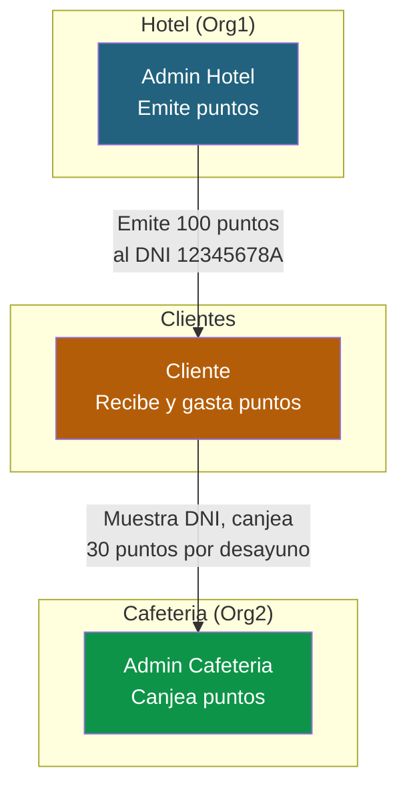
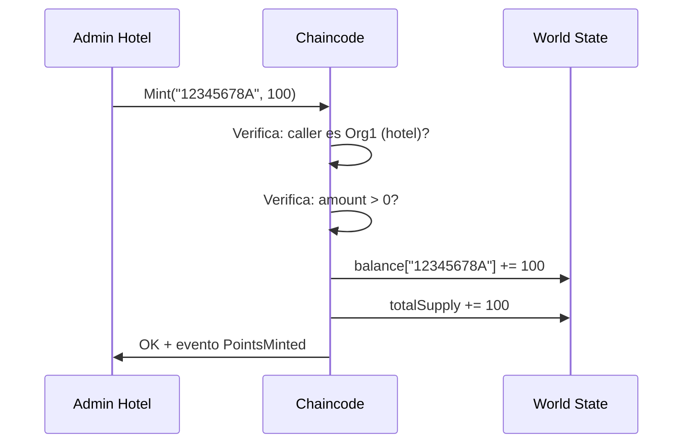
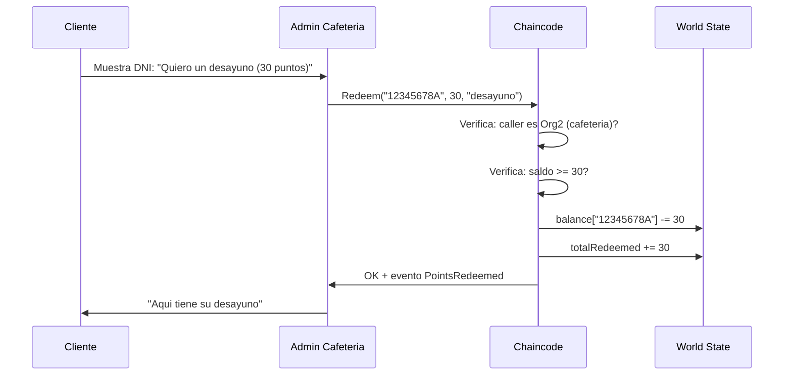
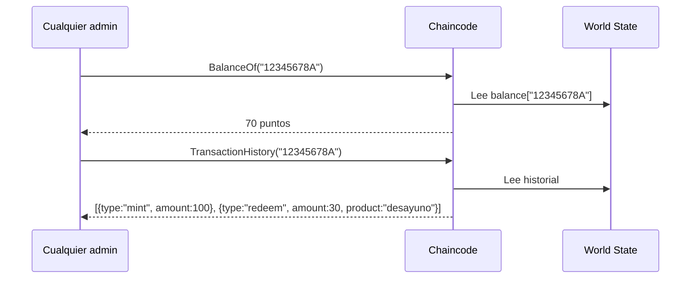
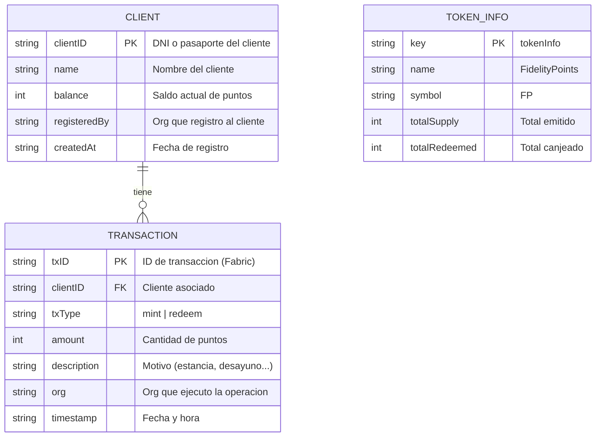

# 01 - Diseño funcional: FidelityChain

## Descripcion del proyecto

FidelityChain es un sistema de puntos de fidelizacion compartido entre dos empresas: un **hotel** y una **cafeteria**. El hotel emite puntos a sus clientes como recompensa por cada estancia. Los clientes pueden gastar esos puntos en la cafeteria para pagar desayunos, cafes y otros productos.

Ambas empresas comparten un ledger comun en Hyperledger Fabric que registra de forma inmutable todas las emisiones, canjes y transferencias de puntos. Ninguna de las dos puede modificar los datos de la otra, y ambas tienen visibilidad completa de los movimientos.

---

## Por que blockchain para esto?

Sin blockchain, este sistema requeriria que una de las dos empresas (o un tercero) gestionase la base de datos de puntos. Esto genera problemas de confianza:

- Si el hotel gestiona la base de datos, la cafeteria tiene que confiar en que no emite puntos fraudulentos
- Si la cafeteria la gestiona, el hotel tiene que confiar en que los canjes son legitimos
- Si un tercero la gestiona, ambas dependen de el y pagan por el servicio

Con Fabric, **cada empresa mantiene su propia copia del ledger** y valida las transacciones de la otra. No hay intermediario, no hay confianza ciega, y el registro es inmutable.

---

## Actores del sistema

| Actor | Organizacion | Rol | Que puede hacer |
|-------|-------------|-----|-----------------|
| **Admin Hotel** | Org1 (Hotel) | Emisor | Emitir puntos a clientes, consultar saldos |
| **Admin Cafeteria** | Org2 (Cafeteria) | Canjeador | Canjear puntos de clientes por productos, consultar saldos |
| **Cliente** | Identificado por DNI | Beneficiario | Consultar su saldo e historial |

> **Identificacion de clientes:** Los clientes se identifican por su **numero de DNI/pasaporte** (por ejemplo `12345678A`). No tienen certificado X.509 propio en la red Fabric — son registros en el World State gestionados por los admins. Cuando un cliente quiere canjear puntos en la cafeteria, muestra su DNI y el admin de la cafeteria ejecuta la transaccion en su nombre.

---

## Flujos funcionales

### Flujo 1: Emision de puntos

1. Un huesped hace check-out en el hotel
2. El admin del hotel ejecuta `Mint("12345678A", 100)` para emitirle 100 puntos
3. El chaincode verifica que quien llama es Org1 (solo el hotel puede emitir)
4. Se actualiza el saldo del cliente y el supply total
5. Se emite un evento `PointsMinted` que la cafeteria puede escuchar

### Flujo 2: Canje de puntos

1. El cliente llega a la cafeteria y dice que quiere pagar con puntos
2. El admin de la cafeteria ejecuta `Redeem("12345678A", 30, "desayuno")`
3. El chaincode verifica que quien llama es Org2 (solo la cafeteria canjea)
4. Se verifica que el cliente tiene saldo suficiente
5. Se descuenta del saldo y se registra el canje
6. Se emite un evento `PointsRedeemed`

### Flujo 3: Consulta de saldo e historial

---

## Catalogo de productos (cafeteria)

| Producto | Puntos |
|----------|--------|
| Cafe solo | 10 |
| Cafe con leche | 15 |
| Tostada | 15 |
| Desayuno completo | 30 |
| Menu almuerzo | 50 |

> El catalogo se gestiona en la aplicacion cliente, no en el chaincode. El chaincode solo ve el canje de puntos con una descripcion del producto.

---

## Reglas de negocio

1. **Solo el hotel (Org1) puede emitir puntos** — La cafeteria no puede crear puntos de la nada
2. **Solo la cafeteria (Org2) puede canjear puntos** — El hotel no canjea en nombre del cliente
3. **Ambas organizaciones pueden consultar saldos e historiales** — Transparencia total
4. **No se puede gastar mas de lo que se tiene** — El chaincode valida saldo >= amount
5. **Los puntos no caducan** — Simplificacion para el proyecto (en produccion se andiria TTL)
6. **No hay transferencia entre clientes** — Solo mint y redeem (simplificacion)
7. **El amount debe ser positivo** — No se permiten operaciones con 0 o negativos
8. **El historial es inmutable** — Cada operacion queda registrada para siempre

---

## Modelo de datos

### Keys en el World State

| Key | Valor | Proposito |
|-----|-------|-----------|
| `client~12345678A` | JSON del cliente (name, balance...) | Datos del cliente |
| `tx~12345678A~00001` | JSON de la transaccion | Historial (composite key) |
| `tokenInfo` | JSON con totales | Metadata del token |

---

## Funciones del chaincode

| Funcion | Quien puede llamarla | Descripcion |
|---------|---------------------|-------------|
| `RegisterClient(clientID, name)` | Org1 o Org2 | Registrar un nuevo cliente |
| `Mint(clientID, amount, description)` | Solo Org1 (Hotel) | Emitir puntos |
| `Redeem(clientID, amount, product)` | Solo Org2 (Cafeteria) | Canjear puntos por producto |
| `BalanceOf(clientID)` | Org1 o Org2 | Consultar saldo |
| `ClientHistory(clientID)` | Org1 o Org2 | Ver historial de movimientos |
| `GetTokenInfo()` | Org1 o Org2 | Ver totales (supply, redeemed) |
| `GetAllClients()` | Org1 o Org2 | Listar todos los clientes |

---

## Eventos

| Evento | Payload | Cuando se emite |
|--------|---------|-----------------|
| `ClientRegistered` | `{clientID, name, registeredBy}` | Al registrar un cliente nuevo |
| `PointsMinted` | `{clientID, amount, description, newBalance}` | Al emitir puntos |
| `PointsRedeemed` | `{clientID, amount, product, newBalance}` | Al canjear puntos |

---

**Siguiente:** [02 - Arquitectura de red](02-arquitectura-red.md)
