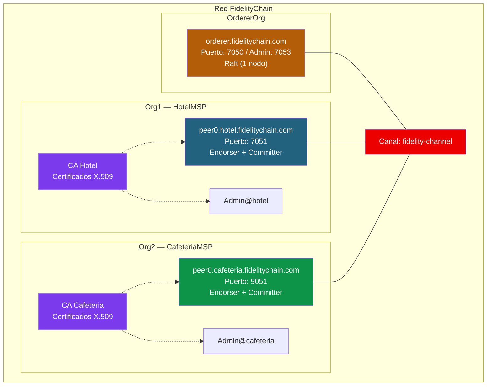
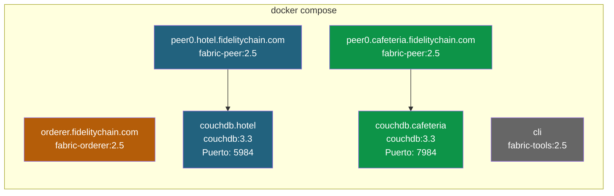
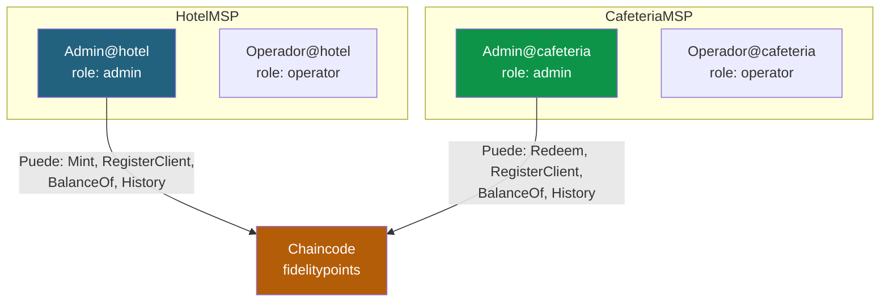

# 02 - Arquitectura de red: FidelityChain

## Topologia de la red

Nuestra red tiene la estructura minima para un consorcio real: dos organizaciones independientes que comparten un canal. Cada una mantiene su propio peer y valida las transacciones de la otra.



### Decisiones de diseno

| Decision | Eleccion | Motivo |
|----------|----------|--------|
| Organizaciones | 2 (Hotel + Cafeteria) | Minimo para demostrar consorcio |
| Peers por org | 1 | Suficiente para desarrollo |
| Orderer | Raft, 1 nodo | Simplicidad (produccion: 3-5 nodos) |
| Canal | 1 (fidelity-channel) | Ambas orgs comparten todos los datos |
| Base de datos | CouchDB | Necesitamos rich queries para historial |
| Chaincode | Go + Node.js | Ambas versiones para el curso |
| Politica endorsement | AND(Hotel, Cafeteria) | Ambas orgs deben aprobar cada transaccion |

> **¿Por que AND y no MAJORITY?** Con solo 2 organizaciones, MAJORITY seria "al menos 1", lo que permitiria que una org modifique el ledger sin aprobacion de la otra. AND garantiza que ambas validen cada transaccion.

---

## Contenedores Docker



| Contenedor | Imagen | Puerto | Proposito |
|-----------|--------|--------|-----------|
| orderer.fidelitychain.com | fabric-orderer:2.5 | 7050, 7053 | Servicio de ordenacion |
| peer0.hotel.fidelitychain.com | fabric-peer:2.5 | 7051 | Peer del hotel |
| peer0.cafeteria.fidelitychain.com | fabric-peer:2.5 | 9051 | Peer de la cafeteria |
| couchdb.hotel | couchdb:3.3 | 5984 | World State del hotel |
| couchdb.cafeteria | couchdb:3.3 | 7984 | World State de la cafeteria |
| cli | fabric-tools:2.5 | - | Administracion |

> **¿Por que CouchDB?** Porque necesitamos rich queries para buscar transacciones por cliente, por tipo o por rango de fechas. Con LevelDB solo podriamos buscar por clave exacta o por rango de claves.

---

## Identidades y permisos



El control de acceso se implementa en el chaincode verificando el MSPID del caller:
- `HotelMSP` → puede ejecutar `Mint`
- `CafeteriaMSP` → puede ejecutar `Redeem`
- Ambos → pueden ejecutar `RegisterClient`, `BalanceOf`, `ClientHistory`, `GetTokenInfo`

---

## Estructura del proyecto

```
proyecto-fidelitychain/
├── network/
│   ├── crypto-config.yaml            # Definicion de orgs e identidades
│   ├── configtx.yaml                 # Topologia del canal y politicas
│   └── docker/
│       └── docker-compose.yaml       # Todos los contenedores
├── chaincode/
│   ├── chaincode-go/                 # Chaincode en Go
│   │   ├── go.mod
│   │   ├── go.sum
│   │   ├── fidelitypoints.go         # Contrato principal
│   │   └── fidelitypoints_test.go    # Tests unitarios
│   └── chaincode-javascript/         # Chaincode en Node.js
│       ├── package.json
│       ├── lib/
│       │   └── fidelitypoints.js
│       └── test/
│           └── fidelitypoints.test.js
├── application/
│   ├── package.json
│   ├── hotel-app.js                  # App del hotel (emitir puntos)
│   ├── cafeteria-app.js              # App de la cafeteria (canjear puntos)
│   ├── utils/
│   │   └── fabric-connection.js      # Helper de conexion al Gateway
│   └── wallet/                       # Identidades (se genera al arrancar)
└── scripts/
    ├── start-network.sh              # Levantar red + crear canal
    ├── deploy-chaincode.sh           # Empaquetar, instalar, aprobar, commit
    ├── stop-network.sh               # Parar red
    └── clean-all.sh                  # Borrar todo y empezar de cero
```

---

## Archivos de configuracion

### crypto-config.yaml

```yaml
# proyecto-fidelitychain/network/crypto-config.yaml
OrdererOrgs:
  - Name: Orderer
    Domain: fidelitychain.com
    EnableNodeOUs: true
    Specs:
      - Hostname: orderer
        SANS:
          - localhost
          - 127.0.0.1

PeerOrgs:
  - Name: Hotel
    Domain: hotel.fidelitychain.com
    EnableNodeOUs: true
    Template:
      Count: 1
      SANS:
        - localhost
        - 127.0.0.1
    Users:
      Count: 1

  - Name: Cafeteria
    Domain: cafeteria.fidelitychain.com
    EnableNodeOUs: true
    Template:
      Count: 1
      SANS:
        - localhost
        - 127.0.0.1
    Users:
      Count: 1
```

### configtx.yaml

```yaml
# proyecto-fidelitychain/network/configtx.yaml
---
Organizations:
  - &OrdererOrg
    Name: OrdererOrg
    ID: OrdererMSP
    MSPDir: crypto-config/ordererOrganizations/fidelitychain.com/msp
    Policies:
      Readers:
        Type: Signature
        Rule: "OR('OrdererMSP.member')"
      Writers:
        Type: Signature
        Rule: "OR('OrdererMSP.member')"
      Admins:
        Type: Signature
        Rule: "OR('OrdererMSP.admin')"
    OrdererEndpoints:
      - orderer.fidelitychain.com:7050

  - &Hotel
    Name: HotelMSP
    ID: HotelMSP
    MSPDir: crypto-config/peerOrganizations/hotel.fidelitychain.com/msp
    Policies:
      Readers:
        Type: Signature
        Rule: "OR('HotelMSP.admin', 'HotelMSP.peer', 'HotelMSP.client')"
      Writers:
        Type: Signature
        Rule: "OR('HotelMSP.admin', 'HotelMSP.client')"
      Admins:
        Type: Signature
        Rule: "OR('HotelMSP.admin')"
      Endorsement:
        Type: Signature
        Rule: "OR('HotelMSP.peer')"
    AnchorPeers:
      - Host: peer0.hotel.fidelitychain.com
        Port: 7051

  - &Cafeteria
    Name: CafeteriaMSP
    ID: CafeteriaMSP
    MSPDir: crypto-config/peerOrganizations/cafeteria.fidelitychain.com/msp
    Policies:
      Readers:
        Type: Signature
        Rule: "OR('CafeteriaMSP.admin', 'CafeteriaMSP.peer', 'CafeteriaMSP.client')"
      Writers:
        Type: Signature
        Rule: "OR('CafeteriaMSP.admin', 'CafeteriaMSP.client')"
      Admins:
        Type: Signature
        Rule: "OR('CafeteriaMSP.admin')"
      Endorsement:
        Type: Signature
        Rule: "OR('CafeteriaMSP.peer')"
    AnchorPeers:
      - Host: peer0.cafeteria.fidelitychain.com
        Port: 9051

Capabilities:
  Channel: &ChannelCapabilities
    V2_0: true
  Orderer: &OrdererCapabilities
    V2_0: true
  Application: &ApplicationCapabilities
    V2_0: true

Application: &ApplicationDefaults
  Organizations:
  Policies:
    Readers:
      Type: ImplicitMeta
      Rule: "ANY Readers"
    Writers:
      Type: ImplicitMeta
      Rule: "ANY Writers"
    Admins:
      Type: ImplicitMeta
      Rule: "MAJORITY Admins"
    LifecycleEndorsement:
      Type: ImplicitMeta
      Rule: "MAJORITY Endorsement"
    Endorsement:
      Type: ImplicitMeta
      Rule: "MAJORITY Endorsement"
  Capabilities:
    <<: *ApplicationCapabilities

Orderer: &OrdererDefaults
  OrdererType: etcdraft
  BatchTimeout: 2s
  BatchSize:
    MaxMessageCount: 10
    AbsoluteMaxBytes: 99 MB
    PreferredMaxBytes: 512 KB
  EtcdRaft:
    Consenters:
      - Host: orderer.fidelitychain.com
        Port: 7050
        ClientTLSCert: crypto-config/ordererOrganizations/fidelitychain.com/orderers/orderer.fidelitychain.com/tls/server.crt
        ServerTLSCert: crypto-config/ordererOrganizations/fidelitychain.com/orderers/orderer.fidelitychain.com/tls/server.crt
  Organizations:
  Policies:
    Readers:
      Type: ImplicitMeta
      Rule: "ANY Readers"
    Writers:
      Type: ImplicitMeta
      Rule: "ANY Writers"
    Admins:
      Type: ImplicitMeta
      Rule: "MAJORITY Admins"
    BlockValidation:
      Type: ImplicitMeta
      Rule: "ANY Writers"
  Capabilities:
    <<: *OrdererCapabilities

Channel: &ChannelDefaults
  Policies:
    Readers:
      Type: ImplicitMeta
      Rule: "ANY Readers"
    Writers:
      Type: ImplicitMeta
      Rule: "ANY Writers"
    Admins:
      Type: ImplicitMeta
      Rule: "MAJORITY Admins"
  Capabilities:
    <<: *ChannelCapabilities

Profiles:
  FidelityChannel:
    <<: *ChannelDefaults
    Orderer:
      <<: *OrdererDefaults
      Organizations:
        - *OrdererOrg
    Application:
      <<: *ApplicationDefaults
      Organizations:
        - *Hotel
        - *Cafeteria
```

---

## Flujo completo de despliegue

```mermaid
graph LR
    A["crypto-config.yaml<br/>Generar certs"] --> B["configtx.yaml<br/>Bloque genesis"]
    B --> C["docker-compose<br/>Levantar red"]
    C --> D["osnadmin<br/>Crear canal"]
    D --> E["peer channel join<br/>Unir peers"]
    E --> F["Lifecycle<br/>Desplegar chaincode"]
    F --> G["App Node.js<br/>Conectar y operar"]

    style A fill:#7C3AED,color:#fff
    style B fill:#22627E,color:#fff
    style C fill:#0D9448,color:#fff
    style D fill:#B45D09,color:#fff
    style E fill:#B45D09,color:#fff
    style F fill:#EC0000,color:#fff
    style G fill:#EC0000,color:#fff
```



Cada uno de estos pasos se detalla en los documentos siguientes (04 y 05).

---

**Anterior:** [01 - Diseno funcional](01-diseno-funcional.md)
**Siguiente:** [03 - Chaincode](03-chaincode.md)
