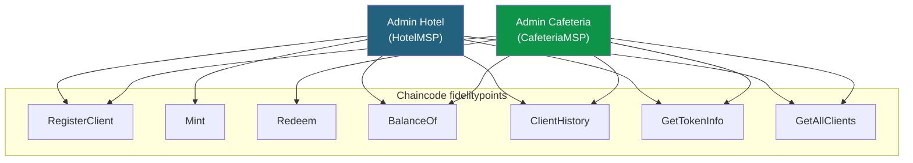
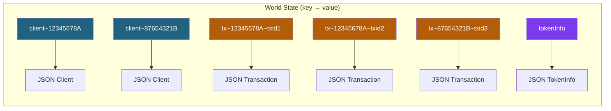
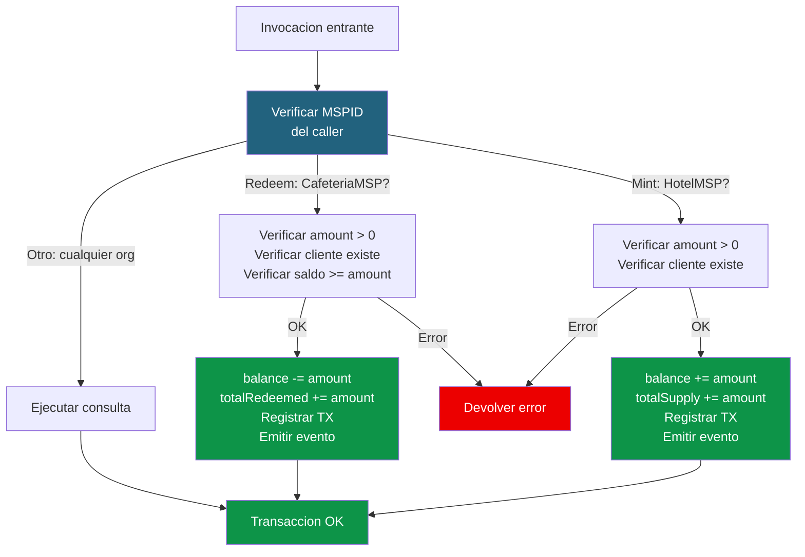

# 03 - Chaincode: FidelityPoints

## Visión general

El chaincode `fidelitypoints` es el corazon del sistema. Gestiona los puntos de fidelizacion: registrar clientes, emitir puntos, canjearlos y consultar saldos e historiales.



---

## Modelo de datos

### Client

```go
type Client struct {
    DocType      string `json:"docType"`      // "client"
    ClientID     string `json:"clientID"`     // Identificador unico
    Name         string `json:"name"`         // Nombre del cliente
    Balance      int    `json:"balance"`      // Saldo actual de puntos
    RegisteredBy string `json:"registeredBy"` // Org que lo registro (MSPID)
    CreatedAt    string `json:"createdAt"`    // Timestamp de registro
}
```

### Transaction (registro de movimiento)

```go
type Transaction struct {
    DocType     string `json:"docType"`     // "transaction"
    TxID        string `json:"txID"`        // ID de la transaccion Fabric
    ClientID    string `json:"clientID"`    // Cliente asociado
    TxType      string `json:"txType"`      // "mint" o "redeem"
    Amount      int    `json:"amount"`      // Cantidad de puntos
    Description string `json:"description"` // Motivo o producto
    Org         string `json:"org"`         // Org que ejecuto la operacion
    Timestamp   string `json:"timestamp"`   // Fecha y hora
}
```

### TokenInfo (metadata global del token)

```go
type TokenInfo struct {
    DocType       string `json:"docType"`       // "tokenInfo"
    Name          string `json:"name"`          // "FidelityPoints"
    Symbol        string `json:"symbol"`        // "FP"
    TotalSupply   int    `json:"totalSupply"`   // Total emitido
    TotalRedeemed int    `json:"totalRedeemed"` // Total canjeado
}
```

### Diseño de claves en el World State



Las transacciones usan **composite keys** (`tx~clientID~txID`) para poder buscar todas las transacciones de un cliente eficientemente con `GetStateByPartialCompositeKey`.

---

## Código del chaincode (Go)

### Estructura principal

```go
package main

import (
    "encoding/json"
    "fmt"
    "time"

    "github.com/hyperledger/fabric-contract-api-go/contractapi"
)

// SmartContract implementa el contrato de puntos de fidelizacion
type SmartContract struct {
    contractapi.Contract
}
```

### InitLedger — Inicializar el token

```go
// InitLedger crea la metadata del token. Se llama una sola vez al desplegar.
func (s *SmartContract) InitLedger(ctx contractapi.TransactionContextInterface) error {
    tokenInfo := TokenInfo{
        DocType:       "tokenInfo",
        Name:          "FidelityPoints",
        Symbol:        "FP",
        TotalSupply:   0,
        TotalRedeemed: 0,
    }
    tokenJSON, err := json.Marshal(tokenInfo)
    if err != nil {
        return err
    }
    return ctx.GetStub().PutState("tokenInfo", tokenJSON)
}
```

### RegisterClient — Registrar un cliente

```go
// RegisterClient registra un nuevo cliente. Puede llamarlo cualquier org.
func (s *SmartContract) RegisterClient(ctx contractapi.TransactionContextInterface,
    clientID string, name string) error {

    // Verificar que no existe
    existing, err := ctx.GetStub().GetState("client~" + clientID)
    if err != nil {
        return fmt.Errorf("error leyendo state: %v", err)
    }
    if existing != nil {
        return fmt.Errorf("el cliente %s ya existe", clientID)
    }

    // Obtener la org que registra
    mspID, err := ctx.GetClientIdentity().GetMSPID()
    if err != nil {
        return fmt.Errorf("error obteniendo MSPID: %v", err)
    }

    // Obtener timestamp de la transaccion (determinista)
    txTimestamp, _ := ctx.GetStub().GetTxTimestamp()
    createdAt := time.Unix(txTimestamp.Seconds, 0).Format(time.RFC3339)

    client := Client{
        DocType:      "client",
        ClientID:     clientID,
        Name:         name,
        Balance:      0,
        RegisteredBy: mspID,
        CreatedAt:    createdAt,
    }
    clientJSON, _ := json.Marshal(client)

    // Emitir evento
    ctx.GetStub().SetEvent("ClientRegistered", []byte(
        fmt.Sprintf(`{"clientID":"%s","name":"%s","registeredBy":"%s"}`,
            clientID, name, mspID)))

    return ctx.GetStub().PutState("client~"+clientID, clientJSON)
}
```

### Mint — Emitir puntos (solo Hotel)

```go
// Mint emite puntos a un cliente. Solo puede llamarlo HotelMSP.
func (s *SmartContract) Mint(ctx contractapi.TransactionContextInterface,
    clientID string, amount int, description string) error {

    // Verificar que el caller es el hotel
    mspID, _ := ctx.GetClientIdentity().GetMSPID()
    if mspID != "HotelMSP" {
        return fmt.Errorf("solo el hotel puede emitir puntos (caller: %s)", mspID)
    }

    if amount <= 0 {
        return fmt.Errorf("la cantidad debe ser positiva")
    }

    // Leer cliente
    client, err := s.getClient(ctx, clientID)
    if err != nil {
        return err
    }

    // Actualizar saldo
    client.Balance += amount
    clientJSON, _ := json.Marshal(client)
    ctx.GetStub().PutState("client~"+clientID, clientJSON)

    // Actualizar totalSupply
    tokenInfo, _ := s.getTokenInfo(ctx)
    tokenInfo.TotalSupply += amount
    tokenJSON, _ := json.Marshal(tokenInfo)
    ctx.GetStub().PutState("tokenInfo", tokenJSON)

    // Registrar transaccion
    txID := ctx.GetStub().GetTxID()
    txTimestamp, _ := ctx.GetStub().GetTxTimestamp()
    ts := time.Unix(txTimestamp.Seconds, 0).Format(time.RFC3339)

    tx := Transaction{
        DocType:     "transaction",
        TxID:        txID,
        ClientID:    clientID,
        TxType:      "mint",
        Amount:      amount,
        Description: description,
        Org:         mspID,
        Timestamp:   ts,
    }
    txJSON, _ := json.Marshal(tx)

    // Composite key para buscar por cliente
    txKey, _ := ctx.GetStub().CreateCompositeKey("tx", []string{clientID, txID})
    ctx.GetStub().PutState(txKey, txJSON)

    // Evento
    ctx.GetStub().SetEvent("PointsMinted", []byte(
        fmt.Sprintf(`{"clientID":"%s","amount":%d,"description":"%s","newBalance":%d}`,
            clientID, amount, description, client.Balance)))

    return nil
}
```

### Redeem — Canjear puntos (solo Cafeteria)

```go
// Redeem canjea puntos de un cliente por un producto. Solo CafeteriaMSP.
func (s *SmartContract) Redeem(ctx contractapi.TransactionContextInterface,
    clientID string, amount int, product string) error {

    // Verificar que el caller es la cafeteria
    mspID, _ := ctx.GetClientIdentity().GetMSPID()
    if mspID != "CafeteriaMSP" {
        return fmt.Errorf("solo la cafeteria puede canjear puntos (caller: %s)", mspID)
    }

    if amount <= 0 {
        return fmt.Errorf("la cantidad debe ser positiva")
    }

    // Leer cliente
    client, err := s.getClient(ctx, clientID)
    if err != nil {
        return err
    }

    // Verificar saldo
    if client.Balance < amount {
        return fmt.Errorf("saldo insuficiente: tiene %d puntos, necesita %d",
            client.Balance, amount)
    }

    // Actualizar saldo
    client.Balance -= amount
    clientJSON, _ := json.Marshal(client)
    ctx.GetStub().PutState("client~"+clientID, clientJSON)

    // Actualizar totalRedeemed
    tokenInfo, _ := s.getTokenInfo(ctx)
    tokenInfo.TotalRedeemed += amount
    tokenJSON, _ := json.Marshal(tokenInfo)
    ctx.GetStub().PutState("tokenInfo", tokenJSON)

    // Registrar transaccion
    txID := ctx.GetStub().GetTxID()
    txTimestamp, _ := ctx.GetStub().GetTxTimestamp()
    ts := time.Unix(txTimestamp.Seconds, 0).Format(time.RFC3339)

    tx := Transaction{
        DocType:     "transaction",
        TxID:        txID,
        ClientID:    clientID,
        TxType:      "redeem",
        Amount:      amount,
        Description: product,
        Org:         mspID,
        Timestamp:   ts,
    }
    txJSON, _ := json.Marshal(tx)

    txKey, _ := ctx.GetStub().CreateCompositeKey("tx", []string{clientID, txID})
    ctx.GetStub().PutState(txKey, txJSON)

    // Evento
    ctx.GetStub().SetEvent("PointsRedeemed", []byte(
        fmt.Sprintf(`{"clientID":"%s","amount":%d,"product":"%s","newBalance":%d}`,
            clientID, amount, product, client.Balance)))

    return nil
}
```

### BalanceOf — Consultar saldo

```go
// BalanceOf devuelve el saldo de puntos de un cliente.
func (s *SmartContract) BalanceOf(ctx contractapi.TransactionContextInterface,
    clientID string) (int, error) {

    client, err := s.getClient(ctx, clientID)
    if err != nil {
        return 0, err
    }
    return client.Balance, nil
}
```

### ClientHistory — Historial de movimientos

```go
// ClientHistory devuelve todas las transacciones de un cliente.
func (s *SmartContract) ClientHistory(ctx contractapi.TransactionContextInterface,
    clientID string) ([]*Transaction, error) {

    // Verificar que el cliente existe
    _, err := s.getClient(ctx, clientID)
    if err != nil {
        return nil, err
    }

    // Buscar por composite key parcial
    iterator, err := ctx.GetStub().GetStateByPartialCompositeKey("tx",
        []string{clientID})
    if err != nil {
        return nil, err
    }
    defer iterator.Close()

    var transactions []*Transaction
    for iterator.HasNext() {
        result, err := iterator.Next()
        if err != nil {
            return nil, err
        }
        var tx Transaction
        json.Unmarshal(result.Value, &tx)
        transactions = append(transactions, &tx)
    }
    return transactions, nil
}
```

### GetTokenInfo — Metadata del token

```go
// GetTokenInfo devuelve la informacion global del token.
func (s *SmartContract) GetTokenInfo(ctx contractapi.TransactionContextInterface) (*TokenInfo, error) {
    return s.getTokenInfo(ctx)
}
```

### GetAllClients — Listar clientes

```go
// GetAllClients devuelve todos los clientes registrados.
func (s *SmartContract) GetAllClients(ctx contractapi.TransactionContextInterface) ([]*Client, error) {
    queryString := `{"selector":{"docType":"client"}}`
    iterator, err := ctx.GetStub().GetQueryResult(queryString)
    if err != nil {
        return nil, err
    }
    defer iterator.Close()

    var clients []*Client
    for iterator.HasNext() {
        result, err := iterator.Next()
        if err != nil {
            return nil, err
        }
        var client Client
        json.Unmarshal(result.Value, &client)
        clients = append(clients, &client)
    }
    return clients, nil
}
```

### Funciones auxiliares

```go
// getClient lee un cliente del World State
func (s *SmartContract) getClient(ctx contractapi.TransactionContextInterface,
    clientID string) (*Client, error) {

    clientJSON, err := ctx.GetStub().GetState("client~" + clientID)
    if err != nil {
        return nil, fmt.Errorf("error leyendo cliente: %v", err)
    }
    if clientJSON == nil {
        return nil, fmt.Errorf("el cliente %s no existe", clientID)
    }
    var client Client
    json.Unmarshal(clientJSON, &client)
    return &client, nil
}

// getTokenInfo lee la metadata del token
func (s *SmartContract) getTokenInfo(ctx contractapi.TransactionContextInterface) (*TokenInfo, error) {
    tokenJSON, err := ctx.GetStub().GetState("tokenInfo")
    if err != nil {
        return nil, err
    }
    if tokenJSON == nil {
        return nil, fmt.Errorf("token no inicializado, ejecuta InitLedger primero")
    }
    var tokenInfo TokenInfo
    json.Unmarshal(tokenJSON, &tokenInfo)
    return &tokenInfo, nil
}
```

### main()

```go
func main() {
    chaincode, err := contractapi.NewChaincode(&SmartContract{})
    if err != nil {
        panic(fmt.Sprintf("Error creando chaincode: %v", err))
    }
    if err := chaincode.Start(); err != nil {
        panic(fmt.Sprintf("Error arrancando chaincode: %v", err))
    }
}
```

---

## Diagrama de flujo interno del chaincode



---

## Puntos clave para explicar en clase

1. **Determinismo:** Usamos `ctx.GetStub().GetTxTimestamp()` en vez de `time.Now()` para que todos los peers obtengan el mismo timestamp.

2. **Composite keys:** Las transacciones usan `tx~clientID~txID` para poder buscar eficientemente todas las transacciones de un cliente.

3. **Control de acceso por MSPID:** El chaincode verifica quién llama para decidir si la operación está permitida. No es ABAC (atributos), es por organización completa.

4. **Un solo evento por transacción:** Si llamamos a `SetEvent` dos veces, solo el último gana. Por eso cada función emite un evento diferente.

5. **Rich queries para GetAllClients:** Usamos CouchDB para buscar por `docType`. Con LevelDB no podríamos hacer esta consulta.

---

**Anterior:** [02 - Arquitectura de red](02-arquitectura-red.md)
**Siguiente:** [04 - Despliegue de la red](04-despliegue-red.md)
