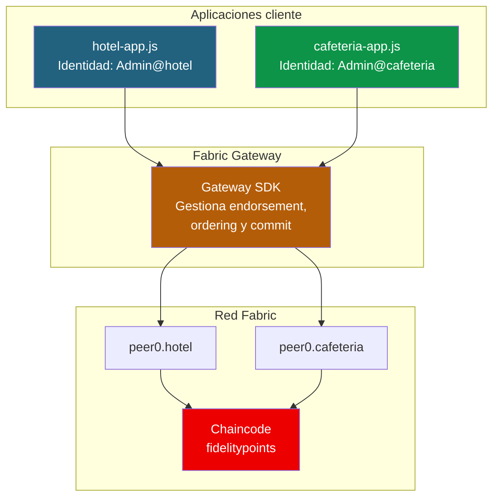
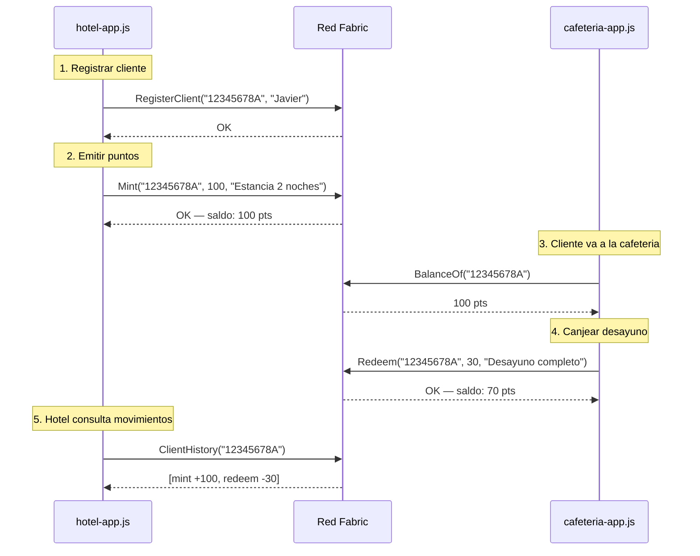

# 05 - Aplicación cliente: FidelityChain

## Visión general

En este documento creamos dos aplicaciones Node.js que se conectan a la red Fabric usando el Gateway SDK:

- **hotel-app.js** — Interfaz del hotel: registrar clientes, emitir puntos, consultar saldos
- **cafeteria-app.js** — Interfaz de la cafeteria: canjear puntos por productos, consultar saldos



---

## Estructura de la aplicación

```
proyecto-fidelitychain/application/
├── package.json
├── hotel-app.js              # App del hotel
├── cafeteria-app.js          # App de la cafeteria
└── utils/
    └── fabric-connection.js  # Helper de conexion al Gateway
```

---

## Helper de conexión (fabric-connection.js)

Este módulo encapsula la lógica de conexión al Gateway para no repetirla en cada app.

```javascript
// application/utils/fabric-connection.js
'use strict';

const { Gateway, Wallets } = require('fabric-network');
const path = require('path');
const fs = require('fs');

/**
 * Conecta al Gateway de Fabric y devuelve el contrato.
 * @param {string} org - 'hotel' o 'cafeteria'
 * @returns {Object} { gateway, contract }
 */
async function connectToFabric(org) {
    // Configuracion por org
    const config = {
        hotel: {
            msp: 'HotelMSP',
            domain: 'hotel.fidelitychain.com',
            peerPort: '7051',
        },
        cafeteria: {
            msp: 'CafeteriaMSP',
            domain: 'cafeteria.fidelitychain.com',
            peerPort: '9051',
        },
    };

    const orgConfig = config[org];
    if (!orgConfig) throw new Error(`Org desconocida: ${org}`);

    const networkPath = path.resolve(__dirname, '..', '..', 'network');
    const cryptoPath = path.join(networkPath, 'crypto-config', 'peerOrganizations',
        orgConfig.domain);

    // Leer certificado y clave del admin
    const certPath = path.join(cryptoPath, 'users', `Admin@${orgConfig.domain}`,
        'msp', 'signcerts');
    const certFile = fs.readdirSync(certPath)[0];
    const certificate = fs.readFileSync(path.join(certPath, certFile), 'utf8');

    const keyPath = path.join(cryptoPath, 'users', `Admin@${orgConfig.domain}`,
        'msp', 'keystore');
    const keyFile = fs.readdirSync(keyPath)[0];
    const privateKey = fs.readFileSync(path.join(keyPath, keyFile), 'utf8');

    // Crear wallet en memoria
    const wallet = await Wallets.newInMemoryWallet();
    const identity = {
        credentials: { certificate, privateKey },
        mspId: orgConfig.msp,
        type: 'X.509',
    };
    await wallet.put('admin', identity);

    // Leer certificado TLS del peer
    const tlsCertPath = path.join(cryptoPath, 'peers',
        `peer0.${orgConfig.domain}`, 'tls', 'ca.crt');
    const tlsCert = fs.readFileSync(tlsCertPath, 'utf8');

    // Connection profile
    const ccp = {
        name: `fidelitychain-${org}`,
        version: '1.0.0',
        channels: {
            'fidelity-channel': {
                orderers: ['orderer.fidelitychain.com'],
                peers: { [`peer0.${orgConfig.domain}`]: {} },
            },
        },
        organizations: {
            [orgConfig.msp]: {
                mspid: orgConfig.msp,
                peers: [`peer0.${orgConfig.domain}`],
            },
        },
        orderers: {
            'orderer.fidelitychain.com': {
                url: 'grpcs://localhost:7050',
                tlsCACerts: {
                    pem: fs.readFileSync(path.join(networkPath, 'crypto-config',
                        'ordererOrganizations', 'fidelitychain.com', 'orderers',
                        'orderer.fidelitychain.com', 'tls', 'ca.crt'), 'utf8'),
                },
                grpcOptions: {
                    'ssl-target-name-override': 'orderer.fidelitychain.com',
                },
            },
        },
        peers: {
            [`peer0.${orgConfig.domain}`]: {
                url: `grpcs://localhost:${orgConfig.peerPort}`,
                tlsCACerts: { pem: tlsCert },
                grpcOptions: {
                    'ssl-target-name-override': `peer0.${orgConfig.domain}`,
                },
            },
        },
    };

    // Conectar
    const gateway = new Gateway();
    await gateway.connect(ccp, {
        wallet,
        identity: 'admin',
        discovery: { enabled: true, asLocalhost: true },
    });

    const network = await gateway.getNetwork('fidelity-channel');
    const contract = network.getContract('fidelitypoints');

    return { gateway, contract, network };
}

module.exports = { connectToFabric };
```

---

## App del Hotel (hotel-app.js)

```javascript
// application/hotel-app.js
'use strict';

const readline = require('readline');
const { connectToFabric } = require('./utils/fabric-connection');

const rl = readline.createInterface({
    input: process.stdin,
    output: process.stdout,
});

function ask(question) {
    return new Promise((resolve) => rl.question(question, resolve));
}

async function main() {
    console.log('=== FidelityChain — App Hotel ===\n');
    console.log('Conectando a la red Fabric como HotelMSP...');

    const { gateway, contract } = await connectToFabric('hotel');
    console.log('Conectado.\n');

    let running = true;
    while (running) {
        console.log('--- Menu Hotel ---');
        console.log('1. Registrar cliente');
        console.log('2. Emitir puntos');
        console.log('3. Consultar saldo');
        console.log('4. Ver historial de cliente');
        console.log('5. Ver info del token');
        console.log('6. Listar todos los clientes');
        console.log('0. Salir');
        console.log('');

        const option = await ask('Opcion: ');

        try {
            switch (option.trim()) {
                case '1': {
                    const id = await ask('DNI del cliente: ');
                    const name = await ask('Nombre: ');
                    await contract.submitTransaction('RegisterClient', id.trim(), name.trim());
                    console.log(`\nCliente ${id.trim()} registrado.\n`);
                    break;
                }
                case '2': {
                    const id = await ask('DNI del cliente: ');
                    const amount = await ask('Puntos a emitir: ');
                    const desc = await ask('Motivo: ');
                    await contract.submitTransaction('Mint', id.trim(), amount.trim(), desc.trim());
                    console.log(`\n${amount.trim()} puntos emitidos a ${id.trim()}.\n`);
                    break;
                }
                case '3': {
                    const id = await ask('DNI del cliente: ');
                    const result = await contract.evaluateTransaction('BalanceOf', id.trim());
                    console.log(`\nSaldo: ${result.toString()} puntos\n`);
                    break;
                }
                case '4': {
                    const id = await ask('DNI del cliente: ');
                    const result = await contract.evaluateTransaction('ClientHistory', id.trim());
                    const history = JSON.parse(result.toString());
                    console.log('\nHistorial:');
                    history.forEach((tx, i) => {
                        console.log(`  ${i + 1}. [${tx.txType}] ${tx.amount} pts — ${tx.description} (${tx.timestamp})`);
                    });
                    console.log('');
                    break;
                }
                case '5': {
                    const result = await contract.evaluateTransaction('GetTokenInfo');
                    const info = JSON.parse(result.toString());
                    console.log(`\nToken: ${info.name} (${info.symbol})`);
                    console.log(`Total emitido: ${info.totalSupply} pts`);
                    console.log(`Total canjeado: ${info.totalRedeemed} pts`);
                    console.log(`En circulacion: ${info.totalSupply - info.totalRedeemed} pts\n`);
                    break;
                }
                case '6': {
                    const result = await contract.evaluateTransaction('GetAllClients');
                    const clients = JSON.parse(result.toString());
                    console.log('\nClientes registrados:');
                    clients.forEach((c) => {
                        console.log(`  ${c.clientID} — ${c.name} — ${c.balance} pts`);
                    });
                    console.log('');
                    break;
                }
                case '0':
                    running = false;
                    break;
                default:
                    console.log('Opcion no valida.\n');
            }
        } catch (error) {
            console.error(`\nError: ${error.message}\n`);
        }
    }

    gateway.disconnect();
    rl.close();
    console.log('Desconectado. Hasta pronto.');
}

main().catch(console.error);
```

---

## App de la Cafeteria (cafeteria-app.js)

```javascript
// application/cafeteria-app.js
'use strict';

const readline = require('readline');
const { connectToFabric } = require('./utils/fabric-connection');

const rl = readline.createInterface({
    input: process.stdin,
    output: process.stdout,
});

function ask(question) {
    return new Promise((resolve) => rl.question(question, resolve));
}

// Catalogo de productos
const CATALOGO = {
    '1': { nombre: 'Cafe solo', puntos: 10 },
    '2': { nombre: 'Cafe con leche', puntos: 15 },
    '3': { nombre: 'Tostada', puntos: 15 },
    '4': { nombre: 'Desayuno completo', puntos: 30 },
    '5': { nombre: 'Menu almuerzo', puntos: 50 },
};

async function main() {
    console.log('=== FidelityChain — App Cafeteria ===\n');
    console.log('Conectando a la red Fabric como CafeteriaMSP...');

    const { gateway, contract } = await connectToFabric('cafeteria');
    console.log('Conectado.\n');

    let running = true;
    while (running) {
        console.log('--- Menu Cafeteria ---');
        console.log('1. Canjear puntos por producto');
        console.log('2. Consultar saldo de cliente');
        console.log('3. Ver historial de cliente');
        console.log('4. Ver info del token');
        console.log('5. Listar todos los clientes');
        console.log('0. Salir');
        console.log('');

        const option = await ask('Opcion: ');

        try {
            switch (option.trim()) {
                case '1': {
                    const clientId = await ask('DNI del cliente: ');

                    // Mostrar saldo actual
                    const balance = await contract.evaluateTransaction('BalanceOf', clientId.trim());
                    console.log(`\nSaldo actual: ${balance.toString()} puntos\n`);

                    // Mostrar catalogo
                    console.log('Catalogo:');
                    Object.entries(CATALOGO).forEach(([key, prod]) => {
                        console.log(`  ${key}. ${prod.nombre} — ${prod.puntos} pts`);
                    });
                    console.log('');

                    const prodKey = await ask('Selecciona producto (1-5): ');
                    const producto = CATALOGO[prodKey.trim()];

                    if (!producto) {
                        console.log('Producto no valido.\n');
                        break;
                    }

                    await contract.submitTransaction('Redeem',
                        clientId.trim(),
                        producto.puntos.toString(),
                        producto.nombre);

                    console.log(`\nCanjeado: ${producto.nombre} (${producto.puntos} pts)`);

                    const newBalance = await contract.evaluateTransaction('BalanceOf', clientId.trim());
                    console.log(`Nuevo saldo: ${newBalance.toString()} puntos\n`);
                    break;
                }
                case '2': {
                    const id = await ask('DNI del cliente: ');
                    const result = await contract.evaluateTransaction('BalanceOf', id.trim());
                    console.log(`\nSaldo: ${result.toString()} puntos\n`);
                    break;
                }
                case '3': {
                    const id = await ask('DNI del cliente: ');
                    const result = await contract.evaluateTransaction('ClientHistory', id.trim());
                    const history = JSON.parse(result.toString());
                    console.log('\nHistorial:');
                    history.forEach((tx, i) => {
                        console.log(`  ${i + 1}. [${tx.txType}] ${tx.amount} pts — ${tx.description} (${tx.timestamp})`);
                    });
                    console.log('');
                    break;
                }
                case '4': {
                    const result = await contract.evaluateTransaction('GetTokenInfo');
                    const info = JSON.parse(result.toString());
                    console.log(`\nToken: ${info.name} (${info.symbol})`);
                    console.log(`Total emitido: ${info.totalSupply} pts`);
                    console.log(`Total canjeado: ${info.totalRedeemed} pts`);
                    console.log(`En circulacion: ${info.totalSupply - info.totalRedeemed} pts\n`);
                    break;
                }
                case '5': {
                    const result = await contract.evaluateTransaction('GetAllClients');
                    const clients = JSON.parse(result.toString());
                    console.log('\nClientes registrados:');
                    clients.forEach((c) => {
                        console.log(`  ${c.clientID} — ${c.name} — ${c.balance} pts`);
                    });
                    console.log('');
                    break;
                }
                case '0':
                    running = false;
                    break;
                default:
                    console.log('Opcion no valida.\n');
            }
        } catch (error) {
            console.error(`\nError: ${error.message}\n`);
        }
    }

    gateway.disconnect();
    rl.close();
    console.log('Desconectado. Hasta pronto.');
}

main().catch(console.error);
```

---

## package.json

```json
{
  "name": "fidelitychain-app",
  "version": "1.0.0",
  "description": "Aplicacion cliente para FidelityChain",
  "scripts": {
    "hotel": "node hotel-app.js",
    "cafeteria": "node cafeteria-app.js"
  },
  "dependencies": {
    "fabric-network": "^2.2.20",
    "fabric-ca-client": "^2.2.20"
  }
}
```

---

## Como ejecutar

### Instalar dependencias

```bash
cd $HOME/proyecto-fidelitychain/application
npm install
```

### Ejecutar la app del Hotel

```bash
npm run hotel
```

### Ejecutar la app de la Cafeteria (en otra terminal)

```bash
npm run cafeteria
```

---

## Flujo de demo con las dos apps



---

**Anterior:** [04 - Despliegue de la red](04-despliegue-red.md)
**Siguiente:** [06 - Pruebas y demo](06-pruebas-y-demo.md)
