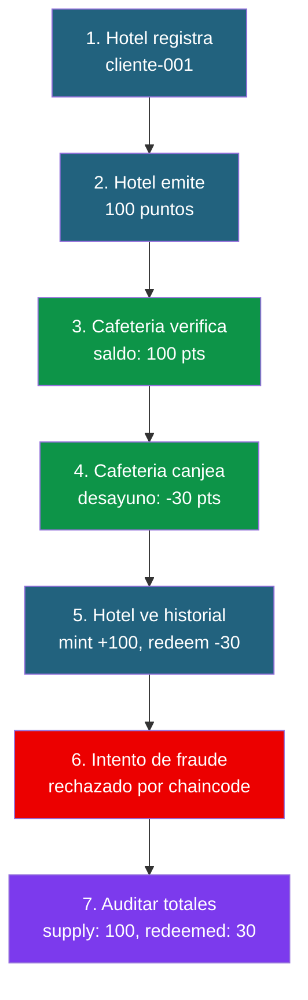

# 06 - Pruebas y demo: FidelityChain

## Guion de demostracion

Este es el flujo completo para demostrar el sistema FidelityChain. Puedes usarlo como guion de presentacion en clase.

### Preparacion

1. La red debe estar levantada y el chaincode desplegado (doc 04)
2. Abrir **dos terminales** en WSL:
   - Terminal 1: `cd ~/proyecto-fidelitychain/application && npm run hotel`
   - Terminal 2: `cd ~/proyecto-fidelitychain/application && npm run cafeteria`

### Acto 1: Registro del cliente

**Terminal 1 (Hotel):**
```
Opcion: 1
ID del cliente: cliente-001
Nombre: Javier Garcia
→ Cliente cliente-001 registrado.
```

> **Explicar:** El hotel acaba de crear un registro en el World State de Fabric. La cafeteria puede verlo inmediatamente porque comparten el mismo canal y ledger.

### Acto 2: Emision de puntos

**Terminal 1 (Hotel):**
```
Opcion: 2
ID del cliente: cliente-001
Puntos a emitir: 100
Motivo: Estancia 2 noches suite premium
→ 100 puntos emitidos a cliente-001.
```

> **Explicar:** La transaccion ha sido endorsada por ambos peers (Hotel y Cafeteria), ordenada por el orderer y escrita en el ledger. La cafeteria ya ve los 100 puntos.

### Acto 3: Verificacion cruzada

**Terminal 2 (Cafeteria):**
```
Opcion: 2
ID del cliente: cliente-001
→ Saldo: 100 puntos
```

> **Explicar:** La cafeteria puede ver el saldo del cliente aunque fue el hotel quien emitio los puntos. Esto es posible porque ambas organizaciones comparten el mismo canal. No hay llamadas API entre ellas — leen del mismo ledger.

### Acto 4: Canje de puntos

**Terminal 2 (Cafeteria):**
```
Opcion: 1
ID del cliente: cliente-001
Saldo actual: 100 puntos

Catalogo:
  1. Cafe solo — 10 pts
  2. Cafe con leche — 15 pts
  3. Tostada — 15 pts
  4. Desayuno completo — 30 pts
  5. Menu almuerzo — 50 pts

Selecciona producto (1-5): 4
→ Canjeado: Desayuno completo (30 pts)
→ Nuevo saldo: 70 puntos
```

> **Explicar:** El chaincode verifico que el caller es CafeteriaMSP (solo ella puede canjear), que el cliente tiene saldo suficiente y desconto los puntos. Todo en una sola transaccion atomica.

### Acto 5: Historial completo

**Terminal 1 (Hotel):**
```
Opcion: 4
ID del cliente: cliente-001

Historial:
  1. [mint] 100 pts — Estancia 2 noches suite premium (2026-04-16T10:30:00Z)
  2. [redeem] 30 pts — Desayuno completo (2026-04-16T10:32:00Z)
```

> **Explicar:** El hotel puede ver que su cliente ha canjeado puntos en la cafeteria. El historial es inmutable — ni el hotel ni la cafeteria pueden borrarlo o modificarlo. Esto es la transparencia que ofrece blockchain.

### Acto 6: Intento de fraude

**Terminal 2 (Cafeteria):**
```
Opcion: 1
ID del cliente: cliente-001
Selecciona producto: 5 (Menu almuerzo — 50 pts)
→ Error: saldo insuficiente: tiene 70 puntos, necesita 50
```

Espera... 70 >= 50, deberia funcionar. Si no, cambialo por un importe mayor para forzar el error:

**Terminal 1 (Hotel) — intentar canjear como Hotel:**
Si modificas la app para intentar llamar a Redeem desde el Hotel:
```
→ Error: solo la cafeteria puede canjear puntos (caller: HotelMSP)
```

> **Explicar:** El chaincode rechaza la operacion porque el Hotel no tiene permiso de canje. Esto no es una regla de la aplicacion — esta en el smart contract, es inviolable.

### Acto 7: Estado global del token

**Cualquier terminal:**
```
Opcion: 5 (Ver info del token)

Token: FidelityPoints (FP)
Total emitido: 100 pts
Total canjeado: 30 pts
En circulacion: 70 pts
```

> **Explicar:** Estos totales se actualizan automaticamente con cada Mint y Redeem. Cualquier org puede auditar el estado del sistema en cualquier momento.

---

## Diagrama del flujo completo de la demo



---

## Tests unitarios del chaincode

### Que probar

| Funcion | Test happy path | Test error |
|---------|----------------|------------|
| RegisterClient | Registrar nuevo cliente | Cliente ya existe |
| Mint | Emitir puntos como Hotel | Emitir como Cafeteria (denegado) |
| Mint | Emitir cantidad positiva | Emitir cantidad 0 o negativa |
| Redeem | Canjear como Cafeteria | Canjear como Hotel (denegado) |
| Redeem | Canjear con saldo suficiente | Saldo insuficiente |
| BalanceOf | Consultar cliente existente | Cliente no existe |
| ClientHistory | Historial con transacciones | Cliente sin movimientos |

### Ejemplo de test (Go)

```go
func TestMint_SoloHotelPuedeEmitir(t *testing.T) {
    mockCtx := new(mocks.TransactionContext)
    mockStub := new(mocks.ChaincodeStub)
    mockIdentity := new(mocks.ClientIdentity)

    mockCtx.On("GetStub").Return(mockStub)
    mockCtx.On("GetClientIdentity").Return(mockIdentity)

    // Simular que el caller es la Cafeteria (no deberia poder emitir)
    mockIdentity.On("GetMSPID").Return("CafeteriaMSP", nil)

    contract := SmartContract{}
    err := contract.Mint(mockCtx, "cliente-001", 100, "test")

    assert.Error(t, err)
    assert.Contains(t, err.Error(), "solo el hotel puede emitir")
}

func TestRedeem_SaldoInsuficiente(t *testing.T) {
    mockCtx := new(mocks.TransactionContext)
    mockStub := new(mocks.ChaincodeStub)
    mockIdentity := new(mocks.ClientIdentity)

    mockCtx.On("GetStub").Return(mockStub)
    mockCtx.On("GetClientIdentity").Return(mockIdentity)
    mockIdentity.On("GetMSPID").Return("CafeteriaMSP", nil)

    // Cliente con 20 puntos
    clientJSON, _ := json.Marshal(Client{
        ClientID: "cliente-001", Balance: 20,
    })
    mockStub.On("GetState", "client~cliente-001").Return(clientJSON, nil)

    contract := SmartContract{}
    err := contract.Redeem(mockCtx, "cliente-001", 50, "Menu almuerzo")

    assert.Error(t, err)
    assert.Contains(t, err.Error(), "saldo insuficiente")
}
```

---

## Checklist de evaluacion del proyecto

Para los alumnos que presenten el proyecto, esta es la rubrica de evaluacion:

### Obligatorio (para aprobar)

- [ ] La red levanta correctamente (orderer + 2 peers + CouchDB)
- [ ] El canal se crea y ambos peers se unen
- [ ] El chaincode se despliega con el lifecycle completo
- [ ] Se puede registrar un cliente
- [ ] El hotel puede emitir puntos
- [ ] La cafeteria puede canjear puntos
- [ ] La consulta de saldo funciona correctamente
- [ ] El control de acceso funciona (Hotel no puede canjear, Cafeteria no puede emitir)

### Extras (para subir nota)

- [ ] App cliente con menu interactivo funcionando
- [ ] Historial de transacciones consultable
- [ ] Escucha de eventos en tiempo real
- [ ] Tests unitarios del chaincode (al menos 3)
- [ ] Manejo de errores correcto en la app (saldo insuficiente, cliente no existe)
- [ ] Documentacion propia explicando decisiones de diseno

---

## Posibles ampliaciones

Si algun alumno quiere ir mas alla, estas son extensiones interesantes:

1. **Anadir una tercera organizacion** (restaurante) que tambien pueda canjear puntos
2. **Puntos con caducidad:** anadir un campo `expiresAt` y una funcion que invalide puntos caducados
3. **Private Data:** que el precio de liquidacion entre hotel y cafeteria sea privado (solo lo ven ellos)
4. **Web UI:** crear un frontend React/Vue que se conecte a una API REST que a su vez use el Gateway SDK
5. **Transferencia entre clientes:** permitir que un cliente regale puntos a otro
6. **Niveles de fidelidad:** bronce (0-500), plata (500-2000), oro (2000+) con multiplicadores

---

**Anterior:** [05 - Aplicacion cliente](05-aplicacion-cliente.md)
