# Generales Bizantinos — Diagramas con 3, 4, 5 y 6 generales

## Caso 1: El traidor es un teniente

El Comandante es leal y ordena **"Atacar"**. El Teniente 2 es el traidor.

### Ronda 1 — El Comandante envía la orden

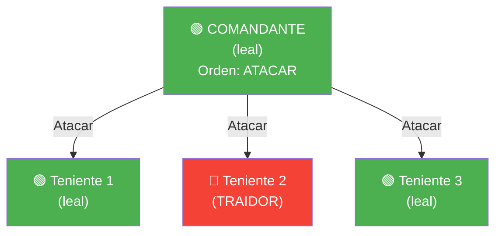

### Ronda 2 — Los tenientes intercambian lo que recibieron

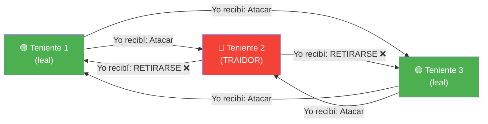

### Votación por mayoría

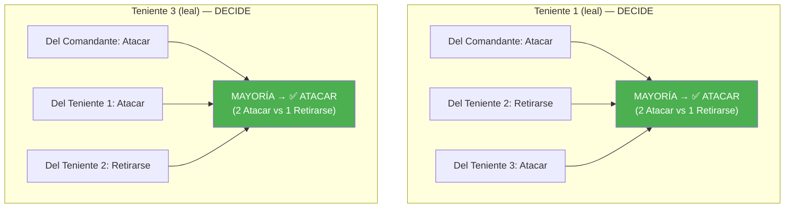

**Resultado: Ambos tenientes leales deciden ATACAR. Consenso alcanzado.**

---

## Caso 2: El traidor es el Comandante

El Comandante es el traidor. Envía órdenes contradictorias. Los 3 tenientes son leales.

### Ronda 1 — El Comandante (traidor) envía órdenes distintas

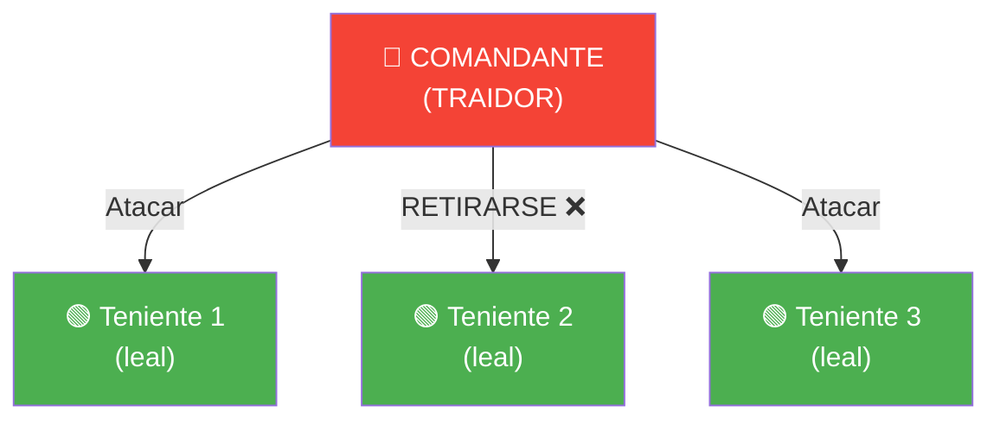

### Ronda 2 — Los tenientes intercambian lo que recibieron (todos dicen la verdad)

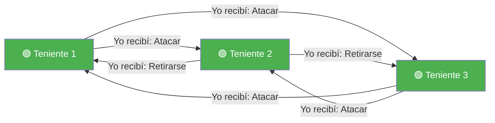

### Votación por mayoría

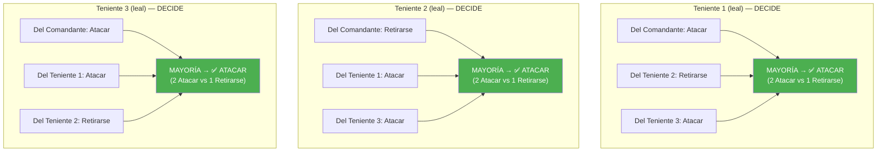

**Resultado: Los 3 tenientes leales deciden ATACAR. Consenso alcanzado.**

El Teniente 2 recibió "Retirarse" del comandante traidor, pero al contrastar con los otros dos tenientes, descubre que la mayoría dice "Atacar" → se alinea con la mayoría.

---

## Caso 3 (fallo): Solo 3 generales con 1 traidor

Con 3 generales no se puede resolver. Ejemplo: Comandante traidor.

### Ronda 1

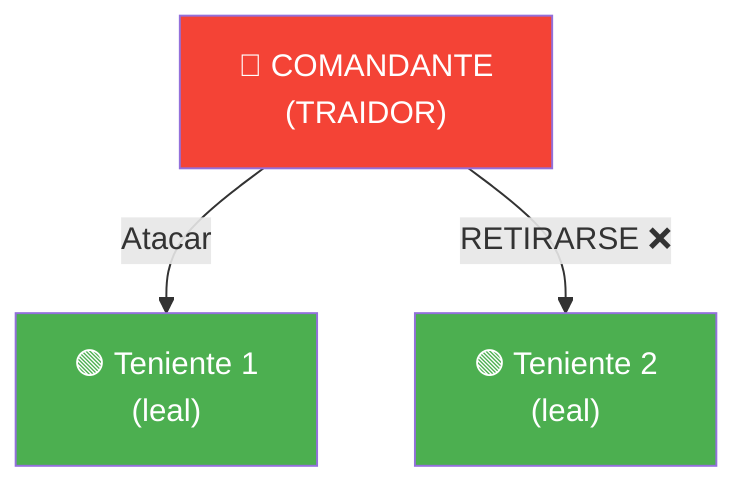

### Ronda 2


### Votación

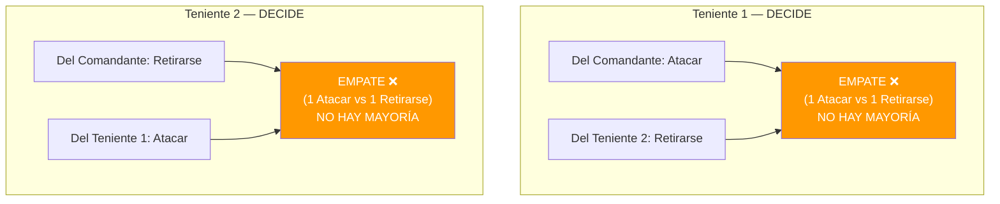

**Resultado: Empate. Cada teniente tiene 1 voto de cada tipo. No pueden distinguir quién miente. NO hay consenso posible.**

---

## 5 generales con 1 traidor — Funciona con más margen

Comandante leal, 4 tenientes (1 traidor). El margen de mayoría es aún mayor.

### Ronda 1 — El Comandante envía la orden

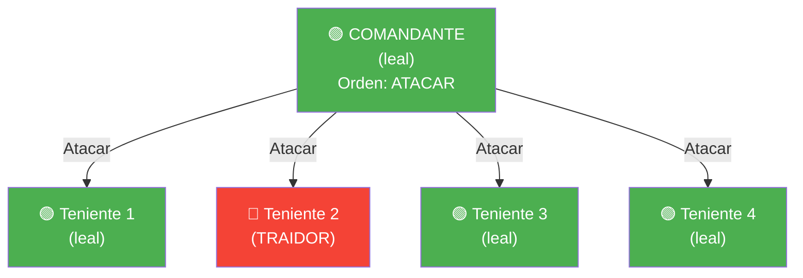

### Ronda 2 — Intercambio entre tenientes

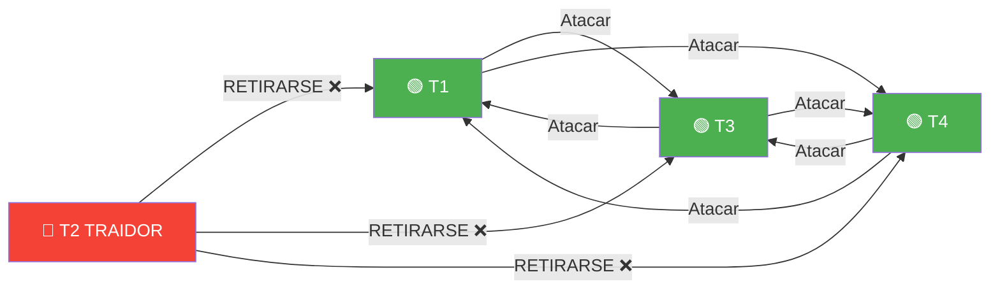

### Votación — Ejemplo: Teniente 1

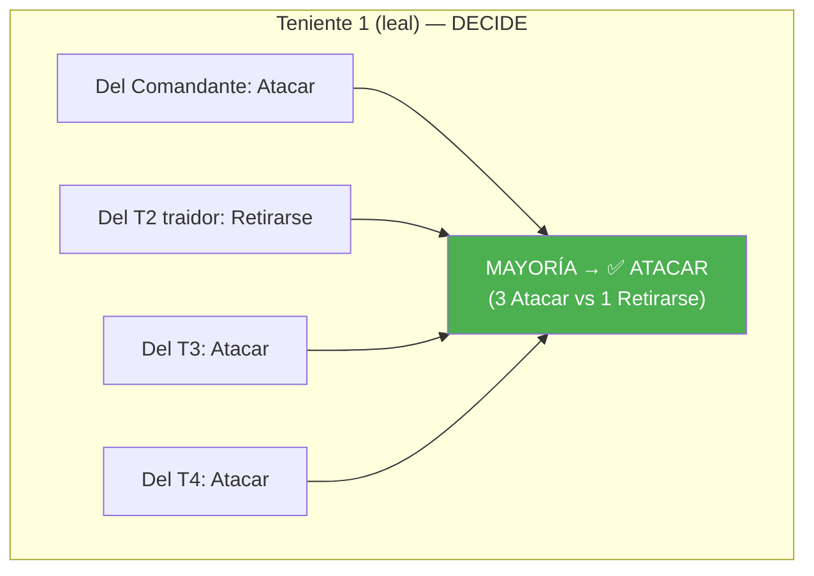

**Todos los tenientes leales tienen el mismo resultado: 3 Atacar vs 1 Retirarse. Consenso fácil.**

Con 5 generales y 1 traidor, el margen es muy cómodo (3 vs 1). El sistema tolera hasta 1 traidor (necesitaría 4 para fallar, lo cual requeriría al menos 4 traidores sobre 5 — muy por encima de 1/3).

---

## 5 generales con 2 traidores — Falla (no cumple n ≥ 3f+1)

Necesitaríamos 3×2+1 = **7 generales** para tolerar 2 traidores. Con solo 5, falla.

### Ronda 1 — Comandante traidor, T2 también traidor

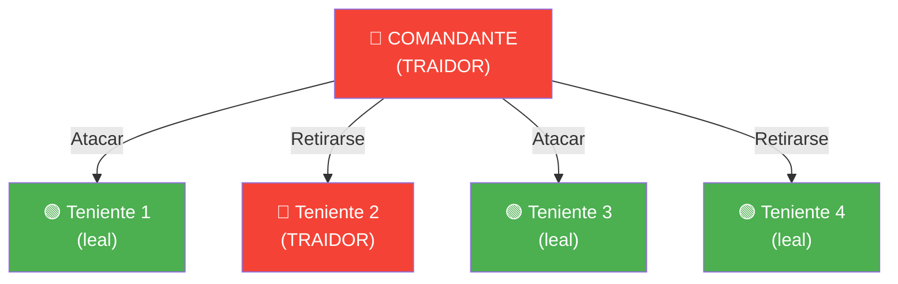

### Ronda 2 — Intercambio

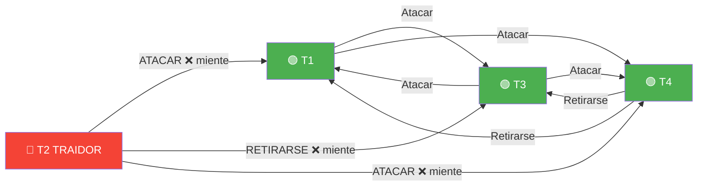

### Votación — Los leales NO llegan al mismo resultado

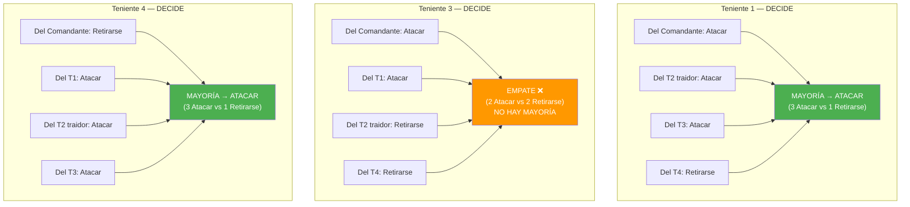

**Resultado: T1 y T4 deciden Atacar, pero T3 tiene empate y no puede decidir. Los traidores (Comandante + T2) han enviado mensajes diferentes a cada leal, rompiendo el consenso. FALLA.**

---

## 6 generales con 1 traidor — Funciona con margen enorme

Con 6 generales y solo 1 traidor (muy por encima de 3×1+1=4), el consenso es trivial.

### Ronda 1 — Comandante leal

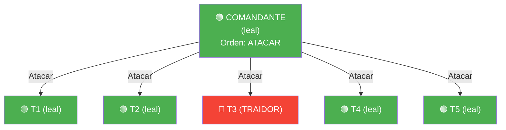

### Votación — Ejemplo: Teniente 1

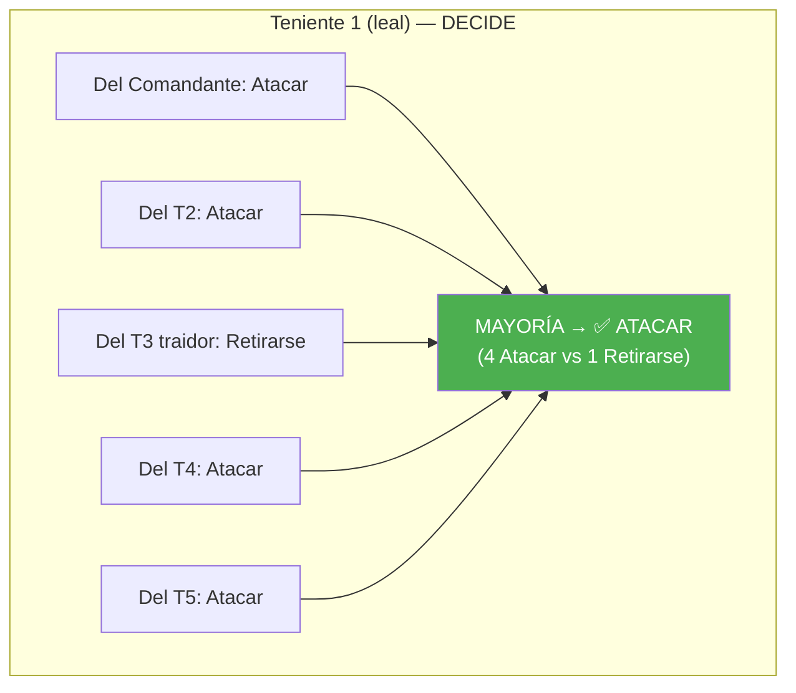

**4 contra 1. El traidor es irrelevante. Consenso trivial.**

---

## 6 generales con 2 traidores — NO funciona (6 < 3×2+1 = 7)

### Ronda 1 — Comandante traidor, T3 también traidor

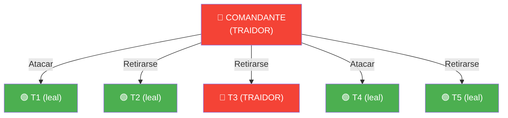

### Ronda 2 — Intercambio (los leales dicen la verdad, T3 miente)

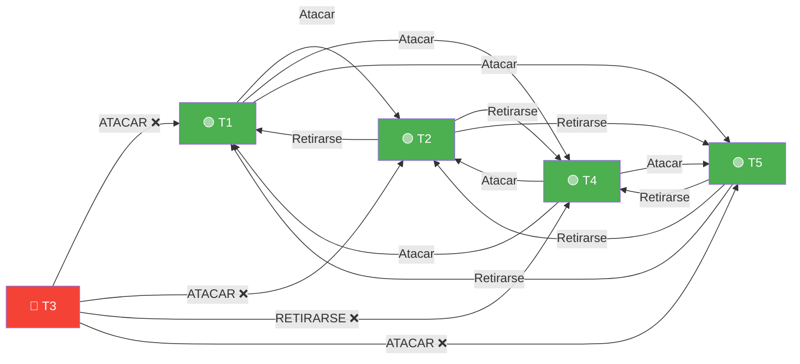

### Votación — Los 4 tenientes leales

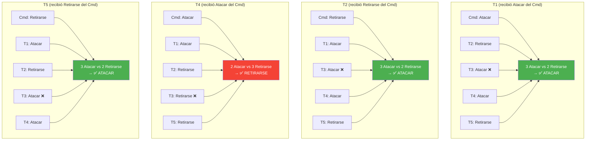

**Resultado: T1, T2 y T5 deciden ATACAR, pero T4 decide RETIRARSE. El traidor T3 envió mensajes diferentes a cada leal, y logró que T4 viera una mayoría distinta. NO hay consenso total entre leales. FALLA.**

> **Conclusión:** 6 generales con 2 traidores **no funciona**. La regla exige n ≥ 3f+1 = **7**, y 6 < 7. Este caso demuestra que no basta con tener "más o menos" 2/3 leales — hacen falta **estrictamente más** de 2/3. Con 7 generales y 2 traidores (5 leales), sí funcionaría.

---

## Resumen visual de la regla

```mermaid
graph LR
    subgraph FALLA["❌ NO FUNCIONA"]
        F1["3 generales<br/>1 traidor"]
        F5["5 generales<br/>2 traidores"]
        F6["6 generales<br/>2 traidores"]
    end

    subgraph FUNCIONA["✅ FUNCIONA"]
        F2["4 generales<br/>1 traidor"]
        F7["5 generales<br/>1 traidor"]
        F8["6 generales<br/>1 traidor"]
        F3["7 generales<br/>2 traidores"]
        F4["10 generales<br/>3 traidores"]
    end

    R["REGLA: n ≥ 3f + 1<br/>Máximo 1/3 de traidores"]

    style FALLA fill:#ffcdd2
    style FUNCIONA fill:#c8e6c9
    style R fill:#2196F3,color:#fff
```

**Fórmula:** Para tolerar **f** traidores, necesitas al menos **3f + 1** generales.

| Traidores (f) | Generales necesarios (3f+1) | Leales mínimos |
|---|---|---|
| 1 | 4 | 3 |
| 2 | 7 | 5 |
| 3 | 10 | 7 |
| 10 | 31 | 21 |
