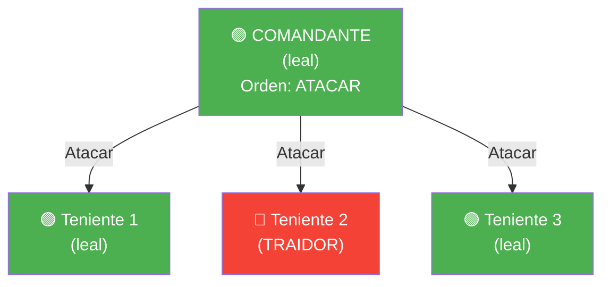
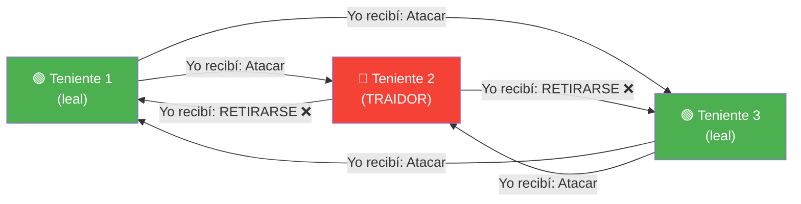
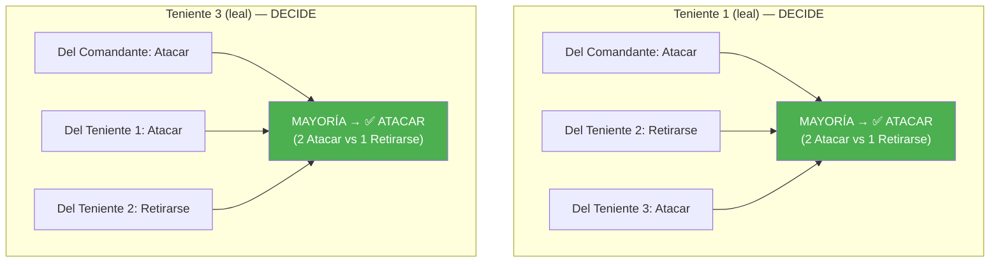
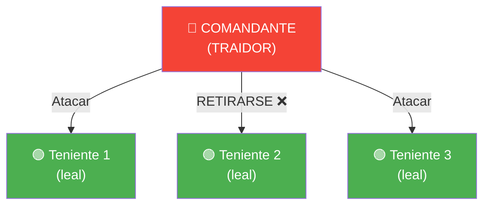
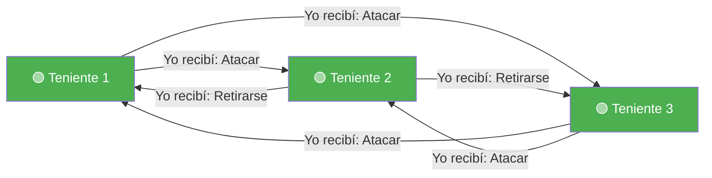
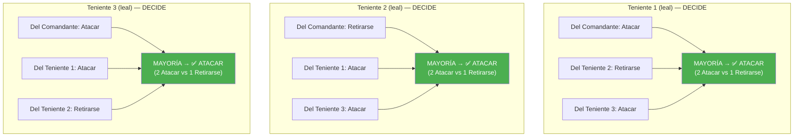
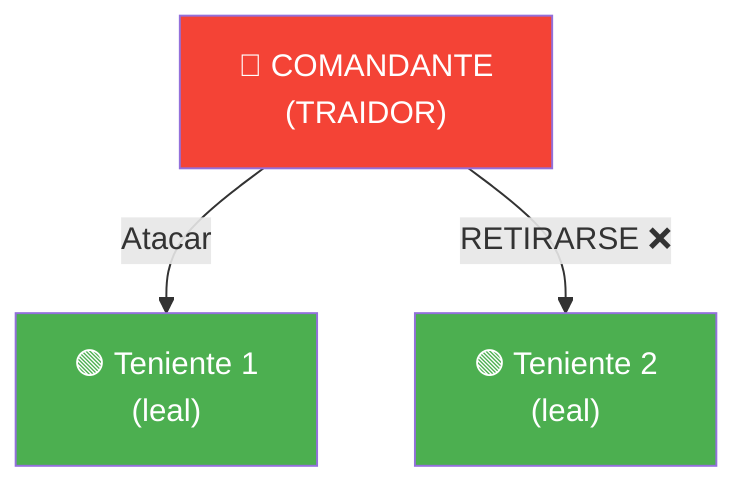
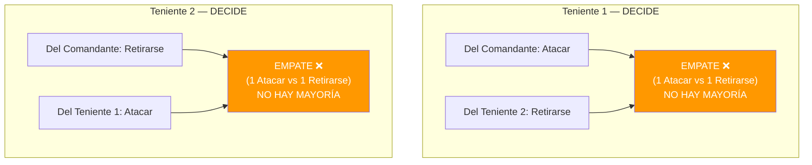
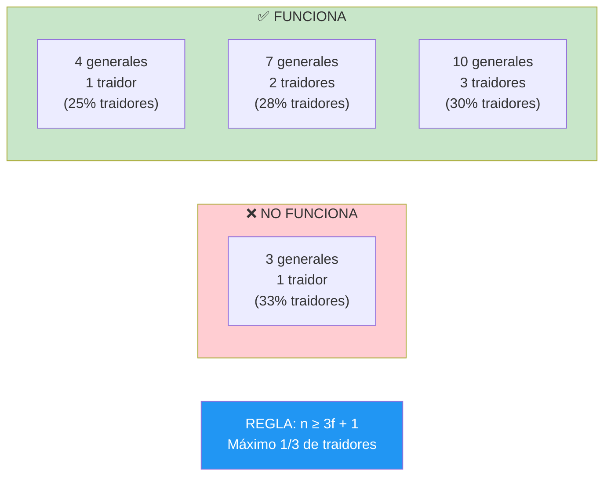

# Generales Bizantinos — Diagramas con 4 generales

## Caso 1: El traidor es un teniente

El Comandante es leal y ordena **"Atacar"**. El Teniente 2 es el traidor.

### Ronda 1 — El Comandante envía la orden

### Ronda 2 — Los tenientes intercambian lo que recibieron

### Votación por mayoría

**Resultado: Ambos tenientes leales deciden ATACAR. Consenso alcanzado.**

---

## Caso 2: El traidor es el Comandante

El Comandante es el traidor. Envía órdenes contradictorias. Los 3 tenientes son leales.

### Ronda 1 — El Comandante (traidor) envía órdenes distintas

### Ronda 2 — Los tenientes intercambian lo que recibieron (todos dicen la verdad)

### Votación por mayoría

**Resultado: Los 3 tenientes leales deciden ATACAR. Consenso alcanzado.**

El Teniente 2 recibió "Retirarse" del comandante traidor, pero al contrastar con los otros dos tenientes, descubre que la mayoría dice "Atacar" → se alinea con la mayoría.

---

## Caso 3 (fallo): Solo 3 generales con 1 traidor

Con 3 generales no se puede resolver. Ejemplo: Comandante traidor.

### Ronda 1

### Ronda 2

### Votación

**Resultado: Empate. Cada teniente tiene 1 voto de cada tipo. No pueden distinguir quién miente. NO hay consenso posible.**

---

## Resumen visual de la regla

**Fórmula:** Para tolerar **f** traidores, necesitas al menos **3f + 1** generales.

| Traidores (f) | Generales necesarios (3f+1) | Leales mínimos |
|---|---|---|
| 1 | 4 | 3 |
| 2 | 7 | 5 |
| 3 | 10 | 7 |
| 10 | 31 | 21 |
