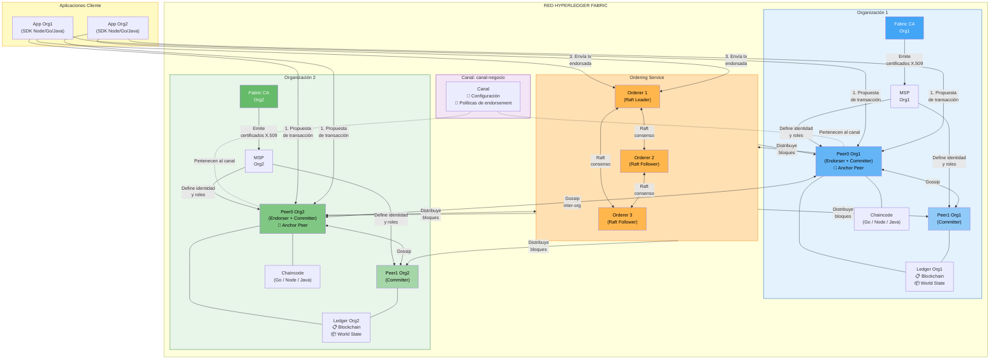
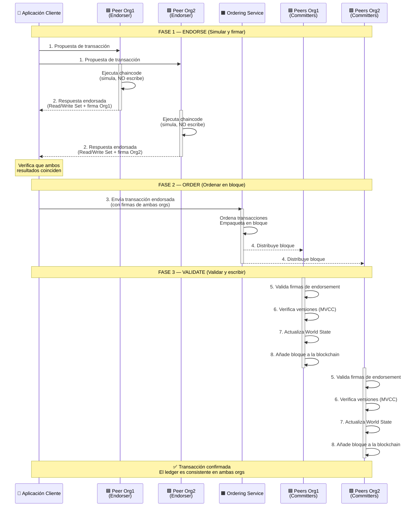
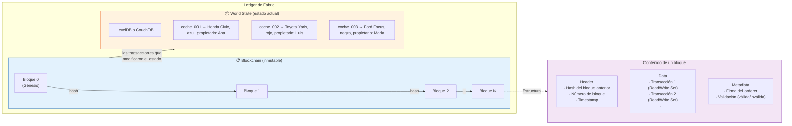
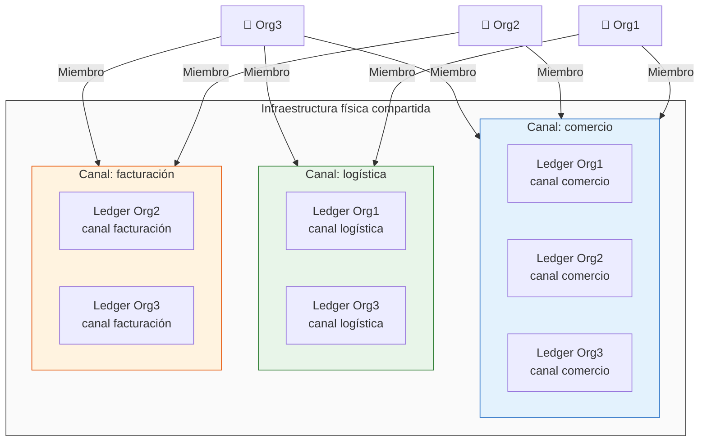
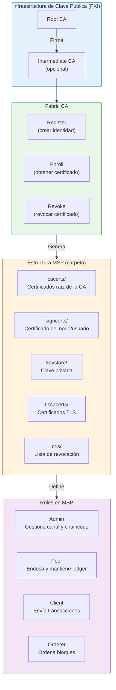
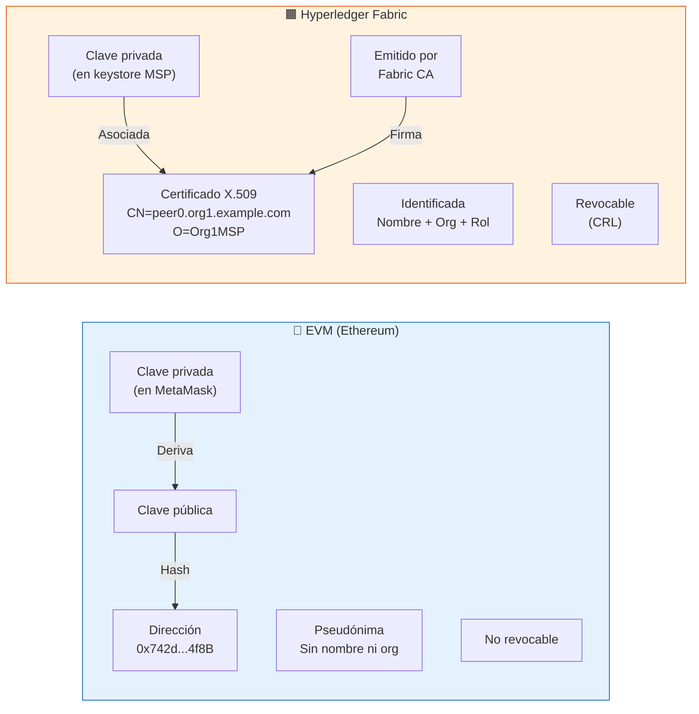

# Arquitectura de Hyperledger Fabric

## Vista general de la red

---

## Flujo de una transacción (Endorse → Order → Validate)

---

## Estructura del Ledger

---

## Canales y privacidad

**Org1** no ve nada de lo que pasa en el canal de facturación.
**Org2** no ve nada de lo que pasa en el canal de logística.
Cada canal tiene su propio ledger independiente.

---

## Identidades y MSP

---

## Comparativa: identidad en EVM vs Fabric

---

## Ciclo de vida del chaincode

```mermaid
graph LR
    PKG["📦 Package<br/>peer lifecycle chaincode<br/>package"]
    INS["💾 Install<br/>peer lifecycle chaincode<br/>install<br/>(en cada peer)"]
    APR["✅ Approve<br/>peer lifecycle chaincode<br/>approveformyorg<br/>(cada org vota)"]
    CHK["🔍 Check<br/>peer lifecycle chaincode<br/>checkcommitreadiness"]
    COM["🚀 Commit<br/>peer lifecycle chaincode<br/>commit<br/>(se activa en el canal)"]
    USE["💬 Invoke / Query<br/>peer chaincode invoke<br/>peer chaincode query"]

    PKG -->|"Crea .tar.gz"| INS
    INS -->|"Package ID"| APR
    APR -->|"¿Mayoría?"| CHK
    CHK -->|"Sí"| COM
    COM -->|"Chaincode activo"| USE

    style PKG fill:#E3F2FD,stroke:#1565C0
    style INS fill:#E8F5E9,stroke:#2E7D32
    style APR fill:#FFF3E0,stroke:#E65100
    style CHK fill:#F3E5F5,stroke:#7B1FA2
    style COM fill:#C8E6C9,stroke:#2E7D32
    style USE fill:#B3E5FC,stroke:#0288D1
```

